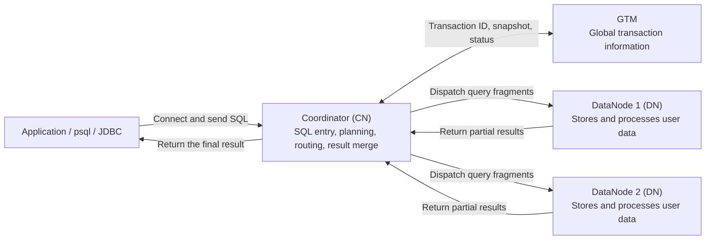

<!--
Copyright (C) 2026 OpenTenBase Authors. All rights reserved.
Licensed under the BSD 3-Clause License. See LICENSE.txt in the repository root.
-->

# OpenTenBase Architecture Glossary and Newcomer Guide

**Language**: [English](GLOSSARY.md) | [简体中文](GLOSSARY_ZH.md)

This guide explains the architecture terms that newcomers frequently encounter in the OpenTenBase README, source tree, and deployment configuration. Its goal is to provide a concise and accurate mental model before readers deploy a cluster, create tables, or start exploring the source code.

## Architecture at a glance

The following diagram shows a typical SQL path in distributed mode. It is a newcomer-oriented logical view: an actual execution plan may contact only a subset of DataNodes or exchange intermediate data between DataNodes.

| Component | Main responsibility | Do not confuse it with |
| --- | --- | --- |
| Client | Connects to a CN in distributed mode and submits SQL as if it were using one database. | The client does not need to locate each row on a DN by itself. |
| Coordinator (CN) | Stores cluster metadata, plans and routes SQL, coordinates work on DNs, and combines results. | A CN is normally not the main store for user-table rows and is not simply a traditional single-node primary database. |
| DataNode (DN) | Stores user data and performs local scans, writes, joins, and aggregations. | A DN is not merely a backup server; it is a storage and compute node. |
| GTM | Manages cluster-wide transaction identifiers, snapshots, and transaction state. | GTM does not store business tables or execute user query plans. |

A typical query can be understood in five steps:

1. The client connects to a CN and sends SQL.
2. The CN parses and plans the statement, then uses distribution metadata to select the relevant DNs.
3. The CN communicates with GTM when cluster-wide transaction information is required.
4. The CN dispatches query fragments, and the selected DNs process local data and return partial results.
5. The CN combines the results and returns one result set to the client.

## Core terms

### 1. Coordinator (CN)

The SQL entry and coordination node of a distributed OpenTenBase cluster. A CN stores metadata such as schemas, nodes, and table placement, creates distributed execution plans, sends work to the relevant DNs, and combines their results. Applications normally connect to a CN instead of bypassing the coordination layer and modifying one DN directly.

### 2. DataNode (DN)

The node that stores actual user data and performs data-local work. A distributed table can be spread across multiple primary DNs so that storage capacity and computation are shared by several nodes.

### 3. GTM (Global Transaction Manager)

The component that provides global transaction information for a distributed cluster. It manages global transaction identifiers, snapshots, and transaction state so that CNs and DNs can work with a consistent transaction view. GTM is neither a SQL gateway nor a business-data store.

### 4. Distributed mode (`distributed`)

A deployment mode in which GTM, CN, and DN roles cooperate. Clients connect to a CN, data can be placed on multiple DNs, and work can run across nodes in parallel. Adding nodes is useful only when table placement, data distribution, and access patterns make effective use of them.

### 5. Centralized mode (`centralized`)

A simplified deployment mode compared with the full distributed topology. It does not follow the usual client-to-CN-to-DN path. Centralized mode is a different deployment shape; it should not be described as GTM, CN, and DN being merged into one process.

### 6. Shared-nothing architecture

An architecture in which each primary DN owns its compute, memory, and storage resources and cooperates with other nodes over the network. This supports horizontal scaling and parallel processing, while making skew, cross-node traffic, and network cost important performance factors.

### 7. Node group

A named logical set of one or more DNs that defines a data-placement scope. A node group is not a physical server, a collection of CNs or GTMs, or a primary/standby pair.

### 8. Data shard and sharding

A shard is the subset of a logical table stored on a DN; sharding is the process of distributing such subsets across DNs. Sharding supports data-level horizontal scaling. It is different from PostgreSQL table partitioning and from a standby node used for availability.

### 9. Distribution key

One or more columns that help determine the target DN for a row. A useful distribution key spreads data evenly and often matches frequent filters or join conditions, reducing the number of participating nodes and the amount of cross-node traffic.

### 10. Distributed table

A logical table whose rows are placed on different DNs according to a distribution rule. One DN normally stores only part of the table. This spreads capacity and computation, but a cross-shard query may contact multiple DNs or move intermediate data.

### 11. Replicated table

A table for which every participating DN in the placement scope stores a complete copy. Replication is useful for small lookup or dimension tables that often join with distributed data, but write and storage cost grows with the number of copies. A replicated table is not the same as an HA standby.

### 12. Distributed query plan

The cross-node execution strategy produced by a CN for one SQL statement. The plan may route a distribution-key lookup to a small set of DNs, push scans or aggregations down to DNs, or redistribute intermediate data for a cross-shard operation. Not every query contacts every DN.

### 13. Global transaction, GXID, and global snapshot

A global transaction is one logical transaction that must be interpreted consistently by multiple nodes. A GXID identifies a transaction across the cluster, while a global snapshot establishes a consistent visibility view. These are transaction-control data, not copies of application rows.

### 14. Two-phase commit (2PC)

An atomic commit protocol commonly used when a write has multiple participating nodes. The coordinator first asks participants to prepare; it then tells all participants to commit when preparation succeeds, or to roll back otherwise. 2PC aligns the final outcome, while GTM supplies the related global transaction context.

### 15. `opentenbase_ctl` and the cluster configuration file

`opentenbase_ctl` is the OpenTenBase V5 command-line deployment and operations tool. It can use a configuration file to install, delete, start, stop, inspect, and operate cluster nodes, and to run remote commands or SQL. The configuration describes items such as deployment mode, nodes, packages, SSH settings, and logging. The tool controls service processes; it is not a database server process itself.

## Common distinctions

| Often confused | Practical difference |
| --- | --- |
| CN vs. GTM | A CN plans, routes, and coordinates SQL; GTM manages global transaction information. |
| Node group vs. shard | A node group is a set of DNs; a shard is a subset of table data. |
| Distributed table vs. replicated table | A distributed table places different rows on different DNs; a replicated table keeps a full copy on each participating DN. |
| Replicated table vs. standby | Table replication is a table-placement strategy; a standby is a node-level availability copy. |
| Sharding vs. table partitioning | Sharding places data across DNs; table partitioning is a table-design mechanism. |
| `opentenbase_ctl` vs. database services | The tool deploys and controls nodes; database processes and GTM provide the running services. |
| `master`/`slave` in current configuration vs. distributed tables | The former describes node-level primary/standby relationships; the latter describes table-data placement. |

## Suggested reading path

1. Start with the [project overview and deployment example](README.md) to understand the basic CN, DN, and GTM relationship.
2. Read the [`opentenbase_ctl` guide](contrib/opentenbase_ctl/README.md) to see how a topology and configuration become running nodes.
3. For table placement, read the distribution and replication sections in the [DDL documentation](doc/src/sgml/ddl.sgml).
4. For a deeper look at transaction management, use `src/gtm/` as a starting point for source navigation.

> This document provides an introductory mental model. Exact behavior should be verified against the current branch, configuration examples, source code, and actual execution plans.
