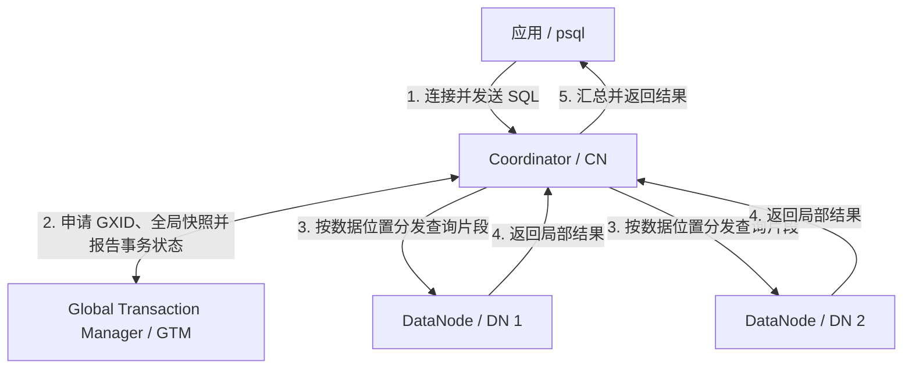

<!--
Copyright (C) 2025 OpenTenBase Authors. All rights reserved.
SPDX-License-Identifier: BSD-3-Clause
-->

# OpenTenBase 架构术语表与新手导览

这份导览面向第一次阅读 OpenTenBase 部署文档的用户。先用一条查询建立整体认识，再解释配置文件和源码中最常见的 15 个术语。

## 一张图看懂分布式模式



这是一张逻辑关系图，不代表固定的进程数量或端口。一个集群可以有多个 CN 和 DN，也可以为节点配置从节点。客户端在分布式模式下连接 CN；用户数据保存在 DN；GTM 负责全局事务 ID 和快照等事务协调信息，不参与用户表数据的存储。

| 交互 | 谁发起 | 谁处理 | 发生了什么 |
| --- | --- | --- | --- |
| 建立会话、提交 SQL | 客户端 | CN | CN 是分布式集群的应用入口，对外提供统一的数据库视图 |
| 获取事务信息 | CN 或 DN | GTM | 事务按需获取全局事务 ID 和全局快照，并报告事务状态 |
| 执行查询片段 | CN | 一个或多个 DN | CN 根据表的分布信息选择 DN，并尽量下推过滤、投影、连接或排序等工作 |
| 保存和读取用户行 | CN 调度 | DN | DN 在本地存储用户数据并执行发送到本节点的工作 |
| 汇总结果 | DN 返回，CN 汇总 | CN | CN 收集局部结果，完成必要的合并后返回客户端 |

## 一条查询经历了什么

以分布式模式中的查询为例：

```sql
SELECT id, note
FROM orders
WHERE id = 42;
```

1. 客户端把 SQL 发给任意可用的 CN。
2. CN 解析和规划语句。事务需要一致性视图时，集群从 GTM 获取 GXID 和全局快照。
3. CN 根据 `orders` 的分布方式和分布键判断目标 DN。能够确定数据位置时只访问相关 DN，否则可能访问表所在的全部 DN。
4. DN 在本地读取数据并返回结果。可下推的过滤等操作会尽量在 DN 完成，减少网络传输。
5. CN 合并局部结果并响应客户端。若写事务涉及多个节点，CN 会在内部使用两阶段提交来协调最终结果。

## 核心术语

### 1. Coordinator（CN，协调节点）

分布式模式的客户端入口。CN 保存集群元数据，接收 SQL，生成并分发在 DN 上执行的工作，最后汇总结果。CN 的职责是协调，不是保存普通用户表数据；它也不是 GTM。

### 2. DataNode（DN，数据节点）

真正保存用户数据并执行本地查询任务的数据库节点。一个表可以把不同数据行分布到多个 DN，也可以在多个 DN 上保存副本。

### 3. Global Transaction Manager（GTM，全局事务管理器）

为集群事务提供全局事务 ID、全局快照和全局时间戳等信息，并跟踪事务状态。它解决的是跨节点事务可见性与协调问题，不负责解析业务 SQL，也不存储用户表。

### 4. 分布式模式（`distributed`）

由 GTM、CN 和 DN 共同组成的部署模式。应用连接 CN，数据可以分散到多个 DN，因此存储和计算能够随 DN 数量扩展。`opentenbase_config.ini` 中使用 `type=distributed`。

### 5. 集中式模式（`centralized`）

不创建独立 GTM 和 CN、只部署 DN 的模式。应用直接连接 DN，适合不需要分布式数据拆分的场景。集中式模式不是“把 GTM、CN、DN 都放到同一台机器”；后者仍然是单机承载的分布式拓扑。

### 6. Catalog（系统目录 / 元数据）

描述数据库对象和集群布局的系统信息，例如表结构、节点和数据分布位置。CN 依靠这些信息规划查询。元数据与用户表中的业务行不同；前者描述“数据在哪里、长什么样”，后者实际保存在 DN。

### 7. Node Group（节点组）

一组 DN 的逻辑别名，可用于定义表所在的子集群。节点组只包含 DN，不包含 CN 或 GTM。它描述数据放置范围，不等同于一个完整 OpenTenBase 集群。

### 8. Distribution Key（分布键）

分布表中用于决定一行数据应落到哪个 DN 的列。例如 `DISTRIBUTE BY SHARD(id)` 中的 `id`。选择分布键时通常要关注数据是否均匀、该列是否稳定，以及常用查询能否利用它缩小访问节点范围。

### 9. Shard Distribution（SHARD 分布）

按照指定分布键把表的行放到参与该表的 DN 上。它的目标是把数据和计算分摊到多个节点；一行数据不等于在每个 DN 都保存一份。

```sql
CREATE TABLE orders (
    id bigint,
    note text
) DISTRIBUTE BY SHARD(id);
```

### 10. Replicated Table（复制表）

在相关 DN 上保存完整副本的表，使用 `DISTRIBUTE BY REPLICATION` 创建。读取时可以选择一个副本，写入则需要更新所有副本。它适合体量较小、读取频繁的表，但不应与用于故障切换的“主节点 / 从节点”混为一谈。

```sql
CREATE TABLE regions (
    code integer,
    name text
) DISTRIBUTE BY REPLICATION;
```

### 11. GXID（Global Transaction ID，全局事务 ID）

GTM 为集群事务提供的全局有序标识。单个 PostgreSQL 实例的本地 XID 只需要在本实例中解释，GXID 则让参与同一集群的节点能够识别同一个全局事务。

### 12. Global Snapshot（全局快照）

描述集群中哪些事务正在运行、已经提交或已经中止的可见性信息。各节点依据同一全局视图判断哪些行版本可见，避免不同 DN 对同一事务观察不一致。

### 13. Two-Phase Commit（2PC，两阶段提交）

写事务涉及多个 DN 或 CN 时使用的内部协调协议。第一阶段确认所有参与节点都已准备好，第二阶段再统一提交；如果无法满足提交条件，则统一中止，避免只在部分节点生效。

### 14. `opentenbase_ctl`

仓库提供的集群管理命令行工具。它读取 `opentenbase_config.ini`，通过 SSH 在目标主机上安装和管理节点，并提供 `install`、`start`、`stop`、`status` 等子命令。配置中的 `ssh-port` 是远程登录端口，不是 CN 或 DN 的数据库端口。

### 15. 主节点 / 从节点（Master / Slave）

同一类组件中的主备角色，用于提高可用性。CN、DN 和 GTM 都可以在部署配置中出现主从关系；这是一种副本和故障恢复关系，不是 CN、DN、GTM 三种职责之间的上下级关系。数据表的 `REPLICATION` 分布也与节点主从是两个不同概念。

## 分布式模式与集中式模式

| 对比项 | 分布式模式 | 集中式模式 |
| --- | --- | --- |
| `type` 配置 | `distributed` | `centralized` |
| 组件 | GTM + CN + DN | DN |
| 客户端入口 | CN | DN |
| 用户数据位置 | 按表的分布规则存放在一个或多个 DN | 集中在 DN 实例中 |
| 全局事务协调 | GTM 提供全局事务信息 | 不需要独立 GTM |
| 典型用途 | 数据分片、并行处理、横向扩展 | 单实例或主从形态、较简单的部署需求 |

## 容易混淆的四组概念

- **CN 与 GTM**：CN 处理 SQL 并协调执行；GTM 提供全局事务信息。
- **复制表与 DN 从节点**：复制表是表的数据分布方式；从节点是数据库实例的高可用副本。
- **Node Group 与集群**：节点组只是一组 DN；完整分布式集群还包括 CN 和 GTM。
- **SSH 端口与数据库端口**：`ssh-port` 供 `opentenbase_ctl` 登录主机；CN/DN 端口由工具探测和分配，应以 `status` 输出为准。

## 术语核对依据

本文按当前仓库中的实现和文档交叉核对，主要依据如下：

- [README_ZH.md](README_ZH.md) 的集群概览和 `opentenbase_config.ini` 说明。
- [架构内部说明](doc/src/sgml/arch-dev.sgml) 中的 GTM、CN、DN、GXID、全局快照、查询下推和两阶段提交说明。
- [数据定义说明](doc/src/sgml/ddl.sgml) 中的分布表、分布键和复制表说明。
- [`CREATE NODE GROUP` 说明](doc/src/sgml/ref/create_nodegroup.sgml) 中的节点组范围和限制。
- [`opentenbase_ctl` 配置模板](contrib/opentenbase_ctl/config/config.ini) 与[命令定义](contrib/opentenbase_ctl/src/command/command.cpp)。
- [SQL 语法定义](src/backend/parser/gram.y) 中当前支持的 `SHARD`、`HASH`、`REPLICATION` 和 `ROUNDROBIN` 分布语法。
