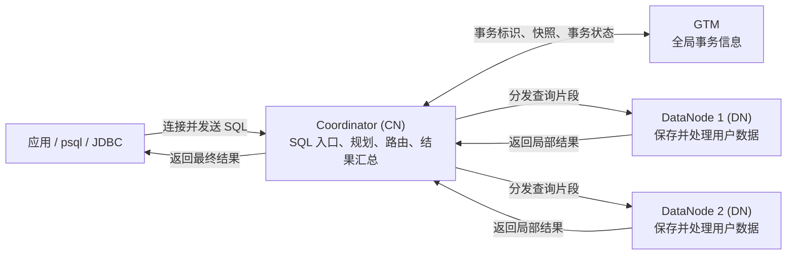

<!--
Copyright (C) 2026 OpenTenBase Authors. All rights reserved.
Licensed under the BSD 3-Clause License. See LICENSE.txt in the repository root.
-->

# OpenTenBase 架构术语表与新手导览

**语言**：[English](GLOSSARY.md) | [简体中文](GLOSSARY_ZH.md)

本文解释 OpenTenBase README、源码目录和部署配置中常见的架构术语，帮助新手在部署、建表或阅读源码前，先建立一套简洁而准确的分布式架构认知。

## 一张图理解 OpenTenBase

下图展示分布式模式下一条 SQL 的典型路径。它是面向新手的逻辑示意图；实际执行计划可能只访问部分 DataNode，也可能在 DataNode 之间交换中间数据。

| 组件 | 主要职责 | 不应误解为 |
| --- | --- | --- |
| 客户端 | 在分布式模式下连接 CN，并像访问一个数据库一样提交 SQL。 | 客户端不需要自行判断每行数据位于哪个 DN。 |
| Coordinator（CN） | 保存集群元数据，规划和路由 SQL，协调 DN 执行并汇总结果。 | CN 通常不是用户表数据行的主要存储位置，也不等同于传统单机数据库的主库。 |
| DataNode（DN） | 保存用户数据，执行本地扫描、写入、连接和聚合等任务。 | DN 不是只用于备份的从库，而是数据存储与计算节点。 |
| GTM | 管理全局事务标识、快照和事务状态等集群级事务信息。 | GTM 不保存业务表，也不执行用户查询计划。 |

一次典型查询可以简化为以下步骤：

1. 客户端连接 CN 并发送 SQL。
2. CN 解析和规划语句，根据表的分布元数据确定相关 DN。
3. 需要集群级事务信息时，CN 与 GTM 交互。
4. CN 向相关 DN 下发查询片段，各 DN 处理本地数据并返回局部结果。
5. CN 汇总结果并向客户端返回一个结果集。

## 核心术语

### 1. Coordinator（CN，协调节点）

分布式 OpenTenBase 集群的 SQL 接入和协调节点。CN 保存模式、节点和表位置等元数据，生成分布式执行计划，把任务发送到相关 DN，并合并执行结果。应用通常连接 CN，而不是绕过协调层直接修改某个 DN。

### 2. DataNode（DN，数据节点）

真正保存用户数据并执行本地计算的节点。分布表的数据可以分散在多个主 DN 上，使存储容量和计算工作能够由多个节点共同承担。

### 3. GTM（Global Transaction Manager，全局事务管理器）

为分布式集群提供全局事务信息的组件。它管理全局事务标识、快照和事务状态等内容，使 CN 与 DN 能够在一致的事务视图下协作。GTM 既不是 SQL 入口，也不是业务数据存储节点。

### 4. 分布式模式（`distributed`）

由 GTM、CN 和 DN 等角色共同组成的部署模式。客户端连接 CN，数据可放置在多个 DN 上，查询工作也可由多个节点并行完成。增加节点是否带来收益，取决于表的放置方式、数据分布和访问模式。

### 5. 集中式模式（`centralized`）

相对于完整分布式拓扑的简化部署模式。它不经过常见的“客户端 -> CN -> DN”分布式访问路径。集中式模式是一种不同的部署形态，不应理解成把 GTM、CN 和 DN 三个角色合并为同一个进程。

### 6. Shared-nothing（无共享）架构

各主 DN 拥有自己的计算、内存和存储资源，节点通过网络协作。它有利于横向扩展和并行处理，同时也使数据倾斜、跨节点通信和网络开销成为重要性能因素。

### 7. Node group（节点组）

由一个或多个 DN 组成的具名逻辑集合，用于限定表或数据的放置范围。节点组不是物理服务器，也不是 CN、GTM 的集合，更不等同于一组主备节点。

### 8. 数据分片与分片（Shard / Sharding）

数据分片是一张逻辑表中放在某个 DN 上的一部分数据；分片是把数据子集分散到多个 DN 的过程。数据分片用于横向扩展，不等同于 PostgreSQL 表分区，也不等同于高可用备节点。

### 9. 分布键（Distribution key）

用于帮助系统决定一行数据目标 DN 的一个或多个列。合适的分布键应尽量让数据均匀，并与常用过滤或连接条件相匹配，从而减少需要参与查询的节点数量和跨节点传输。

### 10. 分布表（Distributed table）

按照指定分布规则把不同行放到不同 DN 的逻辑表。单个 DN 通常只保存表的一部分数据。分布表可以分散容量和计算，但跨分片查询可能需要访问多个 DN 或移动中间数据。

### 11. 复制表（Replicated table）

在指定放置范围内，让每个参与 DN 保存完整副本的表。复制表适合数据量较小、经常参与连接的查找表或维表，但写入和存储成本会随副本数量增加。复制表不等同于节点级高可用备库。

### 12. 分布式查询计划

CN 为一条 SQL 生成的跨节点执行方案。计划可能把带有分布键条件的查询路由到少数 DN，把扫描或聚合下推到 DN，或者在跨分片操作中重新分布中间数据。并非每条查询都会访问所有 DN。

### 13. 全局事务、GXID 与全局快照

全局事务是需要多个节点共同参与并保持一致语义的逻辑事务。GXID 用于标识集群范围内的事务，全局快照用于建立一致的数据可见性视图。这些内容属于事务控制信息，不是业务数据副本。

### 14. 两阶段提交（2PC）

多节点写事务常用的原子提交协议。协调者先让参与节点进入准备阶段；全部准备成功后再统一提交，否则统一回滚。2PC 解决的是多个参与节点能否得到同一个提交结果，GTM 则提供相应的全局事务上下文。

### 15. `opentenbase_ctl` 与集群配置文件

`opentenbase_ctl` 是 OpenTenBase V5 的命令行部署和运维工具，可根据配置文件完成安装、删除、启动、停止、状态检查、远程命令和 SQL 执行等操作。配置文件描述部署模式、节点、软件包、SSH 和日志等信息。该工具负责配置和控制服务进程，但自身不是数据库服务进程。

## 容易混淆的概念

| 容易混淆 | 实际区别 |
| --- | --- |
| CN 与 GTM | CN 规划、路由并协调 SQL；GTM 管理全局事务信息。 |
| 节点组与数据分片 | 节点组是一组 DN；数据分片是一部分表数据。 |
| 分布表与复制表 | 分布表把不同数据行放到不同 DN；复制表让参与 DN 各保存完整副本。 |
| 复制表与备节点 | 复制表是表级数据放置策略；备节点是节点级高可用副本。 |
| 数据分片与表分区 | 数据分片解决跨 DN 的数据放置；表分区是表结构设计机制。 |
| `opentenbase_ctl` 与数据库服务 | 前者部署和控制节点；数据库进程与 GTM 才提供实际运行服务。 |
| 当前配置中的 master/slave 与分布表 | master/slave 描述节点主备关系；分布表描述表数据如何放置。 |

## 新手阅读路径

1. 先阅读 [项目概览与部署示例](README_ZH.md)，理解 CN、DN、GTM 的基本关系。
2. 再阅读 [`opentenbase_ctl` 使用说明](contrib/opentenbase_ctl/README.md)，了解拓扑和配置如何转化为实际节点。
3. 需要理解建表与数据放置时，阅读 [DDL 文档](doc/src/sgml/ddl.sgml) 中关于分布表、复制表和分布列的内容。
4. 进一步研究事务机制时，可从 `src/gtm/` 开始定位 GTM 相关实现。

> 本文旨在提供入门心智模型。具体行为应以当前分支的源码、配置示例和实际执行计划为准。
