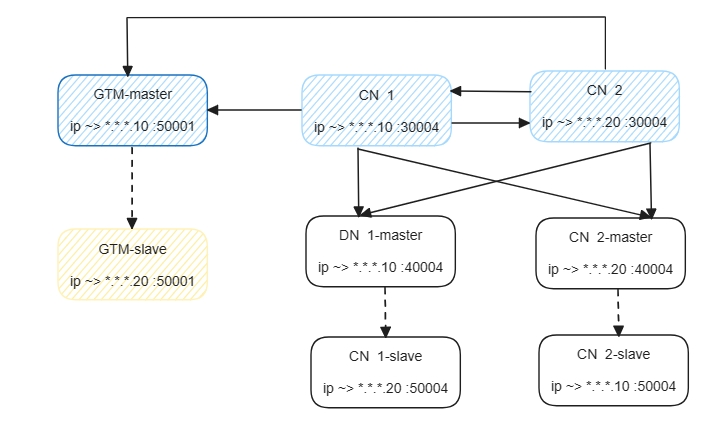
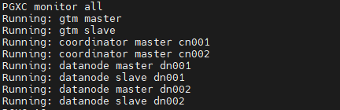

___
# OpenTenBase Database Management System
OpenTenBase is an advanced enterprise-level database management system based on prior work of Postgres-XL project. It supports an extended subset of the SQL standard, including transactions, foreign keys, user-defined types and functions. Additional, it adds parallel computing, security, management, audit and other functions.

OpenTenBase has many language interfaces similar to PostgreSQL, many of which are listed here:

	https://www.postgresql.org/download

## Overview
A OpenTenBase cluster consists of multiple CoordinateNodes, DataNodes, and GTM nodes. All user data resides in the DataNode, the CoordinateNode contains only metadata, the GTM for global transaction management. The CoordinateNodes and DataNodes share the same schema.

Users always connect to the CoordinateNodes, which divides up the query into fragments that are executed in the DataNodes, and collects the results.

The latest version of this software may be obtained at:

	https://github.com/OpenTenBase/OpenTenBase

For more information look at our website located at:

	https://www.opentenbase.org/

## Building
### System Requirements: 

Memory: 4G RAM minimum

OS: TencentOS 2, TencentOS 3, OpenCloudOS, CentOS 7, CentOS 8, Ubuntu

### Dependence

` yum -y install gcc make readline-devel zlib-devel openssl-devel uuid-devel bison flex`

or

` apt install -y gcc make libreadline-dev zlib1g-dev libssl-dev libossp-uuid-dev bison flex`

### Create User 'opentenbase'

```shell
mkdir /data
useradd -d /data/opentenbase -s /bin/bash -m opentenbase # add user opentenbase
passwd opentenbase # set password
```

### Building

```shell
git clone https://github.com/OpenTenBase/OpenTenBase

export SOURCECODE_PATH=/data/opentenbase/OpenTenBase
export INSTALL_PATH=/data/opentenbase/install

cd ${SOURCECODE_PATH}
rm -rf ${INSTALL_PATH}/opentenbase_bin_v2.0
chmod +x configure*
./configure --prefix=${INSTALL_PATH}/opentenbase_bin_v2.0 --enable-user-switch --with-openssl --with-ossp-uuid CFLAGS=-g
make clean
make -sj
make install
chmod +x contrib/pgxc_ctl/make_signature
cd contrib
make -sj
make install
```
**Notice: if you use Ubuntu and see *initgtm: command not found* while doing "init all", you may add *${INSTALL_PATH}/opentenbase_bin_v2.0/bin* to */etc/environment***

## Installation
Use the PGXC_CTL tool to build a cluster with disaster recovery capabilities in a minimal configuration, for example, set up the following components on two servers: 1 primary 1GTM (Global Transaction Management primary node), 1 standby 1GTM, 2 primary CNs (COORDINATOR primary nodes, mutually equal and do not require backup), 2 primary DNs (DATA NODE primary nodes), and 2 standby DNs. Please note that the minimum configuration requirement for the entire system is 2H8G.


### Preparation

Unlike source code compilation and installation, the following operations need to be successfully executed on each machine. Otherwise, it may result in the failure of binary installation package transmission on the host machine and the cluster being unable to communicate properly.

1. Install pgxc and import the path of pgxc installation package into environment variable.

    Execute `vim ~/.bashrc` to edit system environment variables.

    ```shell
    PG_HOME=${INSTALL_PATH}/opentenbase_bin_v2.0
    export PATH="$PATH:$PG_HOME/bin"
    export LD_LIBRARY_PATH="$LD_LIBRARY_PATH:$PG_HOME/lib"
    export LC_ALL=C
    ```

    Execute `source ~/.bashrc` to make the variables take effect, otherwise the terminal will prompt that commands like `pgxc_ctl` cannot be found.

2. Disable SELinux and firewall (optional)

    ```
    vi /etc/selinux/config # set SELINUX=disabled
    # Disable firewalld
    systemctl disable firewalld
    systemctl stop firewalld
    ```

3. Get through the SSH password free login between the machines where the cluster node is installed, and then deploy and init will SSH to the machines of each node. After getting through, you do not need to enter the password.

    ```
    ssh-keygen -t rsa
    ssh-copy-id -i ~/.ssh/id_rsa.pub destination-user@destination-server
    ```

### Cluster startup steps

Before starting the cluster, it is necessary to configure each node, including IP addresses, port numbers, database directories, binary directories, and other planning information. These configurations are done in the pgxc_ctl.conf file. The pgxc_ctl.conf file can be manually written or generated by the `pgxc_ctl` tool to create a template for the configuration file, which can then be modified accordingly. Ensure that the configuration of each node is accurate to guarantee the normal startup and operation of the cluster.

1. The first method of configuration is by manually writing the pgxc_ctl.conf file.

  ```shell
  [opentenbase@localhost ~]$ mkdir /data/opentenbase/pgxc_ctl
  [opentenbase@localhost ~]$ cd /data/opentenbase/pgxc_ctl
  [opentenbase@localhost ~/pgxc_ctl]$ vim pgxc_ctl.conf
  ```

  You can also download it from here, rename the file to `pgxc_ctl.conf`, and modify the content according to the actual situation.

  [Click here to download the dual-node configuration](https://docs.opentenbase.org/guide/pgxc_ctl_double.conf)

  [Click here to download the single-node configuration](https://docs.opentenbase.org/guide/pgxc_ctl_single.conf)

2. The second method is to generate a template configuration file using the `pgxc_ctl` tool, which requires filling in information about the cluster nodes in the template. After launching the `pgxc_ctl` tool, a `pgxc_ctl` directory will be created in the current user's home directory. Upon entering the "prepare config" command, a customizable configuration file template will be generated in the `pgxc_ctl` directory.

  * The pgxcInstallDir at the beginning of the configuration file refers to the installation package location of pgxc. The database user can set it according to his own needs.

  ```
  pgxcInstallDir=${INSTALL_PATH}/opentenbase_bin_v2.0
  ```

  * For GTM, you need to configure the node name, IP, port and node directory.

  ```
  #---- GTM ----------
  gtmName=gtm
  gtmMasterServer=xxx.xxx.xxx.10
  gtmMasterPort=50001
  gtmMasterDir=${GTM_MASTER_DATA_DIR}/data/gtm_master
  ```

  * If you do not need gtmSlave, you can directly set it to 'n' in the configuration of the corresponding node.

  ```
  gtmSlave=n
  ```

  If you need gtmSlave, configure it according to the instructions in the configuration file.

  * Coordination node, which needs to be configured with IP, port, directory, etc.

  ```
  coordMasterDir=/data/opentenbase/data/coord
  coordNames=(cn001 cn002 )
  coordPorts=(30004 30004 )
  poolerPorts=(31110 31110 )
  coordPgHbaEntries=(0.0.0.0/0)
  coordMasterServers=($IP_1 $IP_2)
  coordMasterDirs=($coordMasterDir $coordMasterDir)
  ```

  * Data node, similar to the above nodes: IP, port, directory, etc. (since there are two data nodes, you need to configure the same information as the number of nodes.)

  ```
  dn1MstrDir=/data/opentenbase/data/dn001
  dn2MstrDir=/data/opentenbase/data/dn002
  
  primaryDatanode=dn001
  datanodeNames=(dn001 dn002)
  datanodePorts=(40004 40004)
  datanodePoolerPorts=(41110 41110)
  datanodePgHbaEntries=(0.0.0.0/0)
  datanodeMasterServers=($IP_1 $IP_2)
  datanodeMasterDirs=($dn1MstrDir $dn2MstrDir)
  ```

  There are coordSlave and datanodeSlave corresponding to the coordination node and data node. If not, configure them as 'n'; otherwise, configure them according to the configuration file.

  In addition, two type ports: `poolerPort` and `port`, need to be configured for coordinator node and datanode. `poolerPort` is used by nodes to communicate with other nodes. `port` is the port used to login to the node. Here, `poolerPort` and `port` must be configured differently, otherwise there will be conflicts and the cluster cannot be started.

  Each node needs to have its own directory and cannot be created in the same directory.

3. Distribution of installation package(deploy all). After filling in the configuration file, run the pgxc\_ctl tool，and then input "deploy all" command to distribute the installation package to the IP machine of each node.
  

4. Initialize each node of the cluster(init all). After the distribution of the installation package is completed, input "init all" command in pgxc\_ctl tool to initialize all the nodes in the configuration file pgxc\_ctl.conf and start the cluster. So far, the cluster has been started.
  

5. View the cluster status using the "monitor all" command in the pgxc_ctl tool.

  

### Common error handling

1. When installing dependencies, if you encounter the error message "`Error: No match for argument: uuid-devel`," please do not attempt to install other similar uuid libraries, as uuid-devel is the correct dependency. Installing other uuid libraries will not resolve the issue. In CentOS, uuid-devel is included in a software repository called "PowerTools," which is not enabled by default. To enable this repository, you can use the following command: `dnf config-manager --set-enabled powertools`. If the `dnf` command is not installed on your system, first execute `yum install dnf-plugins-core`.
2. Please ensure that the remaining available memory capacity of the system is greater than 4GB when executing the `make -sj` command. Insufficient memory may lead to memory overflow, causing the system to hang and ultimately resulting in a failed compilation process.
3. When configuring, if the pgxc_ctl.conf file specifies the local IP address, it is important to note that during the execution of the `deploy all` phase, SSH connections will be involved. Therefore, it is necessary not only to ensure that SSH connections can be made to the IP addresses of other hosts but also to the local machine's IP address. This ensures that inter-host communication and operations can proceed smoothly during the deployment process.
4. In cases where a node fails to start normally, such as encountering the message `gtm_ctl: another server might be running; trying to start server anyway`, it may be due to the node not shutting down properly. Typically, you would need to manually delete the corresponding PID file to resolve the issue. If the issue persists even after deletion, it is recommended to check the relevant log files for further troubleshooting. Taking the example of a GTM node, you can perform the following steps: first, navigate to the corresponding log directory `cd /data/opentenbase/data/gtm/slave/gtm_log`, then review the related log information to gain a more detailed understanding of the issue.
5. Before making any configuration changes to the pgxc_ctl.conf file, it is recommended to first enter the "clean all" command in the pgxc_ctl tool to clear the state of the current cluster. Once the modifications are done, it is important to execute the "init all" command to ensure that the configuration changes are correctly applied to the entire cluster.

## Usage

```
$ psql -h ${CoordinateNode_IP} -p ${CoordinateNode_PORT} -U ${pgxcOwner} -d postgres

postgres=# create default node group default_group  with (dn001,dn002);
CREATE NODE GROUP
postgres=# create sharding group to group default_group;
CREATE SHARDING GROUP
postgres=# create table foo(id bigint, str text) distribute by shard(id);

```

## References  

```
https://docs.opentenbase.org/
```

## Who are using OpenTenBase
Tencent


## License

The OpenTenBase is licensed under the BSD 3-Clause License. Copyright and license information can be found in the file [LICENSE.txt](LICENSE.txt)

## Contributors
Thanks for all contributors here: [CONTRIBUTORS](CONTRIBUTORS.md)

## News and Events

|Latest|
|------|
|[Special Review of Cloud Native Open Source Project Application Practice](https://www.opentenbase.org/en/event/event-post-1/)|

## Blogs and Articals
|Blogs and Articals|
|------------------|
|[Quick Start](https://www.opentenbase.org/en/blog/01-quickstart/)|

## History
[history_events](history_events.md)
