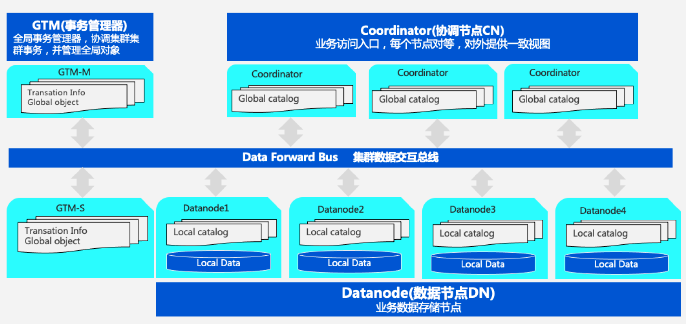

___
# OpenTenBase Database Management System

**Language**: [English](README.md) | [简体中文](README_ZH.md)

OpenTenBase is an advanced enterprise-level database management system based on prior work of Postgres-XL project. It supports an extended subset of the SQL standard, including transactions, foreign keys, user-defined types and functions. Additionally, it adds parallel computing, security, management, audit and other functions.

OpenTenBase has many language interfaces similar to PostgreSQL, many of which are listed here:

	https://www.postgresql.org/download

## Overview
An OpenTenBase cluster consists of multiple CoordinateNodes, DataNodes, and GTM nodes. All user data resides in the DataNodes, the CoordinateNode contains only metadata, the GTM is for global transaction management. The CoordinateNodes and DataNodes share the same schema.

Users always connect to the CoordinateNodes, which divide up the query into fragments that are executed in the DataNodes, and collect the results.

The latest version of this software may be obtained at:

	https://github.com/OpenTenBase/OpenTenBase

For more information look at our website located at:

	https://www.opentenbase.org/

## Building
### System Requirements: 

Memory: 8G RAM minimum

OS: TencentOS 2, TencentOS 3, OpenCloudOS 8.x, OpenCloudOS 9, CentOS 7, CentOS 8, Ubuntu 18.04

### Dependencies

**yum / dnf (RHEL family):**

```
yum -y install git sudo gcc gcc-c++ make readline-devel zlib-devel openssl-devel uuid-devel \
  bison flex cmake postgresql-devel libssh2-devel sshpass libcurl-devel libxml2-devel \
  libxslt-devel perl-ExtUtils-Embed python3-devel libicu-devel pam-devel \
  libevent-devel libyaml-devel lz4-devel libzstd-devel
```

**apt (Debian family):**

```
apt install -y git sudo gcc g++ make libreadline-dev zlib1g-dev libssl-dev libossp-uuid-dev \
  bison flex cmake libpq-dev libssh2-1-dev sshpass libcurl4-openssl-dev libxml2-dev \
  libxslt1-dev libperl-dev python3-dev libicu-dev libpam0g-dev \
  libevent-dev libyaml-dev liblz4-dev libzstd-dev language-pack-zh-hans
```

> **Note**: Some distributions (such as OpenCloudOS 9) may not include `cli11-devel` in their repositories. If the build reports a CLI11-related error, install it from the [CLI11 source](https://github.com/CLIUtils/CLI11) or skip with the `--without-cli11` option.


### Create User 'opentenbase'

```bash
# 1. Make directory /data
mkdir -p /data

# 2. Add user 
useradd -d /data/opentenbase -s /bin/bash -m opentenbase # add user opentenbase

# 3. Set password
passwd opentenbase # set password

# 4. Add users to the wheel group
# For RedHat
usermod -aG wheel opentenbase
# For Debian
usermod -aG sudo opentenbase

# 5. Enable sudo permissions for the wheel group (via visudo)
visudo 
# Then uncomment the line "% wheel", save and exit
```

### Building

```bash
su - opentenbase
cd /data/opentenbase/

# Direct GitHub clone (recommended when network is good)
git clone https://github.com/OpenTenBase/OpenTenBase

# Alternative 1: use ghfast.top proxy for acceleration
# git clone https://ghfast.top/https://github.com/OpenTenBase/OpenTenBase.git

# Alternative 2: use the Gitee mirror
# git clone https://gitee.com/opentenbase/OpenTenBase.git

export SOURCECODE_PATH=/data/opentenbase/OpenTenBase
export INSTALL_PATH=/data/opentenbase/install/

cd ${SOURCECODE_PATH}
rm -rf ${INSTALL_PATH}/opentenbase_bin_v5.0
chmod +x configure*
# --disable-license is equivalent to -DNOLIC; either one is sufficient
./configure --prefix=${INSTALL_PATH}/opentenbase_bin_v5.0 --enable-user-switch --with-libxml --disable-license --with-openssl --with-ossp-uuid CFLAGS="-g"
make clean
make -sj
make install
chmod +x contrib/pgxc_ctl/make_signature
cd contrib
make -sj
make install
```

## Installation
Use OPENTENBASE\_CTL tool to build a cluster, for example: a cluster with a global transaction management node (GTM), a coordinator(COORDINATOR) and two data nodes (DATANODE).

### Preparation

#### 1. Install opentenbase and import the path of opentenbase installation package into environment variable.

It is recommended to write the environment variables to `~/.bash_profile` (not `~/.bashrc`) so they are loaded automatically on login:

```bash
# Write to ~/.bash_profile
cat >> ~/.bash_profile <<'EOF'

# OpenTenBase environment variables
PG_HOME=${INSTALL_PATH}/opentenbase_bin_v5.0
export PATH="$PG_HOME/bin:$PATH"
export LD_LIBRARY_PATH="$PG_HOME/lib:$LD_LIBRARY_PATH"
export LC_ALL=C
EOF

# Apply immediately
source ~/.bash_profile

# Verify
which psql
echo $LD_LIBRARY_PATH
```

> **Note**: `LD_LIBRARY_PATH` must be set correctly, otherwise `psql`, `pg_ctl`, and other tools will report `error while loading shared libraries`. If `PATH` does not take effect, check whether `~/.bashrc` is overriding the `~/.bash_profile` settings.

#### 2. Disable SELinux and firewall (optional)

```
vi /etc/selinux/config
set SELINUX=disabled

# Disable firewalld
sudo systemctl disable firewalld
sudo systemctl stop firewalld
```

> **Note**: OpenCloudOS 9 / some CentOS minimal installations do not ship `firewalld` by default; the commands above will report `Unit firewalld.service could not be found`. In that case use one of the following:
>
> ```
> # Option 1: use iptables
> sudo systemctl stop iptables
> sudo systemctl disable iptables
>
> # Option 2: use nftables
> sudo systemctl stop nftables
> sudo systemctl disable nftables
>
> # Option 3: only open the OpenTenBase ports (recommended for production)
> sudo firewall-cmd --add-port=30001/tcp --permanent  # GTM
> sudo firewall-cmd --add-port=30004/tcp --permanent  # CN
> sudo firewall-cmd --add-port=30006-30007/tcp --permanent  # DN
> sudo firewall-cmd --reload
> # Without firewalld, use iptables:
> # sudo iptables -A INPUT -p tcp --dport 30001 -j ACCEPT
> # sudo iptables -A INPUT -p tcp --dport 30004 -j ACCEPT
> ```

#### 3. Create the *.tar.gz package for initializing instances.

1）If you are compiling from source code, after compilation, you can navigate to the compilation result directory using 'cd ${INSTALL_PATH}' and then package it.

For example: opentenbase-5.21.8-i.x86_64.tar.gz. The packaging process and the package structure information are as follows:
```
[opentenbase@VM-32-23-tencentos opentenbase]$ cd ${INSTALL_PATH}
[opentenbase@VM-32-23-tencentos opentenbase]$ ls
bin  include  lib  share
[opentenbase@VM-32-23-tencentos opentenbase]$ tar zcf opentenbase-5.21.8-i.x86_64.tar.gz *
[opentenbase@VM-32-23-tencentos opentenbase]$ ls
bin  include  lib  share  opentenbase-5.21.8-i.x86_64.tar.gz

```
2）If you have obtained an RPM package, you can use the command 'rpm2cpio opentenbase-5.21.8-i.x86_64.rpm | cpio -idmv' to extract the RPM package in the current directory. Then, navigate to the corresponding directory and package it into a *.tar.gz format.
```
[opentenbase@VM-32-21-tencentos ~/install/opentenbase_bin_v5.0/bin]$ rpm2cpio opentenbase-5.21.8-i.x86_64.rpm | cpio -idmv
[opentenbase@VM-32-21-tencentos ~/install/opentenbase_bin_v5.0/bin]$ cd ./usr/local/install/opentenbase/
[opentenbase@VM-32-21-tencentos ~/install/opentenbase_bin_v5.0/bin/usr/local/install/opentenbase]$ ls
bin  include  lib  share
[opentenbase@VM-32-21-tencentos ~/install/opentenbase_bin_v5.0/bin/usr/local/install/opentenbase]$ tar -zcf opentenbase-5.21.8-i.x86_64.tar.gz *
[opentenbase@VM-32-21-tencentos ~/install/opentenbase_bin_v5.0/bin/usr/local/install/opentenbase]$ ls
bin  include  lib  opentenbase-5.21.8-i.x86_64.tar.gz  share

```

#### 4. Configure SSH passwordless login (required for multi-node deployment)

For multi-node deployment, `opentenbase_ctl` operates on each node through SSH, so passwordless login must be configured in advance. Single-node deployment also benefits from this to avoid password prompts on local SSH operations.

```bash
# Run as the opentenbase user
su - opentenbase

# Generate the key pair (non-interactive, no passphrase)
mkdir -p ~/.ssh && chmod 700 ~/.ssh
ssh-keygen -t rsa -b 4096 -f ~/.ssh/id_rsa -N "" -C "opentenbase@localhost"

# Add the public key to authorized_keys
cat ~/.ssh/id_rsa.pub >> ~/.ssh/authorized_keys
chmod 600 ~/.ssh/authorized_keys

# For multi-node deployment, also copy the public key to every node:
# ssh-copy-id -i ~/.ssh/id_rsa.pub opentenbase@<remote_node_ip>

# Verify passwordless login
ssh opentenbase@localhost echo "SSH OK"
```

### Cluster startup steps

#### Generate and fill in configuration file opentenbase\_config.ini .
opentenbase\_ctl tool can generate a template for the configuration file. You need to fill in the cluster node information in the template. After the opentenbase\_ctl tool is started, opentenbase\_ctl directory will be generated in the current user's home directory. After entering " prepare config" command, the configuration file template that can be directly modified will be generated in opentenbase\_ctl directory.

* Description of each field in opentenbase\_config.ini
```
| Configuration Category | Configuration Item | Description                                                                |
|------------------------|-------------------|----------------------------------------------------------------------------|
| instance               | name              | Instance name, available characters: letters, numbers, underscores, e.g.: opentenbase_instance01 |
|                        | type              | distributed represents distributed mode, requires gtm, coordinator and data nodes; centralized represents centralized mode |
|                        | package           | Software package. Full path (recommended) or relative path to opentenbase_ctl |
| gtm                    | master            | Master node, only one IP                                                   |
|                        | slave             | Slave nodes. If n slave nodes are needed, configure n IPs here, separated by commas |
| coordinators           | master            | Master node IPs, automatically generate node names, deploy nodes-per-server nodes on each IP |
|                        | slave             | Slave node IPs, the number is an integer multiple of master               |
|                        |                   | Example: If 1 master 1 slave, the number of IPs is the same as master; if 1 master 2 slaves, the number of IPs is twice that of master |
|                        | nodes-per-server  | Optional, default 1. Number of nodes deployed on each IP. Example: master has 3 IPs, configured as 2, then there will be 6 nodes |
|                        |                   | cn001-cn006 total 6 nodes, 2 nodes distributed on each server            |
| datanodes              | master            | Master node IPs, automatically generate node names, deploy nodes-per-server nodes on each IP |
|                        | slave             | Slave node IPs, the number is an integer multiple of master               |
|                        |                   | Example: If 1 master 1 slave, the number of IPs is the same as master; if 1 master 2 slaves, the number of IPs is twice that of master |
|                        | nodes-per-server  | Optional, default 1. Number of nodes deployed on each IP. Example: master has 3 IPs, configured as 2, then there will be 6 nodes |
|                        |                   | dn001-dn006 total 6 nodes, 2 nodes distributed on each server            |
| server                 | ssh-user          | Username for remote command execution, needs to be created in advance, all servers should have the same account for simpler configuration management |
|                        | ssh-password      | Password for remote command execution, needs to be created in advance, all servers should have the same password for simpler configuration management |
|                        | ssh-port          | SSH port, all servers should be consistent for simpler configuration management |
| log                    | level             | Log level for opentenbase_ctl tool execution (not the log level of opentenbase nodes) |

```

#### 1. Create a configuration file opentenbase\_config.ini for the instance
```
touch opentenbase_config.ini
vim opentenbase_config.ini
```

* For example, if I have two servers 172.16.16.49 and 172.16.16.131, the typical configuration of a distributed instance distributed across the two servers is as follows. You can copy this configuration information and make modifications according to your deployment requirements. Don't forget to fill in the ssh password configuration.
```
# Instance configuration
[instance]
name=opentenbase01
type=distributed
package=/data/opentenbase/install/opentenbase-5.21.8-i.x86_64.tar.gz

# GTM nodes
[gtm]
master=172.16.16.49
slave=172.16.16.50,172.16.16.131

# Coordinator nodes
[coordinators]
master=172.16.16.49
slave= 172.16.16.131
nodes-per-server=1

# Data nodes
[datanodes]
master=172.16.16.49,172.16.16.131
slave=172.16.16.131,172.16.16.49
nodes-per-server=1

# Login and deployment account
[server]
ssh-user=opentenbase
ssh-password=
ssh-port=36000

# Log configuration
[log]
level=DEBUG
```


* Similarly, the configuration of a typical centralized instance is as follows. Don't forget to fill in the ssh password configuration.
```
# Instance configuration
[instance]
name=opentenbase02
type=centralized
package=/data/opentenbase/install/opentenbase-5.21.8-i.x86_64.tar.gz

# Data nodes
[datanodes]
master=172.16.16.49
slave=172.16.16.131
nodes-per-server=1

# Login and deployment account
[server]
ssh-user=opentenbase
ssh-password=
ssh-port=36000

# Log configuration
[log]
level=DEBUG
```

* For a single-node centralized instance (simplest path for getting started on a single machine), the configuration is as follows. No `slave=` line is required for centralized mode, and the `[gtm]` block should be omitted because the centralized mode reuses a built-in GTM:
```
# Instance configuration
[instance]
name=opentenbase_single
type=centralized
package=/data/opentenbase/install/opentenbase-5.21.8-i.x86_64.tar.gz

# Data nodes (single node, no slave)
[datanodes]
master=127.0.0.1
nodes-per-server=1

# Login and deployment account
[server]
ssh-user=opentenbase
ssh-password=
ssh-port=22

# Log configuration
[log]
level=DEBUG
```
Port planning for this single-node setup:
| Node | Role | Default port | Description |
|------|------|---------|------|
| dn0001 | DataNode | 20001 | Data node |
| cn0001 | Coordinator | 5432 | Coordinator (client connection entry) |

> In centralized mode, the GTM is embedded in the CN, so no standalone GTM process or port is needed.

#### 2. Execute command for instance installation.

```
opentenbase_ctl install  -c opentenbase_config.ini

====== Start to Install Opentenbase test_cluster01  ====== 

step 1: Make *.tar.gz pkg ...
    Make opentenbase-5.21.8-i.x86_64.tar.gz successfully.

step 2: Transfer and extract pkg to servers ...
    Package_path: /data/opentenbase/opentenbase_ctl/opentenbase-5.21.8-i.x86_64.tar.gz
    Transfer and extract pkg to servers successfully.

step 3: Install gtm master node ...
    Install gtm0001(172.16.16.49) ...
    Install gtm0001(172.16.16.49) successfully
    Success to install  gtm master node. 

step 4: Install cn/dn master node ...
    Install cn0001(172.16.16.49) ...
    Install dn0001(172.16.16.49) ...
    Install dn0002(172.16.16.131) ...
    Install cn0001(172.16.16.49) successfully
    Install dn0001(172.16.16.49) successfully
    Install dn0002(172.16.16.131) successfully
    Success to install all cn/dn master nodes. 

step 5: Install slave nodes ...
    Install gtm0002(172.16.16.131) ...
    Install cn0001(172.16.16.131) ...
    Install dn0001(172.16.16.131) ...
    Install dn0002(172.16.16.49) ...
    Install gtm0002(172.16.16.131) successfully
    Install dn0002(172.16.16.49) successfully
    Install dn0001(172.16.16.131) successfully
    Install cn0001(172.16.16.131) successfully
    Success to install all slave nodes. 

step 6:Create node group ...
    Create node group successfully. 

====== Installation completed successfully  ====== 
```
* When you see the words 'Installation completed successfully', it means that the installation has been completed. Enjoy your opentenbase journey to the fullest.

> **Note**: The `opentenbase_ctl install` command only runs `initdb` and prepares the cluster files; it does **not** automatically start the cluster. After installation finishes, start the cluster with:
> ```
> opentenbase_ctl start -c opentenbase_config.ini
> ```
> You can then check the status with `opentenbase_ctl status -c opentenbase_config.ini`.
* You can check the status of the instance
```
[opentenbase@VM-16-49-tencentos opentenbase_ctl]$ ./opentenbase_bin_v5.0/bin/opentenbase_ctl status -c opentenbase_config.ini

------------- Instance status -----------  
Instance name: test_cluster01
Version: 5.21.8

-------------- Node status --------------  
Node gtm0001(172.16.16.49) is Running 
Node dn0001(172.16.16.49) is Running 
Node dn0002(172.16.16.49) is Running 
Node cn0001(172.16.16.49) is Running 
Node dn0002(172.16.16.131) is Running 
Node cn0001(172.16.16.131) is Running 
Node gtm0002(172.16.16.131) is Running 
Node dn0001(172.16.16.131) is Running 
[Result] Total: 8, Running: 8, Stopped: 0, Unknown: 0

------- Master CN Connection Info -------  
[1] cn0001(172.16.16.49)  
Environment variable: export LD_LIBRARY_PATH=/data/opentenbase/install/opentenbase/5.21.8/lib  && export PATH=/data/opentenbase/install/opentenbase/5.21.8/bin:${PATH} 
PSQL connection: psql -h 172.16.16.49 -p 11000 -U opentenbase postgres 
```


## Common Errors and Troubleshooting

The following common issues may be encountered when deploying and using OpenTenBase. They are grouped by category, with the symptom, root cause, and solution for each.

### Environment

| Symptom | Root cause | Solution |
|---------|-----------|----------|
| `systemctl stop firewalld` reports `Unit firewalld.service could not be found` | OpenCloudOS 9 / some CentOS minimal installations do not ship `firewalld`; they use `iptables`/`nftables` instead | Use `systemctl stop iptables` or `systemctl stop nftables`; or open only the required ports |
| `dnf install` cannot find `cli11-devel` | The package is not shipped in some distribution repositories | Build it from the [CLI11 source](https://github.com/CLIUtils/CLI11), or skip it with the `--without-cli11` option |
| `make` reports missing `libzstd` / `lz4` static libraries | `libzstd-devel` / `lz4-devel` are not pre-installed | `dnf install -y libzstd-devel lz4-devel` |
| `git clone` times out or is extremely slow | GitHub network is unstable | Use the `ghfast.top` proxy prefix or the Gitee mirror (see the "Building" section for alternatives) |

### Compilation

| Symptom | Root cause | Solution |
|---------|-----------|----------|
| `contrib` build reports `Permission denied` | The `make_signature` file is not executable | Run `chmod +x contrib/pgxc_ctl/make_signature` **before** `cd contrib` |
| `make install` reports `Permission denied` | The `--prefix` path is not writable by the current user | `chown -R opentenbase:opentenbase ${INSTALL_PATH}` |
| `configure` reports `libxml2 not found` | `libxml2-devel` is not installed | `dnf install -y libxml2-devel` |
| `make` reports `fatal error: libxslt/xslt.h: No such file` | `libxslt-devel` is not installed | `dnf install -y libxslt-devel` |

### Startup

| Symptom | Root cause | Solution |
|---------|-----------|----------|
| `opentenbase_ctl install` reports `Failed to parse configuration file` | The parser misbehaves when `[datanodes].slave=` is empty | In centralized single-node mode, omit the `slave=` line entirely |
| `opentenbase_ctl install` reports a GTM connection failure | Centralized mode has no standalone GTM process, but the configuration still contains a `[gtm]` block | In centralized mode, keep only `[datanodes]` + `[server]` + `[log]` |
| `pg_ctl start` exits without leaving a running process | The node type was not specified | You must add `-Z datanode` (or `-Z coordinator`) |
| `opentenbase_ctl install` finishes but no node is running | The `install` command only runs `initdb`; it does not auto-start the cluster | Run `opentenbase_ctl start -c opentenbase_config.ini` afterwards |
| `opentenbase_ctl` reports `pg_config: command not found` | `PATH` does not include `$PG_HOME/bin` | Verify the environment variables are set and run `source ~/.bash_profile` |

### Connection

| Symptom | Root cause | Solution |
|---------|-----------|----------|
| `psql` cannot connect to the CN | `pg_hba.conf` does not allow the local network segment | Add `host all all 0.0.0.0/0 md5` or a `trust` rule for the local IP |
| Environment variable `PATH` does not take effect | `~/.bashrc` is overriding `~/.bash_profile` | Put the environment variables at the top of `~/.bash_profile` and `source` it; or merge/remove the duplicates |
| `psql` reports `server closed the connection unexpectedly` | `listen_addresses` is not opened up | Set `listen_addresses = '*'` in `postgresql.conf` |
| `psql` reports `error while loading shared libraries` | `LD_LIBRARY_PATH` does not include `$PG_HOME/lib` | Confirm `LD_LIBRARY_PATH` is set in `~/.bash_profile` and run `source` |


## Usage
* Connect to CN Master node to execute SQL

```
export LD_LIBRARY_PATH=/home/opentenbase/install/opentenbase/5.21.8/lib  && export PATH=/home/opentenbase/install/opentenbase/5.21.8/bin:${PATH} 
$ psql -h ${CoordinateNode_IP} -p ${CoordinateNode_PORT} -U opentenbase -d postgres

postgres=# 

```

## References  

```
https://docs.opentenbase.org/
```

## Who are using OpenTenBase
Tencent


## License

The OpenTenBase is licensed under the BSD 3-Clause License. Copyright and license information can be found in the file [LICENSE.txt](LICENSE.txt)

## Contributors
Thanks for all contributors here: [CONTRIBUTORS](CONTRIBUTORS.md)

## News and Events

|Latest|
|------|
|[Special Review of Cloud Native Open Source Project Application Practice](https://www.opentenbase.org/en/event/event-post-1/)|

## Blogs and Articles
|Blogs and Articles|
|------------------|
|[Quick Start](https://www.opentenbase.org/en/blog/01-quickstart/)|

## History
[history_events](history_events.md)
