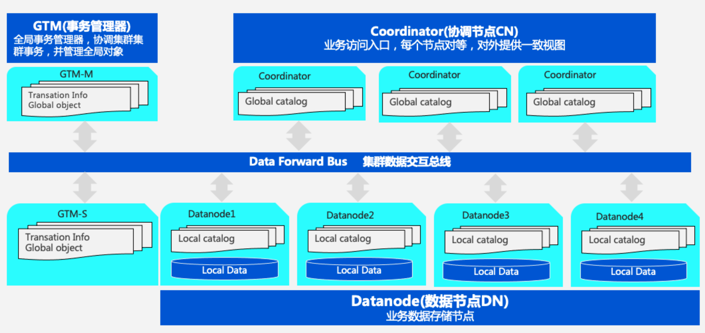

___
# OpenTenBase 数据库管理系统
OpenTenBase 是基于 Postgres-XL 项目的先进企业级数据库管理系统。它支持SQL标准的扩展子集，包括事务、外键、用户定义类型和函数。此外，它还添加了并行计算、安全性、管理、审计和其他功能。

OpenTenBase具有许多类似于PostgreSQL的语言接口，其中的一些可以在下面的链接中找到：

	https://www.postgresql.org/download


## 概览
一个 OpenTenBase 集群由多个 `CoordinateNodes` 、`DataNodes` 和 `GTM` 节点组成。所有用户数据都存储在 `DataNode` 中，`CoordinateNode` 仅包含元数据，`GTM` 则用于全局事务管理。`CoordinateNodes` 和`DataNodes` 共享相同的视图。

用户始终连接到 `CoordinateNodes`，它将查询分片为在 `DataNodes` 中执行的片段，并收集结果。

您可以在以下的链接获取 OpenTenBase 软件的最新版本：

	https://github.com/OpenTenBase/OpenTenBase

更多的信息则可以从我们的网站中获取到：

	opentenbase.github.io/website

## 构建过程
### 系统要求

内存: 最小 4G RAM

操作系统: TencentOS 2, TencentOS 3, OpenCloudOS, CentOS 7, CentOS 8, Ubuntu等

### 安装依赖

` yum -y install gcc make readline-devel zlib-devel openssl-devel uuid-devel bison flex`

或者

` apt install -y gcc make libreadline-dev zlib1g-dev libssl-dev libossp-uuid-dev bison flex`

### 创建用户 'opentenbase'

```shell
mkdir /data
useradd -d /data/opentenbase -s /bin/bash -m opentenbase # add user opentenbase
passwd opentenbase # set password
```

### 编译

```shell
git clone https://github.com/OpenTenBase/OpenTenBase

export SOURCECODE_PATH=/data/opentenbase/OpenTenBase
export INSTALL_PATH=/data/opentenbase/install

cd ${SOURCECODE_PATH}
rm -rf ${INSTALL_PATH}/opentenbase_bin_v2.0
chmod +x configure*
./configure --prefix=${INSTALL_PATH}/opentenbase_bin_v2.0 --enable-user-switch --with-openssl --with-ossp-uuid CFLAGS=-g
make clean
make -sj
make install
chmod +x contrib/pgxc_ctl/make_signature
cd contrib
make -sj
make install
```
**注意: 如果您使用 Ubuntu 并且在"init all"的过程中出现了 `initgtm: command not found`错误, 你可以需要添加 `${INSTALL_PATH}/opentenbase_bin_v2.0/bi` 到 `/etc/environment`中**

## 安装
使用 PGXC\_CTL 工具 来搭建一个集群, 例如: 搭建一个具有1个 global transaction management(GTM) 节点, 1个 coordinator(COORDINATOR)节点以及2个 data nodes (DATANODE) 节点的集群。


### 准备工作

1. 安装 `pgxc` 并且把 `pgxc` 安装包的路径导入到系统环境变量中

    ```shell
	PG_HOME=${INSTALL_PATH}/opentenbase_bin_v2.0
	export PATH="$PATH:$PG_HOME/bin"
	export LD_LIBRARY_PATH="$LD_LIBRARY_PATH:$PG_HOME/lib"
	export LC_ALL=C
    ```

2. 关掉 `SELinux` 和 `firewall` (可选的)

    ```
	vi /etc/selinux/config # set SELINUX=disabled
	# Disable firewalld
    systemctl disable firewalld
    systemctl stop firewalld
    ```
    
3. 实现集群节点所在机器之间的 `ssh` 无密码登录，然后进行部署和初始化将会通过 `ssh` 连接到每个节点的机器。一旦完成这一步，就无需输入密码

    ```
	ssh-keygen -t rsa
	ssh-copy-id -i ~/.ssh/id_rsa.pub destination-user@destination-server
    ```

### 集群启动步骤

1. 生成并填写配置文件 `pgxc_ctl.conf`。`pgxc_ctl` 工具可以生成配置文件的模板，需要在模板中填写集群节点的信息。启动 `pgxc_ctl` 工具后，将在当前用户的主目录中生成 `pgxc_ctl` 目录。在输入 "prepare config" 命令后，将在 `pgxc_ctl` 目录中生成可直接修改的配置文件模板。

	* 配置文件开头的 `pgxcInstallDir` 指的是 `pgxc` 安装包的存放位置, 数据库用户可以根据自己的需求进行设置

	```
	pgxcInstallDir=${INSTALL_PATH}/opentenbase_bin_v2.0
	```

	* 对于GTM节点，您需要配置节点名称、IP端口、端口号和节点目录

	```
	#---- GTM ----------
	gtmName=gtm
	gtmMasterServer=xxx.xxx.xxx.1
	gtmMasterPort=50001
	gtmMasterDir=${GTM_MASTER_DATA_DIR}/data/gtm_master
	```

	* 如果您不需要`gtmSlave`，您可以直接在相应节点的配置中将其设置为`n`

	```
	gtmSlave=n
	```

	如果您需要`gtmSlave`，则可以按照配置文件中的说明进行配置。

	* Coordination节点要配置IP、端口、目录等信息

	```
	coordNames=(cn001)
	coordMasterCluster=(opentenbase_cluster)
	coordPorts=(30004)
	poolerPorts=(30014)
	coordPgHbaEntries=(0.0.0.0/0)
	coordMasterServers=(xxx.xxx.xxx.2)
	coordMasterDirs=(${COORD_MASTER_DATA_DIR}/data/cn_master/cn001)
	```

	* Data节点与上述节点类似：需要配置IP地址、端口号、目录等（由于有两个数据节点，您需要配置与节点数量相同的信息）。

	```
	primaryDatanode=dn001
	datanodeNames=(dn001 dn002)
	datanodePorts=(20008 20009)
	datanodePoolerPorts=(20018 20019)
	datanodeMasterCluster=(opentenbase_cluster opentenbase_cluster)
	datanodePgHbaEntries=(0.0.0.0/0)
	datanodeMasterServers=(xxx.xxx.xxx.3 xxx.xxx.xxx.4)
	datanodeMasterDirs=(${DATANODE_MASTER_DATA_DIR}/data/dn_master/dn001 ${DATANODE_MASTER_DATA_DIR}/data/dn_master/dn002)
	```

	Coordination节点和Data节点分别对应 `coordSlave` 和 `datanodeSlave`。如果不需要这些节点，则可以将它们配置为'n'；否则，需要根据配置文件的说明进行配置。

	此外，Coordination节点和Data节点需要配置两种类型的端口：`poolerPort` 和 `port`, `poolerPort` 用于节点之间的通信，`port` 用于用户登陆节点。值得注意的是，`poolerPort` 和 `port` 必须配置不同，否则会发生冲突，导致集群无法启动。

	每个节点都需要有自己的目录，并且不能配置位相同的目录。

3. 安装包的分发（全节点部署）。在填写好配置文件后，运行 `pgxc_ctl` 工具，然后输入 "deploy all" 命令，将安装包分发到每个节点的IP机器上。


4. 初始化集群的每个节点（全节点初始化）。在安装包分发完成后，在 `pgxc_ctl` 工具中输入 "init all" 命令，初始化配置文件 `pgxc_ctl.conf` 中的所有节点，并启动集群。到目前为止，集群已经完成启动。


## 使用

```
$ psql -h ${CoordinateNode_IP} -p ${CoordinateNode_PORT} -U ${pgxcOwner} -d postgres

postgres=# create default node group default_group  with (dn001,dn002);
CREATE NODE GROUP
postgres=# create sharding group to group default_group;
CREATE SHARDING GROUP
postgres=# create table foo(id bigint, str text) distribute by shard(id);

```

## 引用  

```
opentenbase.github.io/docs
```

## 许可

OpenTenBase 使用 BSD 3-Clause 许可证，版权和许可信息可以在 [LICENSE.txt](LICENSE.txt) 中找到。

## 贡献者
感谢所有参与项目贡献的人: [CONTRIBUTORS](CONTRIBUTORS.md)

## 最新消息和活动

|新闻|
|------|
|[开放原子校源行走进苏南，加速开源人才培养和创新能力提升](https://mp.weixin.qq.com/s/SU5NYTcKQPyHqfiT4OXp8Q)|
|[OpenTenBase首亮相，腾讯云数据库开源取得重大突破](https://www.opentenbase.org/news/news-post-3/)|
|[开放原子校源行走进西部，加速开源人才培养](https://www.opentenbase.org/event/event-post-3/)|
|[开源数据库OpenTenBase获信通院“OSCAR尖峰开源项目优秀案例”奖](https://www.opentenbase.org/news/news-post-2/)|
|[开放原子开源基金会赴黑龙江科技大学走访交流](https://www.opentenbase.org/event/event-post-2/)|

## 博客和文章
|博客和文章|
|------------------|
|[快速入门](https://www.opentenbase.org/blog/01-quickstart/)|

## 过去的活动
[history_events](history_events.md)
