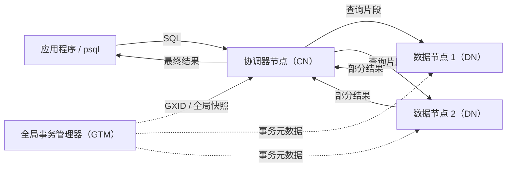

___
# OpenTenBase 数据库管理系统

OpenTenBase 是基于 Postgres-XL 项目的先进企业级数据库管理系统。它支持SQL标准的扩展子集，包括事务、外键、用户定义类型和函数。此外，它还添加了并行计算、安全性、管理、审计和其他功能。

OpenTenBase具有许多类似于PostgreSQL的语言接口，其中的一些可以在下面的链接中找到：

	https://www.postgresql.org/download

## 概览
一个 OpenTenBase 集群由多个 CoordinateNodes、DataNodes 和 GTM 节点组成。所有用户数据都存储在 DataNodes 中，CoordinateNode 仅包含元数据，GTM 用于全局事务管理。CoordinateNodes 和 DataNodes 共享相同的模式。

用户总是连接到 CoordinateNodes，CoordinateNodes 将查询分解为在 DataNodes 中执行的片段，并收集结果。

### 架构速览

下图中的实线表示查询与数据路径，虚线表示事务元数据路径。GTM 不存储用户表，也不执行查询片段。


```mermaid
flowchart LR
    APP["应用程序 / psql"]
    CN["协调器节点（CN）"]
    DN1["数据节点 1（DN）"]
    DN2["数据节点 2（DN）"]
    GTM["全局事务管理器（GTM）"]

    APP -->|"SQL"| CN
    CN -->|"查询片段"| DN1
    CN -->|"查询片段"| DN2
    DN1 -->|"部分结果"| CN
    DN2 -->|"部分结果"| CN
    CN -->|"最终结果"| APP

    GTM -.->|"GXID / 全局快照"| CN
    GTM -.->|"事务元数据"| DN1
    GTM -.->|"事务元数据"| DN2
```

因此，一次请求通常会经过以下步骤：

1. 客户端连接 CN 并发送 SQL。
2. CN 解析和规划 SQL，判断需要哪些 DN 参与，再向各 DN 下发查询片段。
3. DN 读取或修改本地数据并返回部分结果；CN 汇总后将最终结果返回客户端。
4. 对于分布式事务，GTM 提供集群级事务标识和可见性信息，供 CN 与 DN 共同使用。

### 核心架构术语表

| 术语 | 面向新手的解释 |
|------|----------------|
| **无共享架构（Share-Nothing）** | 每个数据库节点独占自己的 CPU、内存和存储，而不是共享同一个存储引擎。节点通过网络交换数据，因此可以通过增加节点扩展容量和算力。 |
| **协调器节点（Coordinator / CoordinateNode，CN）** | 应用连接数据库的 SQL 入口。CN 负责解析和规划 SQL、把任务路由到所需 DN，并汇总执行结果。它保存集群元数据，但不保存用户表数据行。 |
| **数据节点（DataNode，DN）** | 保存用户表数据并执行查询本地部分的节点。一张表的数据可以分布在多个 DN 上，也可以复制到多个 DN。 |
| **全局事务管理器（Global Transaction Manager，GTM）** | 分配全局事务标识并提供全局快照的集群服务，使不同 CN、DN 上的操作能够看到一致的事务状态。 |
| **分布式模式（distributed）** | 同时部署 GTM、CN 和 DN 角色的模式。数据和查询任务可以分散到多个 DN，实现水平扩展。 |
| **集中式模式（centralized）** | 不单独部署 GTM 和 CN 的模式。在不需要分布式横向扩展时，使用类似 PostgreSQL 的 DN 主备拓扑。 |
| **节点组（node group）** | 一组有名称的 DN，是数据放置和路由的范围。分布表或复制表的数据会放到所选节点组包含的 DN 上。 |
| **分布表 / 分片（distributed table / sharding）** | 表中的行被划分为逻辑分片并存放在不同 DN 上。CN 根据分片归属，将数据行或查询路由到相应 DN。 |
| **分布键（distribution key）** | 用来决定一行数据应进入哪个分片和 DN 的表字段。合适的分布键能让数据尽量均匀，并减少跨节点数据传输。 |
| **复制表（replicated table）** | 在每个目标 DN 上保存完整副本的表。读取可以使用任一副本，写入则需要更新所有副本，因此更适合较小且经常读取的参考表。 |
| **GXID 与全局快照（global snapshot）** | GXID 是集群范围的事务标识；全局快照记录事务处于运行、提交或回滚等状态，使所有参与节点对数据行可见性作出一致判断。 |
| **查询片段 / 远程片段（Query Fragment / Remote Fragment）** | CN 生成并交给一个或多个 DN 执行的子计划。DN 可以把部分结果返回 CN；分布式操作需要时，DN 之间也会交换中间数据。 |
| **主节点 / 备用节点（primary / standby）** | 同一个逻辑节点的高可用角色。主节点承担活动角色，一个或多个备用节点保存可恢复副本；它与“不同 DN 保存不同分片”是两个独立概念。 |
| **元数据 / 系统目录（metadata / system catalog）** | 数据库、模式、表、列和节点信息等定义。CN 依靠这些信息规划和路由 SQL，集群级 DDL 会让相关系统目录在节点间保持一致。 |
| **`opentenbase_ctl`** | 集群部署和运维工具。它读取拓扑配置，提供安装、启动、停止、删除、状态检查和批量操作等命令；它本身不是查询处理节点。 |

您可以在以下链接获取 OpenTenBase 软件的最新版本：

	https://github.com/OpenTenBase/OpenTenBase

更多信息可以从我们的网站中获取：

	https://www.opentenbase.org/

## 构建
### 系统要求

内存: 最小 8G RAM

操作系统: TencentOS 2, TencentOS 3, OpenCloudOS 8.x, CentOS 7, CentOS 8, Ubuntu 18.04

### 依赖

``` 
yum -y install git sudo gcc make readline-devel zlib-devel openssl-devel uuid-devel bison flex cmake postgresql-devel libssh2-devel sshpass  libcurl-devel libxml2-devel
```

或者

```
apt install -y git sudo gcc make libreadline-dev zlib1g-dev libssl-dev libossp-uuid-dev bison flex cmake libssh2-1-dev sshpass libxml2-dev language-pack-zh-hans
```

### 创建用户 'opentenbase'

```bash
# 1. 创建目录 /data
mkdir -p /data

# 2. 添加用户
useradd -d /data/opentenbase -s /bin/bash -m opentenbase # 添加用户 opentenbase

# 3. 设置密码
passwd opentenbase # 设置密码

# 4. 将用户添加到 wheel 组
# 对于 RedHat
usermod -aG wheel opentenbase
# 对于 Debian
usermod -aG sudo opentenbase

# 5. 为 wheel 组启用 sudo 权限（通过 visudo）
visudo 
# 然后取消注释 "% wheel" 行，保存并退出
```

### 编译

```bash
su - opentenbase
cd /data/opentenbase/
git clone https://github.com/OpenTenBase/OpenTenBase

export SOURCECODE_PATH=/data/opentenbase/OpenTenBase
export INSTALL_PATH=/data/opentenbase/install/

cd ${SOURCECODE_PATH}
rm -rf ${INSTALL_PATH}/opentenbase_bin_v5.0
chmod +x configure*
./configure --prefix=${INSTALL_PATH}/opentenbase_bin_v5.0 --enable-user-switch --with-libxml --disable-license --with-openssl --with-ossp-uuid CFLAGS="-g"
make clean
make -sj
make install
chmod +x contrib/pgxc_ctl/make_signature
cd contrib
make -sj
make install
```

## 安装
使用 OPENTENBASE\_CTL 工具来搭建一个集群，例如：搭建一个具有1个全局事务管理节点(GTM)、1个协调器节点(COORDINATOR)以及2个数据节点(DATANODE)的集群。

### 准备工作

#### 1. 安装 opentenbase 并将 opentenbase 安装包的路径导入到环境变量中。

```shell
PG_HOME=${INSTALL_PATH}/opentenbase_bin_v5.0
export PATH="$PATH:$PG_HOME/bin"
export LD_LIBRARY_PATH="$LD_LIBRARY_PATH:$PG_HOME/lib"
export LC_ALL=C
```

#### 2. 禁用 SELinux 和防火墙（可选）

```
vi /etc/selinux/config 
set SELINUX=disabled

# 禁用防火墙
sudo systemctl disable firewalld
sudo systemctl stop firewalld
```

#### 3. 创建用于初始化实例的 *.tar.gz 包。

```
cd ${PG_HOME}
tar -zcf ${INSTALL_PATH}/opentenbase-5.21.8-i.x86_64.tar.gz *
cd ${INSTALL_PATH}
```

### 集群启动步骤

#### 生成并填写配置文件 
opentenbase\_config.opentenbase\_ctl 工具可以生成配置文件的模板。您需要在模板中填写集群节点信息。启动 opentenbase\_ctl 工具后，将在当前用户的主目录中生成 opentenbase\_ctl 目录。输入 "prepare config" 命令后，将在 opentenbase\_ctl 目录中生成可直接修改的配置文件模板。

* opentenbase\_config.ini 中各字段说明
```
| 配置类别        | 配置项            | 说明                                                                      |
|----------------|------------------|---------------------------------------------------------------------------||
| instance       | name             | 实例名称，可用字符：字母、数字、下划线，例如：opentenbase_instance01        |
|                | type             | distributed 表示分布式模式，需要 gtm、coordinator 和 data 节点；centralized 表示集中式模式 |
|                | package          | 软件包。完整路径（推荐）或相对于 opentenbase_ctl 的相对路径                  |
| gtm            | master           | 主节点，只有一个 IP                                                        |
|                | slave            | 从节点。如果需要 n 个从节点，在此配置 n 个 IP，用逗号分隔                    |
| coordinators   | master           | 主节点 IP，自动生成节点名称，在每个 IP 上部署 nodes-per-server 个节点        |
|                | slave            | 从节点 IP，数量是主节点的整数倍                                             |
|                |                  | 示例：如果 1 主 1 从，IP 数量与主节点相同；如果 1 主 2 从，IP 数量是主节点的两倍 |
|                | nodes-per-server | 可选，默认 1。每个 IP 上部署的节点数。示例：主节点有 3 个 IP，配置为 2，则有 6 个节点 |
|                |                  | cn001-cn006 共 6 个节点，每个服务器分布 2 个节点                            |
| datanodes      | master           | 主节点 IP，自动生成节点名称，在每个 IP 上部署 nodes-per-server 个节点        |
|                | slave            | 从节点 IP，数量是主节点的整数倍                                             |
|                |                  | 示例：如果 1 主 1 从，IP 数量与主节点相同；如果 1 主 2 从，IP 数量是主节点的两倍 |
|                | nodes-per-server | 可选，默认 1。每个 IP 上部署的节点数。示例：主节点有 3 个 IP，配置为 2，则有 6 个节点 |
|                |                  | dn001-dn006 共 6 个节点，每个服务器分布 2 个节点                            |
| server         | ssh-user         | 远程命令执行用户名，需要提前创建，所有服务器应有相同账户以简化配置管理          |
|                | ssh-password     | 远程命令执行密码，需要提前创建，所有服务器应有相同密码以简化配置管理            |
|                | ssh-port         | SSH 端口，所有服务器应保持一致以简化配置管理                                 |
| log            | level            | opentenbase_ctl 工具执行的日志级别（不是 opentenbase 节点的日志级别）        |

```

#### 1. 为实例创建配置文件 opentenbase\_config.ini
```
mkdir -p ./logs
touch opentenbase_config.ini
vim opentenbase_config.ini
```

* 例如，如果我有两台服务器 172.16.16.49 和 172.16.16.131，分布在两台服务器上的典型分布式实例配置如下。您可以复制此配置信息并根据您的部署要求进行修改。不要忘记填写 ssh 密码配置。
```
# 实例配置
[instance]
name=opentenbase01
type=distributed
package=/data/opentenbase/install/opentenbase-5.21.8-i.x86_64.tar.gz

# GTM 节点
[gtm]
master=172.16.16.49
slave=172.16.16.50,172.16.16.131

# 协调器节点
[coordinators]
master=172.16.16.49
slave= 172.16.16.131
nodes-per-server=1

# 数据节点
[datanodes]
master=172.16.16.49,172.16.16.131
slave=172.16.16.131,172.16.16.49
nodes-per-server=1

# 登录和部署账户
[server]
ssh-user=opentenbase
ssh-password=
ssh-port=36000

# 日志配置
[log]
level=DEBUG
```


* 同样，典型集中式实例的配置如下。不要忘记填写 ssh 密码配置。
```
# 实例配置
[instance]
name=opentenbase02
type=centralized
package=/data/opentenbase/install/opentenbase-5.21.8-i.x86_64.tar.gz

# 数据节点
[datanodes]
master=172.16.16.49
slave=172.16.16.131
nodes-per-server=1

# 登录和部署账户
[server]
ssh-user=opentenbase
ssh-password=
ssh-port=36000

# 日志配置
[log]
level=DEBUG
```

#### 2. 执行实例安装命令。

```
export LD_LIBRARY_PATH=/data/opentenbase/install/opentenbase_bin_v5.0/lib
./opentenbase_bin_v5.0/bin/opentenbase_ctl install  -c opentenbase_config.ini

====== Start to Install Opentenbase test_cluster01  ====== 

step 1: Make *.tar.gz pkg ...
    Make opentenbase-5.21.8-i.x86_64.tar.gz successfully.

step 2: Transfer and extract pkg to servers ...
    Package_path: /data/opentenbase/opentenbase_ctl/opentenbase-5.21.8-i.x86_64.tar.gz
    Transfer and extract pkg to servers successfully.

step 3: Install gtm master node ...
    Install gtm0001(172.16.16.49) ...
    Install gtm0001(172.16.16.49) successfully
    Success to install  gtm master node. 

step 4: Install cn/dn master node ...
    Install cn0001(172.16.16.49) ...
    Install dn0001(172.16.16.49) ...
    Install dn0002(172.16.16.131) ...
    Install cn0001(172.16.16.49) successfully
    Install dn0001(172.16.16.49) successfully
    Install dn0002(172.16.16.131) successfully
    Success to install all cn/dn master nodes. 

step 5: Install slave nodes ...
    Install gtm0002(172.16.16.131) ...
    Install cn0001(172.16.16.131) ...
    Install dn0001(172.16.16.131) ...
    Install dn0002(172.16.16.49) ...
    Install gtm0002(172.16.16.131) successfully
    Install dn0002(172.16.16.49) successfully
    Install dn0001(172.16.16.131) successfully
    Install cn0001(172.16.16.131) successfully
    Success to install all slave nodes. 

step 6: Create node group ...
    Create node group successfully. 

====== Installation completed successfully  ====== 
```
* 当您看到 'Installation completed successfully' 字样时，表示安装已完成。尽情享受您的 opentenbase 之旅吧。
* 您可以检查实例的状态
```
[opentenbase@VM-16-49-tencentos opentenbase_ctl]$ ./opentenbase_bin_v5.0/bin/opentenbase_ctl status -c opentenbase_config.ini

------------- Instance status -----------  
Instance name: test_cluster01
Version: 5.21.8

-------------- Node status --------------  
Node gtm0001(172.16.16.49) is Running 
Node dn0001(172.16.16.49) is Running 
Node dn0002(172.16.16.49) is Running 
Node cn0001(172.16.16.49) is Running 
Node dn0002(172.16.16.131) is Running 
Node cn0001(172.16.16.131) is Running 
Node gtm0002(172.16.16.131) is Running 
Node dn0001(172.16.16.131) is Running 
[Result] Total: 8, Running: 8, Stopped: 0, Unknown: 0

------- Master CN Connection Info -------  
[1] cn0001(172.16.16.49)  
Environment variable: export LD_LIBRARY_PATH=/data/opentenbase/install/opentenbase/5.21.8/lib  && export PATH=/data/opentenbase/install/opentenbase/5.21.8/bin:${PATH} 
PSQL connection: psql -h 172.16.16.49 -p 11000 -U opentenbase postgres 
```

## 使用
* 连接到 CN 主节点执行 SQL

```
export LD_LIBRARY_PATH=/home/opentenbase/install/opentenbase/5.21.8/lib  && export PATH=/home/opentenbase/install/opentenbase/5.21.8/bin:${PATH} 
$ psql -h ${CoordinateNode_IP} -p ${CoordinateNode_PORT} -U opentenbase -d postgres

postgres=# 

```

## 引用  

```
https://docs.opentenbase.org/
```

## 谁在使用 OpenTenBase
腾讯


## 许可

OpenTenBase 使用 BSD 3-Clause 许可证，版权和许可信息可以在 [LICENSE.txt](LICENSE.txt) 中找到。

## 贡献者
感谢所有参与项目贡献的人: [CONTRIBUTORS](CONTRIBUTORS.md)

## 最新消息和活动

|新闻|
|------|
|[开放原子校源行走进苏南，加速开源人才培养和创新能力提升](https://mp.weixin.qq.com/s/SU5NYTcKQPyHqfiT4OXp8Q)|
|[OpenTenBase首亮相，腾讯云数据库开源取得重大突破](https://www.opentenbase.org/news/news-post-3/)|
|[开放原子校源行走进西部，加速开源人才培养](https://www.opentenbase.org/event/event-post-3/)|
|[开源数据库OpenTenBase获信通院“OSCAR尖峰开源项目优秀案例”奖](https://www.opentenbase.org/news/news-post-2/)|
|[开放原子开源基金会赴黑龙江科技大学走访交流](https://www.opentenbase.org/event/event-post-2/)|

## 博客和文章
|博客和文章|
|------------------|
|[快速入门](https://www.opentenbase.org/blog/01-quickstart/)|

## 历史
[history_events](history_events.md)
