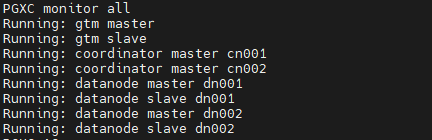

___
# OpenTenBase 数据库管理系统
OpenTenBase 是基于 Postgres-XL 项目的先进企业级数据库管理系统。它支持SQL标准的扩展子集，包括事务、外键、用户定义类型和函数。此外，它还添加了并行计算、安全性、管理、审计和其他功能。

OpenTenBase具有许多类似于PostgreSQL的语言接口，其中的一些可以在下面的链接中找到：

	https://www.postgresql.org/download


## 概览
一个 OpenTenBase 集群由多个 `CoordinateNodes` 、`DataNodes` 和 `GTM` 节点组成。所有用户数据都存储在 `DataNode` 中，`CoordinateNode` 仅包含元数据，`GTM` 则用于全局事务管理。`CoordinateNodes` 和`DataNodes` 共享相同的视图。

用户总是会将请求发送到到 `CoordinateNodes`，`CoordinateNodes`将请求分段之后分发给 `DataNodes`执行 ，`CoordinateNodes`将收集到的请求汇总后返回给用户。

您可以在以下的链接获取 OpenTenBase 软件的最新版本：

	https://github.com/OpenTenBase/OpenTenBase

更多的信息则可以从我们的网站中获取到：

	https://www.opentenbase.org/

## 构建过程
### 系统要求

内存: 最小 4G RAM

操作系统: TencentOS 2, TencentOS 3, OpenCloudOS, CentOS 7, CentOS 8, Ubuntu等

### 安装依赖

` yum -y install gcc make readline-devel zlib-devel openssl-devel uuid-devel bison flex`

或者

` apt install -y gcc make libreadline-dev zlib1g-dev libssl-dev libossp-uuid-dev bison flex`

### 创建用户 'opentenbase'

```shell
mkdir /data
useradd -d /data/opentenbase -s /bin/bash -m opentenbase # add user opentenbase
passwd opentenbase # set password
```

### 编译

```shell
git clone https://github.com/OpenTenBase/OpenTenBase

export SOURCECODE_PATH=/data/opentenbase/OpenTenBase
export INSTALL_PATH=/data/opentenbase/install

cd ${SOURCECODE_PATH}
rm -rf ${INSTALL_PATH}/opentenbase_bin_v2.0
chmod +x configure*
./configure --prefix=${INSTALL_PATH}/opentenbase_bin_v2.0 --enable-user-switch --with-openssl --with-ossp-uuid CFLAGS=-g
make clean
make -sj
make install
chmod +x contrib/pgxc_ctl/make_signature
cd contrib
make -sj
make install
```
**注意: 如果您使用 Ubuntu 并且在"init all"的过程中出现了 `initgtm: command not found`错误, 你可以需要添加 `${INSTALL_PATH}/opentenbase_bin_v2.0/bin` 到 `/etc/environment`中**

## 安装
使用 PGXC\_CTL 工具来搭建一个具备容灾能力的最小配置的集群，例如在两台服务器上搭建如下组成：1个1GTM主（Global Transaction Management 主节点）、1个1GTM备、2个CN主（COORDINATOR 主节点，相互对等无需备份）、2个DN主（DATA NODE 主节点）、以及2个DN备。请注意，整个系统的最低配置要求为2H8G。


### 准备工作

与源码编译安装不同，以下操作每台机器都需要成功执行这三个步骤。否则，可能导致主机器的二进制安装包传输失败以及集群无法正常通信。

1. 安装 `pgxc` 并且把 `pgxc` 安装包的路径导入到系统环境变量中

    执行`vim ~/.bashrc`编辑系统环境变量

    ```shell
    PG_HOME=${INSTALL_PATH}/opentenbase_bin_v2.0
    export PATH="$PATH:$PG_HOME/bin"
    export LD_LIBRARY_PATH="$LD_LIBRARY_PATH:$PG_HOME/lib"
    export LC_ALL=C
    ```

    执行`source ~/.bashrc`使变量生效，否则终端将提示找不到`pgxc_ctl`等命令

2. 关掉 `SELinux` 和 `firewall` (可选的)

    ```
    vi /etc/selinux/config # set SELINUX=disabled
    # Disable firewalld
    systemctl disable firewalld
    systemctl stop firewalld
    ```

3. 实现集群节点所在机器之间的 `ssh` 无密码登录，然后进行部署和初始化将会通过 `ssh` 连接到每个节点的机器。一旦完成这一步，就无需输入密码

    ```
    ssh-keygen -t rsa
    ssh-copy-id -i ~/.ssh/id_rsa.pub destination-user@destination-server
    ```

### 集群启动步骤

在启动集群之前，需要对各个节点进行配置，包括IP地址、端口号、数据库目录、二进制目录等规划信息，这些配置都在pgxc_ctl.conf文件中进行。pgxc_ctl.conf文件可以手动编写，也可以通过使用`pgxc_ctl`工具生成配置文件的模板，然后进行相应的修改。确保每个节点的配置准确无误，以确保集群的正常启动和运行。

1. 第一种配置方式是通过手动编写pgxc_ctl.conf文件

  ```shell
  [opentenbase@localhost ~]$ mkdir /data/opentenbase/pgxc_ctl
  [opentenbase@localhost ~]$ cd /data/opentenbase/pgxc_ctl
  [opentenbase@localhost ~/pgxc_ctl]$ vim pgxc_ctl.conf
  ```

  亦可从此处下载，修改文件名为 `pgxc_ctl.conf` ，按照实际情况修改内容即可

  [点击此处下载双节点配置](https://docs.opentenbase.org/guide/pgxc_ctl_double.conf)

  [点击此处下载单节点配置](https://docs.opentenbase.org/guide/pgxc_ctl_single.conf)

  第二种方式是通过`pgxc_ctl` 工具生成配置文件的模板，需要在模板中填写集群节点的信息。启动 `pgxc_ctl` 工具后，将在当前用户的主目录中生成 `pgxc_ctl` 目录。在输入 "prepare config" 命令后，将在 `pgxc_ctl` 目录中生成可直接修改的配置文件模板。

  * 配置文件开头的 `pgxcInstallDir` 指的是 `pgxc` 安装包的存放位置, 数据库用户可以根据自己的需求进行设置

  ```
  pgxcInstallDir=${INSTALL_PATH}/opentenbase_bin_v2.0
  ```

  * 对于GTM节点，您需要配置节点名称、IP端口、端口号和节点目录

  ```
  #---- GTM ----------
  gtmName=gtm
  gtmMasterServer=xxx.xxx.xxx.10
  gtmMasterPort=50001
  gtmMasterDir=${GTM_MASTER_DATA_DIR}/data/gtm_master
  ```

  * 如果您不需要`gtmSlave`，您可以直接在相应节点的配置中将其设置为`n`

  ```
  gtmSlave=n
  ```

  如果您需要`gtmSlave`，则可以按照配置文件中的说明进行配置。

  * Coordination节点要配置IP、端口、目录等信息

  ```
  coordMasterDir=/data/opentenbase/data/coord
  coordNames=(cn001 cn002 )
  coordPorts=(30004 30004 )
  poolerPorts=(31110 31110 )
  coordPgHbaEntries=(0.0.0.0/0)
  coordMasterServers=($IP_1 $IP_2)
  coordMasterDirs=($coordMasterDir $coordMasterDir)
  ```

  * Data节点与上述节点类似：需要配置IP地址、端口号、目录等（由于有两个数据节点，您需要配置与节点数量相同的信息）。

  ```
  dn1MstrDir=/data/opentenbase/data/dn001
  dn2MstrDir=/data/opentenbase/data/dn002
  
  primaryDatanode=dn001
  datanodeNames=(dn001 dn002)
  datanodePorts=(40004 40004)
  datanodePoolerPorts=(41110 41110)
  datanodePgHbaEntries=(0.0.0.0/0)
  datanodeMasterServers=($IP_1 $IP_2)
  datanodeMasterDirs=($dn1MstrDir $dn2MstrDir)
  ```

  Coordination节点和Data节点分别对应 `coordSlave` 和 `datanodeSlave`。如果不需要这些节点，则可以将它们配置为'n'；否则，需要根据配置文件的说明进行配置。

  此外，Coordination节点和Data节点需要配置两种类型的端口：`poolerPort` 和 `port`, `poolerPort` 用于节点之间的通信，`port` 用于用户登录节点。值得注意的是，`poolerPort` 和 `port` 必须配置不同，否则会发生冲突，导致集群无法启动。

  每个节点都需要有自己的目录，并且不能配置位相同的目录。

2. 安装包的分发（deploy all）。在填写好配置文件后，运行 `pgxc_ctl` 工具，然后输入 "deploy all" 命令，将安装包分发到每个节点的IP机器上。
  

3. 初始化集群的每个节点（init all）。在安装包分发完成后，在 `pgxc_ctl` 工具中输入 "init all" 命令，初始化配置文件 `pgxc_ctl.conf` 中的所有节点，并启动集群。到目前为止，集群已经完成启动。
  

4. 通过 pgxc_ctl 工具的"monitor all"命令来查看集群状态。

  

### 常见错误处理

1. 在安装依赖包时，如果出现错误信息：`错误：没有任何匹配: uuid-devel`，请不要尝试安装其他类似的uuid库，因为uuid-devel 是正确的依赖项。其他的uuid库安装了也无法解决问题。在CentOS 中，uuid-devel 包含在称为“PowerTools”的软件库中，但该软件库默认未启用。为了启用该软件库，您可以使用以下命令：`dnf config-manager --set-enabled powertools`。如果您的系统中没有安装 dnf 命令，请先执行`yum install dnf-plugins-core`。
2. 请确保执行`make -sj`命令时，系统剩余可用内存容量必须大于 4GB。如果内存不足，可能会导致内存溢出并使系统陷入卡死状态，最终导致编译过程失败。
3. 在进行配置时，如果 pgxc_ctl.conf 文件中指定了本机 IP 地址，需要注意在执行 deploy all 阶段时会涉及到 SSH 连接。因此，不仅需要确保能够 SSH 连接到其他主机的 IP 地址，还需要确保能够 SSH 连接到本机的 IP 地址。这样可以确保在部署过程中能够正常地进行主机间通信和操作。
4. 在某节点无法正常启动的情况下，例如出现 `gtm_ctl: another server might be running; trying to start server anyway` 提示，可能是因为该节点没有正常关闭导致。通常情况下，您需要手动删除相应的 PID 文件才能解决问题。如果删除后仍无法启动，建议查看相应的日志文件以进一步排查问题。以 GTM 节点为例，您可以执行以下操作：首先进入对应的日志目录 `cd /data/opentenbase/data/gtm/slave/gtm_log`，然后查看相关日志信息，以便更详细地了解问题所在。
5. 在对pgxc_ctl.conf文件进行配置修改之前，建议首先在pgxc_ctl工具中输入 "clean all" 命令，以清除所有当前集群的状态。修改完成后，务必执行 "init all" 命令以确保配置更改得到正确应用到整个集群中。

## 使用

```
$ psql -h ${CoordinateNode_IP} -p ${CoordinateNode_PORT} -U ${pgxcOwner} -d postgres

postgres=# create default node group default_group  with (dn001,dn002);
CREATE NODE GROUP
postgres=# create sharding group to group default_group;
CREATE SHARDING GROUP
postgres=# create table foo(id bigint, str text) distribute by shard(id);

```

## 引用  

```
https://docs.opentenbase.org/
```

## 许可

OpenTenBase 使用 BSD 3-Clause 许可证，版权和许可信息可以在 [LICENSE.txt](LICENSE.txt) 中找到。

## 贡献者
感谢所有参与项目贡献的人: [CONTRIBUTORS](CONTRIBUTORS.md)

## 最新消息和活动

|新闻|
|------|
|[开放原子校源行走进苏南，加速开源人才培养和创新能力提升](https://mp.weixin.qq.com/s/SU5NYTcKQPyHqfiT4OXp8Q)|
|[OpenTenBase首亮相，腾讯云数据库开源取得重大突破](https://www.opentenbase.org/news/news-post-3/)|
|[开放原子校源行走进西部，加速开源人才培养](https://www.opentenbase.org/event/event-post-3/)|
|[开源数据库OpenTenBase获信通院“OSCAR尖峰开源项目优秀案例”奖](https://www.opentenbase.org/news/news-post-2/)|
|[开放原子开源基金会赴黑龙江科技大学走访交流](https://www.opentenbase.org/event/event-post-2/)|

## 博客和文章
|博客和文章|
|------------------|
|[快速入门](https://www.opentenbase.org/blog/01-quickstart/)|

## 过去的活动
[history_events](history_events.md)
