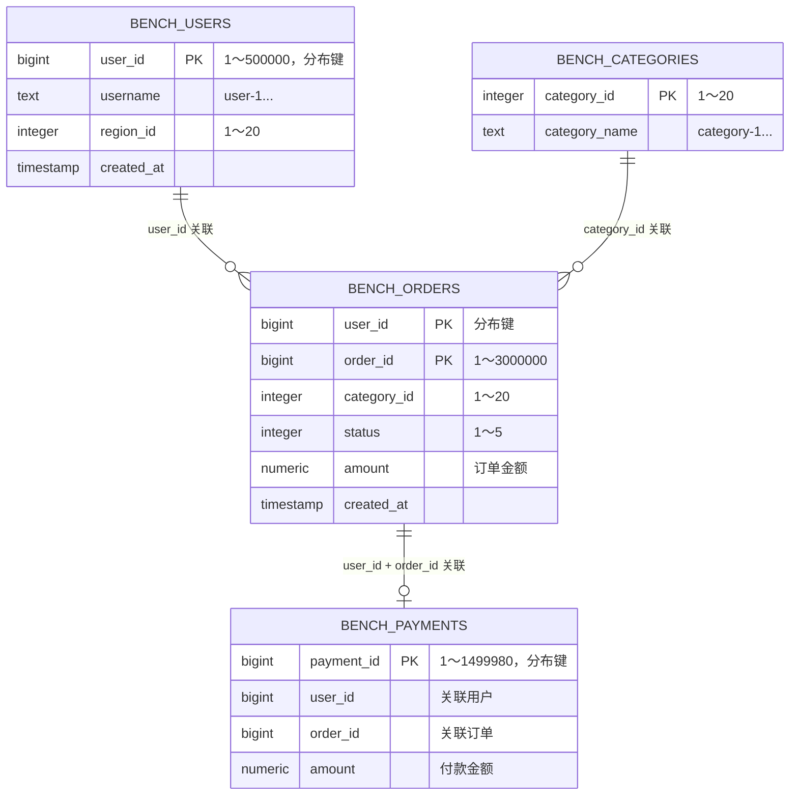
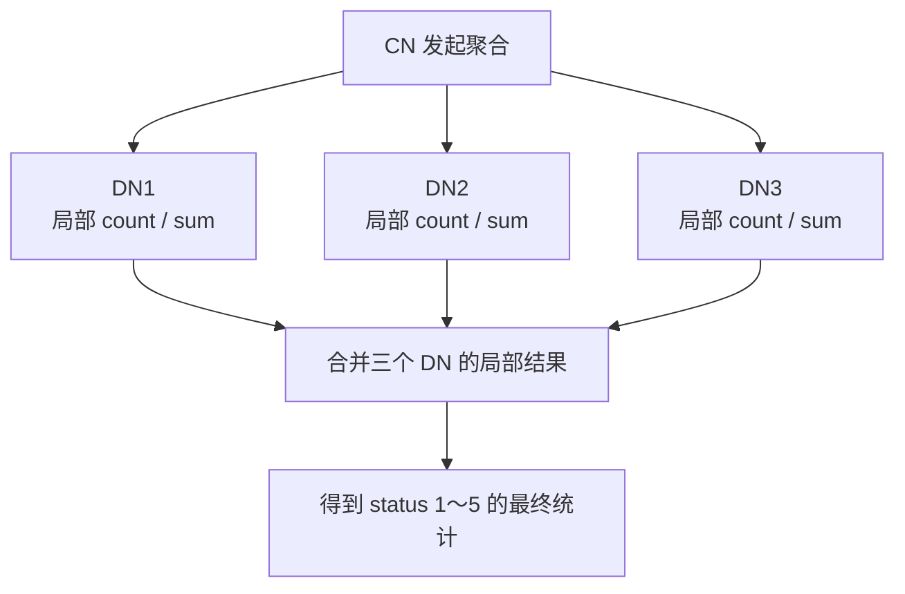

# OpenTenBase 5,000,000 行基础性能测试报告

测试日期：2026-07-21

## 1. 测试结论

在同一个 `database` 数据库中准备了 5,000,000 行数据；装载、索引、统计信息和五类正式测试均完成，另有一个补充测试。

| 测试 | 完成事务数（Transactions） | TPS（事务/秒） | 平均延迟 | 标准差 | 错误 |
| --- | ---: | ---: | ---: | ---: | ---: |
| 单表写入（100 次） | 100 | 82.88 | 12.065 ms | 2.728 ms | 0 |
| 分布键点查询 | 132,725 | 4,424.76 | 0.226 ms | 0.033 ms | 0 |
| 非分布键查询 | 17,107 | 570.30 | 1.753 ms | 3.388 ms | 0 |
| 聚合查询 | 86 | 2.85 | 350.294 ms | 43.515 ms | 0 |
| 同分布键 JOIN | 215 | 7.16 | 139.629 ms | 18.826 ms | 0 |
| 非共址 JOIN（补充） | 120 | 3.990 | 250.637 ms | — | 0 |

1.  只读测试使用 `pgbench -T 30`，即每个测试脚本会被反复执行，直到测试持续约 30 秒。表中的“完成事务数”是这 30 秒内所有客户端完成的脚本执行次数。
例如，`point_select.sql` 每次执行一条 `SELECT`，所以 132,725 表示这条点查询在测试期间成功完成了 132,725 次。

2. TPS（Transactions Per Second，事务/秒）按测试期间完成的事务数除以实际测试耗时计算。

3. 按分布键 `user_id` 查询时，CN 只需访问一个 DN；按非分布键 `region_id` 查询时，CN 需要访问全部三个 DN。因此前者平均为 `0.226 ms`，后者平均为 `1.753 ms`，后者约为前者的 `8` 倍。

4. 在补充的 10 秒并发采样中，点查询 TPS 从 1 个客户端的 `4,454` 增长到 16 个客户端的 `29,096`，32 个客户端时降为 `28,141`；平均延迟则从 `0.55 ms` 上升到 `1.14 ms`。这说明 16 个客户端附近已经接近本机 CPU/调度吞吐上限，继续增加连接主要增加等待，而不能提高总吞吐量。

## 2. 测试环境

| 项目 | 配置 |
| --- | --- |
| OpenTenBase | 5.0，commit `b612d77cbfd4d762f20c54c35f7caf09d57ef098` |
| pgbench | PostgreSQL 10.0 @ OpenTenBase_v5.0 |
| CPU | Intel Core i5-10500，6 核 12 线程 |
| 内存 | 15 GiB |
| 部署方式 | 所有组件位于同一台机器 |
| 拓扑 | 1 CN + 3 DN + 1 GTM |
| 数据库 | `database` |
| 测试时长 | 只读测试脚本 30 秒；写入 100 个事务；并发补充采样 10 秒 |
| 查询模式 | pgbench simple query |


详细环境见 [`results/environment.md`](results/environment.md)。

## 3. 数据与分布

| 表 | 行数 | 分布方式 | 用途 |
| --- | ---: | --- | --- |
| `bench_users` | 500,000 | SHARD（按 `user_id` 分散到多个 DN） | 点查询和 JOIN |
| `bench_orders` | 3,000,000 | SHARD（按 `user_id` 分散到多个 DN） | 写入、聚合和 JOIN |
| `bench_categories` | 20 | REPLICATION（每个 DN 都保留一份） | 复制小表 |
| `bench_payments` | 1,499,980 | SHARD（按 `payment_id` 分散到多个 DN） | 不同分布键实验 |
| 合计 | 5,000,000 | — |

`pgxc_class` 显示三个分散存储的表均覆盖 DN1、DN2、DN3，复制表也位于三个 DN。



## 4. 基础测试结果

| 测试 | 客户端数 | 完成事务数（Transactions） | TPS（事务/秒） | 平均延迟 | 延迟标准差 | 错误 |
| --- | ---: | ---: | ---: | ---: | ---: | ---: |
| 单表写入 | 1 | 100 | 82.88 | 12.065 ms | 2.728 ms | 0 |
| 分布键点查询 | 1 | 132,725 | 4,424.76 | 0.226 ms | 0.033 ms | 0 |
| 非分布键简单查询 | 1 | 17,107 | 570.30 | 1.753 ms | 3.388 ms | 0 |
| 聚合查询 | 1 | 86 | 2.85 | 350.294 ms | 43.515 ms | 0 |
| 分布键 JOIN | 1 | 215 | 7.16 | 139.629 ms | 18.826 ms | 0 |
| 非共址 JOIN（补充） | 1 | 120 | 3.990 | 250.637 ms | — | 0 |

### 4.1 单表写入

测试向 `bench_orders` 插入 100 行，每行单独提交一次事务。全部事务成功，平均 TPS 为 `82.88`。

写入需要修改数据页、记录写入日志（WAL）并完成事务提交，所以明显慢于只读点查询。测试期间订单表最多约为 3,000,100 行；之后删除新增的 100 行并重新统计，确认恢复为 3,000,000 行。

### 4.2 简单查询

分布键查询使用 `WHERE user_id = :user_id`。执行计划显示这是一次由 CN 定位后直接发送到目标 DN 的查询，并且只访问一个 DN。


非分布键查询使用 `WHERE region_id = :region_id LIMIT 100`。执行计划显示它访问 DN1、DN2、DN3，并在各 DN 上进行顺序扫描。它的平均延迟约为分布键点查询的 `7.8` 倍。它最多返回 100 行，而点查询只返回 1 行，所以不能把全部差距都归因于路由。

### 4.3 聚合查询

三个 DN 分别扫描自己的订单并先计算本地的小结果，再把三个 DN 的结果汇总。这证明三个 DN 都参与了执行。该查询每次处理全部 3,000,000 个订单，因此平均延迟 `350.294 ms` 高于点查询。



### 4.4 同分布键的两表 JOIN
```sql
JOIN bench_orders AS o
  ON o.user_id = u.user_id
```

`bench_users` 和 `bench_orders` 都按 `user_id` 分布。执行计划显示 JOIN 在三个 DN 上执行，避免先把两张大表完整搬到 CN 再关联。

### 4.5 不同分布键的两表JOIN（补充测试）

`join_non_colocated.sql` 用 `o.user_id = p.user_id AND o.order_id = p.order_id` 关联`bench_orders` 和 `bench_payments`。其中 `bench_orders` 按 `user_id` 分布，而 `bench_payments` 按 `payment_id` 分布，因此两表不是按相同分布键放置，不能直接根据JOIN 条件把匹配数据定位到同一个 DN。执行计划显示三个 DN 都参与了扫描和并行关联，并交换了中间结果。

该补充测试脚本使用与正式只读测试相同的 `-c 1 -j 1 -T 30` 参数，结果如下：

| 测试 | 完成事务数 | TPS（事务/秒） | 平均延迟 | 错误 |
| --- | ---: | ---: | ---: | ---: |
| 非共址 JOIN | 120 | 3.990 | 250.637 ms | 0 |

这个结果的用途是展示不同分布键会触发跨 DN 的协调与数据交换。该补充测试的最终 pgbench 汇总没有单独输出延迟标准差，因此表中以“—”表示未记录。

## 5. 并发连接结果

并发测试始终使用同一个分布键点查询，只改变客户端数量。

| Clients | Threads | TPS | 相对单连接 | 平均延迟 | 错误 |
| ---: | ---: | ---: | ---: | ---: | ---: |
| 1 | 1 | 4,454 | 1.00x | 0.225 ms | 0 |
| 4 | 4 | 15,005 | 3.37x | 0.267 ms | 0 |
| 8 | 4 | 23,726 | 5.33x | 0.337 ms | 0 |
| 16 | 4 | 29,096 | 6.53x | 0.550 ms | 0 |
| 32 | 4 | 28,141 | 6.32x | 1.138 ms | 0 |

本表为补充的 10 秒采样，作为并发趋势分析。
从 16 增加到 32 个客户端时，TPS 下降约 3.3%，平均延迟约翻倍，延迟波动也明显增大。继续增加连接会让查询等待更久，不会提高总吞吐量。

## 6. 瓶颈分析

在额外的 32 客户端采样中，`vmstat` 显示：

- CPU user 约 80%；
- CPU system 约 16%；
- CPU idle 仅约 4%；
- I/O wait 约 0%；
- 可运行进程队列约 33 个。

这说明该点查询并发测试首先遇到的是 CPU 和进程调度压力。用户表有 500,000 行，但点查询通过分布键只取一行；由于数据大多已经在内存中，不需要频繁从磁盘读取。

| 可能来源 | 本轮判断 | 证据 |
| --- | --- | --- |
| CN/DN CPU | 很可能是主要限制 | 32 并发时 CPU user/system 约 80%/16%，idle 约 4%，TPS 停止增长 |
| 磁盘 | 不是点查询主要限制 | 采样时 I/O wait 约 0%，数据大多已经在内存中 |
| 网络 | 未能真实评估 | 所有节点使用 127.0.0.1 |
| SQL 写法 | 对简单查询影响明显 | 分布键查询访问一个 DN，非分布键查询访问全部 DN |
| 数据分布 | 当前基本合理 | 分散存储的表覆盖三个 DN，聚合计划显示三个 DN 都有数据 |

## 7. 测试限制与改进建议
测试限制
- 单机的基础测试不代表生产容量。
- 并发矩阵是额外的单次 10 秒采样，不是重复多轮后的中位数或 P95（95% 请求的延迟上限）；也没有独立采集 CN、DN、GTM 的 CPU、内存和磁盘指标。
- 后续把节点放到不同主机，重复测试并记录中位数和 P95。
- 所有组件同机，节点之间没有真实网络延迟。
- 没有采集每个 CN、DN、GTM 进程的独立 CPU。若要区分 CN、DN、网络瓶颈，应使用多机部署并采集每台机器指标。
- 没有测试主从复制、故障切换和多 CN。

改进建议: 业务点查询尽量携带分布键，减少访问的 DN 数量。经常 JOIN 的大表尽量采用相同分布键，使关联数据位于同一 DN。
