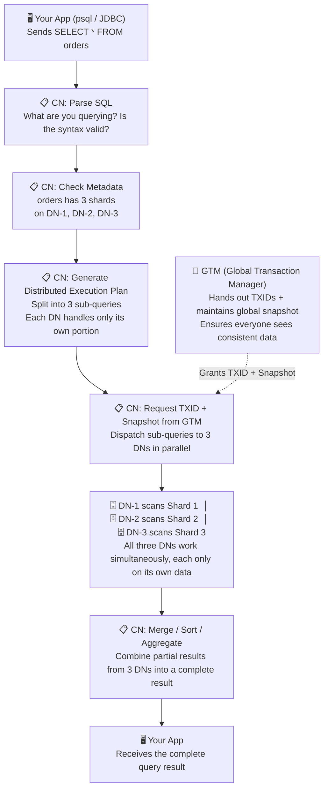
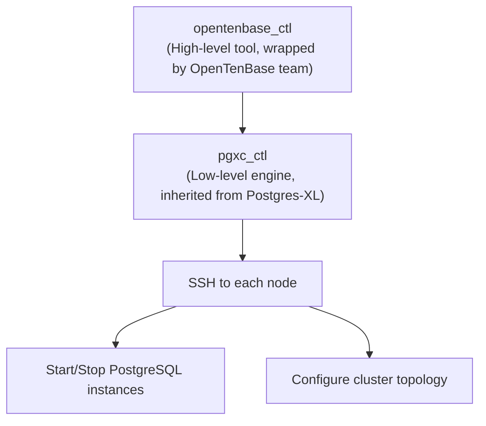
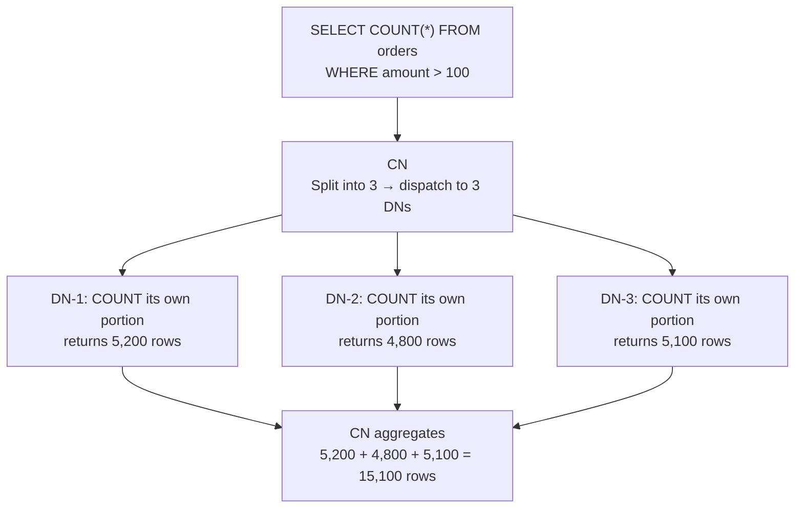
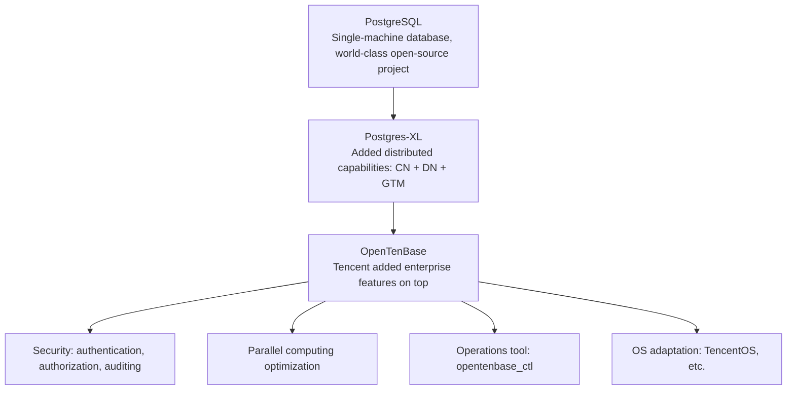
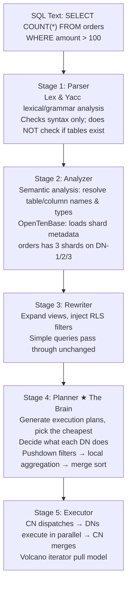
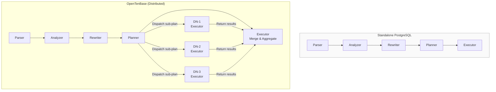
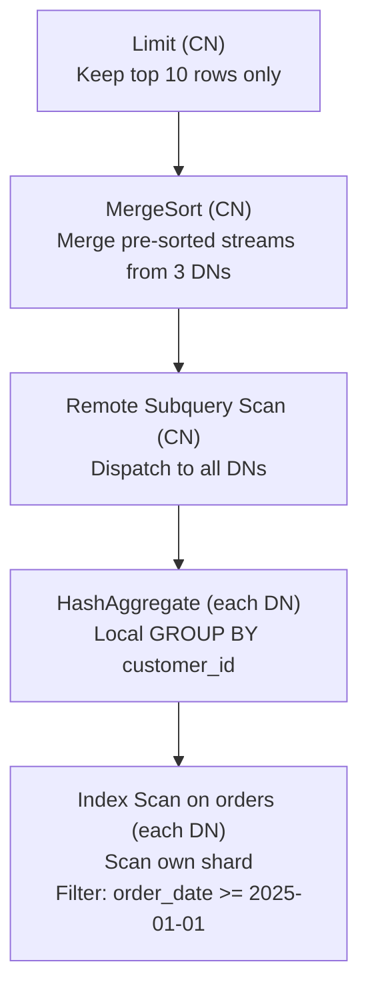
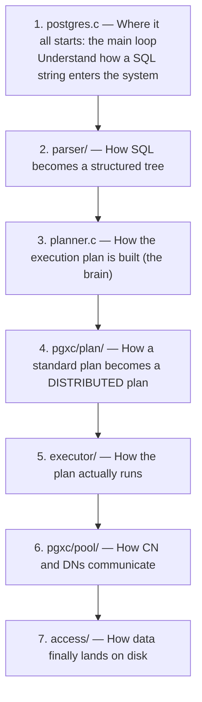
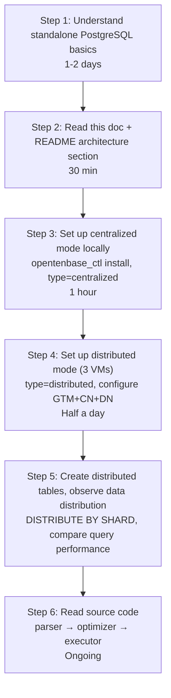

# OpenTenBase Core Terminology & Newcomer's Guide

> This document is written for **beginners new to distributed databases**. It explains the 13 most critical concepts in OpenTenBase using an **"intuition first → then principle → finally connection"** approach. We recommend reading alongside the architecture diagram below.

---

## I. Architecture at a Glance (A Single Picture to Understand OpenTenBase)

### 1.1 The Complete Journey of a User Request



### 1.2 One-Sentence Summary

| Who | Role | Real-Life Analogy |
|:----|:-----|:------------------|
| **CN** | "Project Manager" | Clients only talk to the PM. The PM breaks work into subtasks → assigns to engineers → aggregates results → delivers to client |
| **DN** | "Engineer" | Each engineer holds a portion of the blueprints (data). The PM tells them what to look up; they only manage their own drawer |
| **GTM** | "Global Clock + Ticket Dispenser" | Ensures everyone sees the same data version — "Take a number before you start working" |

---

## II. Core Terminology (13 Must-Know Concepts, from Basic to Deep)

### Term 1: CN (Coordinator Node)

**In simple terms**: CN is the entry point you connect to. You always talk only to the CN; you don't need to know what happens behind it.

**Why is it needed?** In a distributed system, data is scattered across many machines. If you had to query each machine yourself and manually merge results, it would be painful. The CN's mission: **let you use a distributed cluster as if it were a single PostgreSQL instance** — you write `SELECT * FROM orders`, CN automatically finds where the data is, splits it into sub-queries, dispatches them, and merges the results.

**Key insight**: CN itself **does not store business data**. It only stores "metadata" — essentially a map recording "which shard of which table is on which DN." CNs are lightweight; you can deploy multiple for load balancing.

---

### Term 2: DN (DataNode)

**In simple terms**: DNs are where data actually lives. Your business data — order tables, user tables, log tables — ultimately land on DNs' disks.

**Why is it needed?** A single machine has upper limits on disk and compute. When a table grows too large for one machine, you need to "slice" it into pieces and spread them across multiple DNs. Each DN manages its own portion; when CN dispatches query fragments, each DN only needs to compute its own slice — this is the source of **parallel computing**.

**Key insight**: Each DN is essentially a "stripped-down PostgreSQL instance." It has its own storage engine, Buffer Pool, and WAL log. You never connect directly to a DN — only indirectly through CN.

---

### Term 3: GTM (Global Transaction Manager)

**In simple terms**: GTM is the distributed cluster's **"global clock + ticket dispenser"**. It doesn't store business data; it only hands out numbers.

**Why is it needed?** This is the most critical concept in understanding distributed databases. Imagine:

> You transfer $100 to a friend. The CN must simultaneously update two DNs — DN-1 deducts $100 from your account, DN-2 adds $100 to your friend's account. What if someone else checks balances at the same time? Should they see "before deduction" or "after deduction"?

This is the **isolation problem** of distributed transactions. GTM solves it by:

1. Before each transaction starts, requesting a **globally unique, monotonically increasing number** (Transaction ID) from GTM
2. GTM maintains a **global snapshot** — "at this moment, which transactions are committed, which are in progress"
3. All DNs use the same global snapshot as the baseline for data visibility, ensuring **everyone sees the same consistent view**

Without GTM, transaction isolation in distributed databases is a castle in the air.

---

### Term 4: Distributed Mode

**In simple terms**: This is the "full form" — you have GTM, CN, and multiple DNs — a standard distributed cluster.

**When to use it?**
- Your data volume exceeds what a single machine can hold (TB-level)
- You need horizontal scaling — add machines to gain capacity and compute
- You need high availability — CN, DN, GTM each have Slave replicas

**Config identifier**: Write `type=distributed` in `opentenbase_config.ini`

---

### Term 5: Centralized Mode

**In simple terms**: A "downgraded version" — no GTM, no CN, just one or a few DNs. Essentially a single-machine PostgreSQL, but running on OpenTenBase's kernel.

**Why does this mode exist?**
- **Dev/Test**: You don't need to set up a full distributed cluster when writing code locally
- **Small-scale apps**: When data volume is low, distribution is overhead, not benefit
- **Smooth transition**: Run centralized first, migrate to distributed when data grows

**Config identifier**: Write `type=centralized` in `opentenbase_config.ini` (only need to configure the DN section; GTM and CN can be omitted)

**Comparison**:

| Dimension | Distributed Mode | Centralized Mode |
|:----------|:-----------------|:-----------------|
| Node types | GTM + CN + DN | DN only |
| Data distribution | Sharded across multiple machines | All data in one DN group |
| Use case | Production, large data | Dev/Test, small-scale |
| Horizontal scaling | ✅ Add nodes | ❌ Must migrate to distributed |

---

### Term 6: Node Group

**In simple terms**: Node Group is a logical container that groups multiple DNs into one "team." You can place different tables on different Node Groups for **data isolation and resource isolation**.

**Why is it needed?**
Imagine you have two types of business data — core transaction tables (need high-performance SSDs) and archived log tables (can live on cheaper HDDs). With Node Groups, you can:
- Deploy important tables' Node Group on SSD nodes
- Deploy secondary tables' Node Group on HDD nodes
- DNs within the same group provide redundancy for each other; groups are physically isolated

**Key insight**: Node Group is OpenTenBase's core mechanism for **multi-tenancy** and **tiered storage**.

---

### Term 7: opentenbase_ctl (Cluster Management Tool)

**In simple terms**: This is your "cluster remote control" — one command to install, start, stop, scale, or check status of the entire cluster.

**Analogy**: Just like you use `docker-compose up` to start a bunch of containers at once, `opentenbase_ctl` brings up GTM, CN, and DN all together.

**Common commands**:

```bash
# One-click cluster install per config file
opentenbase_ctl install -c opentenbase_config.ini

# Check all node statuses
opentenbase_ctl status -c opentenbase_config.ini

# Start/Stop cluster
opentenbase_ctl start -c opentenbase_config.ini
opentenbase_ctl stop  -c opentenbase_config.ini
```

---

### Term 8: pgxc_ctl (Low-Level Cluster Orchestration Component)

**In simple terms**: `pgxc_ctl` is the "underlying engine" of `opentenbase_ctl`. `opentenbase_ctl` provides a friendlier wrapper; `pgxc_ctl` is the original tool inherited from Postgres-XL.

**Relationship**:


You can find this component at `contrib/pgxc_ctl/` in the source tree.

---

### Term 9: MPP (Massively Parallel Processing)

**In simple terms**: MPP is a **"divide and conquer"** computing architecture. Break one big task into many small tasks, executed simultaneously on many machines.

**How it works in OpenTenBase**:


Three DNs work simultaneously; theoretically 3x faster than single machine (ignoring network overhead). This is the value of MPP.

---

### Term 10: Shard & DISTRIBUTE BY SHARD

**In simple terms**: Sharding is slicing a large table into many small pieces. Each piece is a Shard; different Shards are placed on different DNs.

**Table creation syntax**:
```sql
CREATE TABLE orders (
    id BIGSERIAL,
    user_id INT,
    amount NUMERIC(10,2)
) DISTRIBUTE BY SHARD(id);
```

`DISTRIBUTE BY SHARD(id)` means: **use the hash value of the `id` column to determine which DN each row lands on**.

**Why shard by id?**
- Hash sharding ensures **even distribution** (each DN has roughly the same data volume)
- Sharding by primary key allows querying a single row to be **directly routed** to a unique DN (no broadcast needed)
- **Bad shard key example**: sharding by `status` (only 0/1 values) causes data to all pile up on a few DNs

**Key insight**: Choosing the shard key is one of the most important decisions in a distributed database. Good shard key = even data distribution + precise query routing.

---

### Term 11: Master / Slave (Primary / Standby)

**In simple terms**: Master is the one "doing the work"; Slave is "on standby ready to take over." If Master goes down, Slave steps in.

**In OpenTenBase**: CN, DN, and GTM can all have Slave replicas.

```
Config snippet:
[gtm]
master=172.16.16.49               ← GTM Master, handles ticket dispensing
slave=172.16.16.50,172.16.16.131  ← Two standby nodes, ready to take over

[datanodes]
master=172.16.16.49,172.16.16.131   ← Two machines, each running one DN Master
slave=172.16.16.131,172.16.16.49    ← Slaves cross-deployed (avoid single point of failure)
```

**Why cross-deploy Slaves?** If Master and Slave are on the same machine, a single machine failure kills both — high availability becomes meaningless.

---

### Term 12: pool_nodes

**In simple terms**: A SQL command that shows you the cluster's "family photo" at any time — which nodes are online, what roles they have, how data is distributed.

```sql
-- Execute in psql
SHOW pool_nodes;
```

It lists all CNs and DNs in the current cluster: IP, port, role (Master/Slave), status (online/offline). This is **the first stop for troubleshooting** — if something is slow, `SHOW pool_nodes` first to check if a node is down.

---

### Term 13: Postgres-XL (OpenTenBase's "Lineage")

**In simple terms**: OpenTenBase wasn't written from scratch. It stands on the shoulders of **Postgres-XL**, which also is a PostgreSQL-based distributed database that proposed the classic CN-DN-GTM architecture.

**Evolution**:


Understanding Postgres-XL helps you know which parts of OpenTenBase are "inherited" and which are "self-developed."

---

## III. Quick Reference Table

| # | Term | One-Liner | Can I Operate It Directly? |
|:--|:-----|:----------|:--------------------------|
| 1 | **CN** | Database entry point; parses SQL and distributes to DNs | ✅ You connect to CN |
| 2 | **DN** | Where data actually lives; each DN holds part of the shards | ❌ Indirectly via CN |
| 3 | **GTM** | Global "ticket dispenser" ensuring distributed transaction consistency | ❌ Auto-managed by cluster |
| 4 | **Distributed Mode** | Full cluster (GTM+CN+DN), for production | ✅ Config file: `type=distributed` |
| 5 | **Centralized Mode** | Simplified (DN only), for dev/test | ✅ Config file: `type=centralized` |
| 6 | **Node Group** | Logical grouping of DNs for multi-tenant isolation | ✅ Specify when creating tables |
| 7 | **opentenbase_ctl** | Cluster management remote control | ✅ Use directly in CLI |
| 8 | **pgxc_ctl** | Low-level cluster orchestration engine | ⚠️ Usually called indirectly via opentenbase_ctl |
| 9 | **MPP** | "Divide and conquer" parallel computing architecture | ❌ Architectural concept |
| 10 | **Shard** | Mechanism for splitting large tables into small pieces | ✅ Choose `DISTRIBUTE BY SHARD(col)` when creating tables |
| 11 | **Master/Slave** | Primary-standby high availability | ✅ Configure IPs in config file |
| 12 | **pool_nodes** | View cluster node status | ✅ `SHOW pool_nodes;` |
| 13 | **Postgres-XL** | OpenTenBase's upstream project | ❌ Historical concept |

---

## IV. Frequently Asked Questions

### Q1: How should I understand the difference between a "distributed database" and regular PostgreSQL?

**One-liner**: PostgreSQL is "one person doing all the work"; OpenTenBase is "one project manager (CN) leading a team of engineers (DN) dividing the work."

| | PostgreSQL (Single-Machine) | OpenTenBase (Distributed) |
|:--|:----------------------------|:--------------------------|
| Data storage | All on one machine | Spread across multiple machines (DN) |
| Query execution | Self-parse, self-execute | CN parse → distribute to DNs parallel execution → CN aggregate |
| Transactions | Local, self-managed | Distributed, GTM coordinated |
| Scaling | Upgrade hardware (Scale-Up) | Add machines (Scale-Out) |
| SQL compatibility | 100% | Mostly compatible; some attention to shard keys needed |

### Q2: Distributed mode or centralized mode — which should I choose?

```
Data < 100GB and no scaling needs  → Centralized mode (fewer resources, easier maintenance)
Data > 100GB or need horizontal scaling → Distributed mode
```

Centralized can later migrate to distributed — it's not a "one-time choice forever."

### Q3: What if GTM goes down?

GTM supports Master-Slave high-availability configuration. If Master goes down, Slave takes over automatically. But GTM is the cluster's "single bottleneck" — all transactions must request IDs from it — so give the GTM node decent hardware (fast CPU, fast network).

### Q4: What actually happens when I write `SELECT * FROM table`?

1. CN receives SQL → parser extracts "you want to query `table`"
2. CN checks metadata → "`table` has 3 shards, on DN-1, DN-2, DN-3"
3. CN gets transaction ID and snapshot from GTM
4. CN generates 3 sub-queries → dispatches them in parallel to 3 DNs
5. Each DN executes its portion → returns partial results
6. CN merges the three partial results → sorts (if needed) → returns to you

### Q5: What happens if I choose the wrong shard key?

Choosing a bad shard key (e.g., a column with few distinct values) leads to **data skew** — some DNs have far more data than others. Result: hot DNs get overloaded, other DNs sit idle, and the advantage of parallel computing is lost.

---

## V. Query Execution Flow — From SQL to Result

> FAQ Q4 above gave a quick answer. This section dives deeper into the internal pipeline — what the database engine actually does at each stage, and how CN and DN divide the work.

### 5.1 The Five Stages at a Glance

Every SQL query goes through five stages inside the database:



### 5.2 CN vs DN: Who Does What?

This is the key difference from standalone PostgreSQL:



**In short**: CN does the thinking (Stages 1–4), DNs do the heavy lifting (Stage 5, in parallel).

### 5.3 Stage-by-Stage Walkthrough with a Concrete Query

Let's trace this query end-to-end:

```sql
SELECT customer_id, SUM(amount) AS total
FROM orders
WHERE order_date >= '2025-01-01'
GROUP BY customer_id
ORDER BY total DESC
LIMIT 10;
```

**Stage 1 — Parser (CN only)**

The parser (built with Lex + Yacc) converts the SQL string into a tree of C structs called a *parse tree*. Each keyword (`SELECT`, `FROM`, `WHERE`, etc.) becomes a node. At this stage the parser only checks syntax — a typo like `SELECTT` would fail here, but `SELECT * FROM nonexistent_table` would pass (it's syntactically valid SQL).

Where to read: `src/backend/parser/gram.y` — this is often the largest single file in the project.

**Stage 2 — Analyzer (CN only)**

The analyzer walks the parse tree and transforms it into a *query tree*. For each table/column name, it looks up the system catalog:

- `orders` → found in catalog → table OID 12345 → has 3 shards on [DN-1, DN-2, DN-3]
- `customer_id` → column exists in `orders`, type is `INT`
- `SUM(amount)` → `amount` is `NUMERIC(10,2)`, SUM over it yields `NUMERIC`
- `order_date >= '2025-01-01'` → `order_date` is `DATE`, string literal is cast

After this stage, the database knows *what* the query means. But it still doesn't know *how* to execute it efficiently.

Where to read: `src/backend/parser/analyze.c`

**Stage 3 — Rewriter (CN only)**

The rewriter applies any relevant rules. If `orders` is actually a view, the view definition is expanded inline. If row-level security (RLS) is enabled on `orders`, a filter like `AND (user_id = current_user_id())` is injected here.

For our example: `orders` is a real table, no RLS — the query passes through unchanged.

Where to read: `src/backend/rewrite/rewriteHandler.c`

**Stage 4 — Planner / Optimizer (CN only)**

Now the CN asks: *"What's the cheapest way to execute this query?"*

For our `GROUP BY customer_id` query, the planner considers:

| Decision | Options | Chosen |
|:---------|:--------|:-------|
| How to scan `orders`? | Seq Scan vs Index Scan | If there's an index on `order_date`, use Index Scan; otherwise Seq Scan |
| Where to apply `WHERE` filter? | On CN after pulling all data? | ❌ Never — **always push filters down to DNs (predicate pushdown)** |
| How to do `GROUP BY`? | All rows to CN, then group? | ❌ Wasteful — DNs do partial GROUP BY first, CN merges (two-phase aggregation) |
| How to do `ORDER BY`? | CN sorts everything? | ❌ Each DN sorts locally, CN does merge-sort |
| How to handle `LIMIT 10`? | Compute all, then truncate? | ❌ DNs only need to send local top-10 each, CN picks global top-10 |

The planner produces a distributed plan:



Where to read: `src/backend/optimizer/plan/planner.c`, `src/backend/pgxc/plan/`

**Stage 5 — Executor (CN + all DNs)**

The executor uses a **pull-based model** (the "Volcano" iterator model):

1. CN starts at the top of the plan tree (the `Limit` node) and calls "give me a row"
2. `Limit` asks `MergeSort` for a row → `MergeSort` asks each `Remote Subquery` for a row
3. Each DN receives a plan fragment, executes it independently:
   - DN-1 scans its `orders` shard, filters by date, groups by customer, sends its local top-10
   - DN-2 and DN-3 do the same, in parallel
4. CN's `MergeSort` merges the three sorted streams
5. `Limit` stops after 10 rows — it doesn't need all rows from all DNs

**Why this is efficient**: If each DN has 1 million orders, the query doesn't pull 3 million rows to CN. Each DN does local aggregation and sends only ~10 rows. CN merges ~30 rows total.

Where to read: `src/backend/executor/`, `src/backend/pgxc/pool/`, `src/backend/tcop/postgres.c`

### 5.4 Three Common Query Patterns (And How They Flow)

**Pattern 1: Point Query (single-row lookup by primary key)**

```sql
SELECT * FROM orders WHERE id = 12345;
```

Flow: CN hashes `id=12345` → determines it maps to DN-2 → sends query ONLY to DN-2 (not broadcast) → DN-2 returns 1 row → CN returns to client.

This is the **fastest possible path** in a distributed database — single-hop routing, no aggregation. This is why choosing the right shard key matters.

**Pattern 2: Full Scan with Aggregation**

```sql
SELECT COUNT(*) FROM orders;
```

Flow: CN broadcasts to ALL DNs → each DN counts its shard → CN sums the counts.

Fast (each DN scans locally, only sends one integer back), but still touches all DNs.

**Pattern 3: Cross-Shard JOIN (the expensive one)**

```sql
SELECT o.*, u.name
FROM orders o JOIN users u ON o.user_id = u.id
WHERE o.amount > 100;
```

If `orders` is sharded by `id` and `users` is sharded by `id`, then `o.user_id = u.id` is a **cross-shard join** — a row in `orders` on DN-1 might match a row in `users` on DN-3.

The planner has strategies:
- **Broadcast**: copy the smaller table (`users`) to every DN, then each DN does the join locally
- **Re-shard**: temporarily re-distribute both tables by the join key, then join locally
- **Pull to CN**: pull all matching rows to CN and join there (worst case)

The planner picks the cheapest strategy based on table sizes and available memory.

### 5.5 Quick Comparison: Standalone PostgreSQL vs OpenTenBase

| Stage | Standalone PostgreSQL | OpenTenBase (Distributed) |
|:------|:----------------------|:--------------------------|
| Parser | Local, single process | CN only (same code) |
| Analyzer | Local | CN only (same code + distributed metadata) |
| Rewriter | Local | CN only (same code) |
| Planner | Local — finds cheapest single-machine plan | CN — ALSO decides *which DN does what* |
| Executor | Single process, local I/O | CN dispatches → N DNs execute in parallel → CN merges |
| Key bottleneck | CPU / Disk I/O | Network latency between CN ↔ DN + GTM round-trips |

---

## VI. Reference Reading Locations

When you are ready to go beyond the docs and read the source, here is a map.

### 6.1 Source Code Directory Map

```
OpenTenBase/
├── README.md                  ← Project overview & quick start
├── doc/
│   ├── BeginnerGuider.md      ← Newcomer's Guide (English)
│   ├── BeginnerGuider_ZH.md   ← Newcomer's Guide (Chinese)
│   ├── terminology.md         ← Core terminology (Chinese)
│   ├── terminology-en.md       ← Core terminology (English)
│   ├── terminology-with-mermaid.md ← Architecture diagrams (Mermaid)
│   ├── how-to-submit-pr.md    ← PR submission guide
│   └── ai-usage-report.md     ← AI usage report
├── src/
│   ├── backend/
│   │   ├── parser/            ← Stage 1-2: SQL parsing & semantic analysis
│   │   │   ├── gram.y          — Grammar definition (Bison/Yacc; largest file)
│   │   │   ├── scan.l          — Lexer definition (Flex/Lex)
│   │   │   └── analyze.c       — Semantic analysis entry point
│   │   ├── rewrite/            ← Stage 3: Query rewrite rules
│   │   │   └── rewriteHandler.c
│   │   ├── optimizer/          ← Stage 4: Query planning & optimization
│   │   │   ├── plan/
│   │   │   │   └── planner.c   — Main planner entry point
│   │   │   └── path/
│   │   │       └── costsize.c  — Cost estimation for plan comparison
│   │   ├── executor/           ← Stage 5: Query execution engine
│   │   │   ├── execMain.c      — Executor main loop (Volcano iterator model)
│   │   │   ├── nodeSeqscan.c   — Sequential scan executor node
│   │   │   ├── nodeIndexscan.c — Index scan executor node
│   │   │   ├── nodeHashjoin.c  — Hash join executor node
│   │   │   └── nodeAgg.c       — Aggregation executor node
│   │   ├── pgxc/               ← ** OpenTenBase distributed layer **
│   │   │   ├── plan/           — Distributed query planning (CN → DN split)
│   │   │   ├── pool/           — Connection pool (CN ↔ DN communication protocol)
│   │   │   ├── locator/        — Data location service (hash-based shard routing)
│   │   │   └── shardmap.c      — Shard-to-DN mapping
│   │   ├── tcop/               ← Traffic Cop: Postgres main loop
│   │   │   └── postgres.c      — Main entry: receive SQL → parse → plan → execute
│   │   ├── access/             ← Storage & index access methods
│   │   │   ├── heap/           — Heap table scan / insert / update / delete
│   │   │   └── transam/        — Transaction & snapshot management (GTM interaction)
│   │   └── catalog/            ← System catalog (metadata tables)
│   ├── bin/
│   │   └── opentenbase_ctl     ← Cluster management shell tool
│   └── include/                ← C header files (.h) — good for understanding structs
├── contrib/
│   └── pgxc_ctl/               ← Low-level cluster orchestration (inherited from Postgres-XL)
└── doc/                        ← Project documentation
```

### 6.2 Key Files for Each Concept

| What You Want to Understand | Where to Look | What to Look For |
|:----------------------------|:--------------|:-----------------|
| How SQL text is parsed | `src/backend/parser/gram.y` | `SELECT` statement grammar rules, expression grammar |
| How CN decides which DN has the data | `src/backend/pgxc/locator/` | Hash function, shard map lookup |
| How CN communicates with DNs | `src/backend/pgxc/pool/` | Remote query dispatch, connection pooling |
| How distributed queries are planned | `src/backend/pgxc/plan/` | `RemoteSubquery` plan node |
| How distributed transactions work | `src/backend/access/transam/` | Transaction ID, snapshot, 2PC (two-phase commit) |
| How GTM hands out transaction IDs | `src/backend/access/transam/gtm.c` | GTM client-side protocol |
| Cluster management tool | `src/bin/opentenbase_ctl` | Shell script; `install`, `start`, `stop` commands |
| Postgres main event loop | `src/backend/tcop/postgres.c` | `PostgresMain()` function |

### 6.3 Suggested Reading Order (for Contributors)



### 6.4 External References

- [PostgreSQL Official Documentation](https://www.postgresql.org/docs/) — OpenTenBase inherits PostgreSQL's SQL engine; most PG docs apply
- [Postgres-XL Documentation](https://www.postgres-xl.org/documentation/) — Understanding the original distributed architecture
- [OpenTenBase GitHub](https://github.com/OpenTenBase/OpenTenBase) — Issues, PRs, release notes
- The `doc/` folder in this repository — terminology, PR guide, and architecture diagrams

---

## VII. Recommended Learning Path



---

> **Final words**: OpenTenBase as a distributed database revolves around only three core ideas — **Shard (split data for storage), Coordinate (CN as the commander), Global Consistency (GTM as the referee)**. Understand these three keywords, and everything else is engineering detail. Happy learning! 🚀
