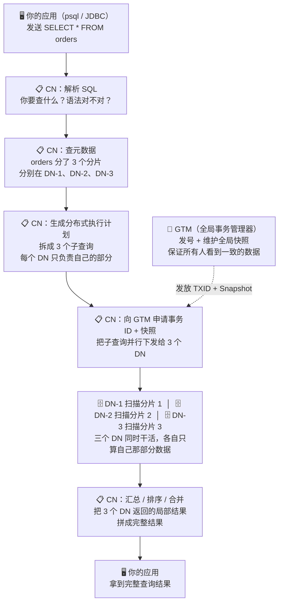
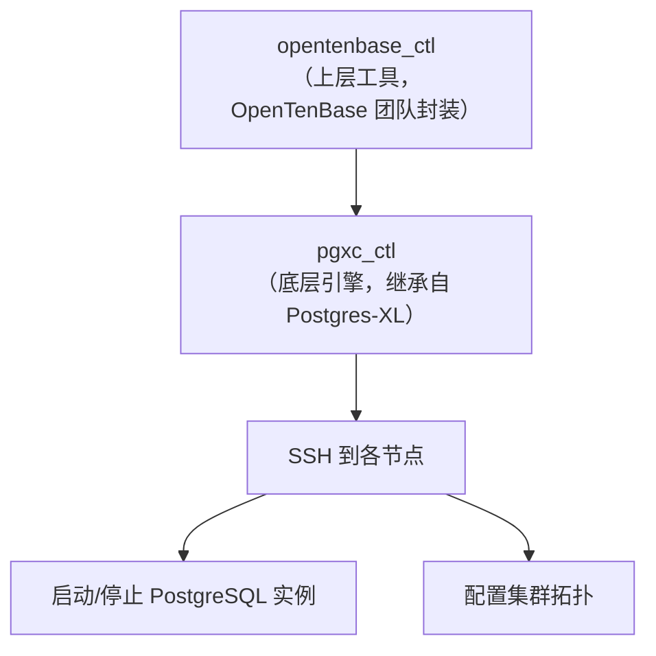
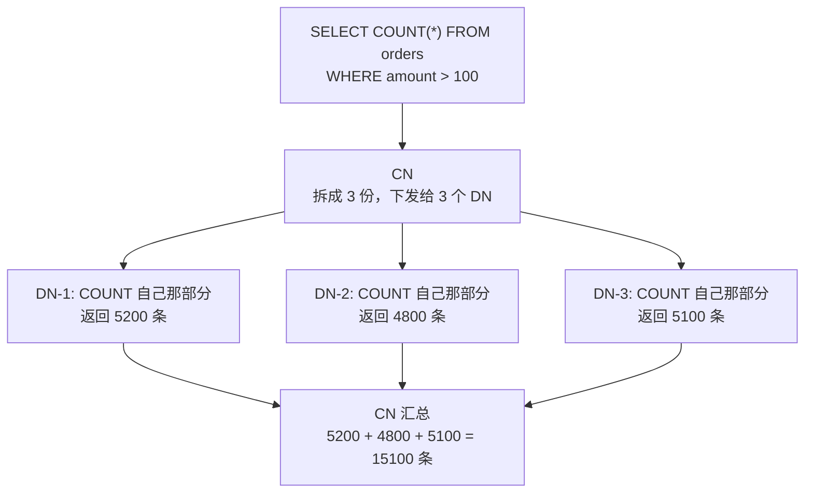
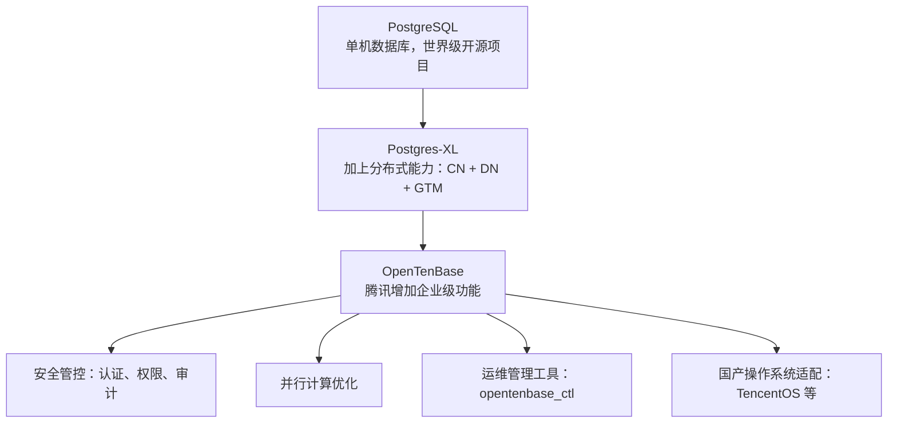
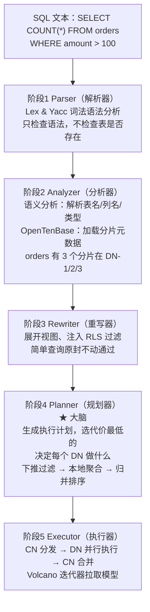
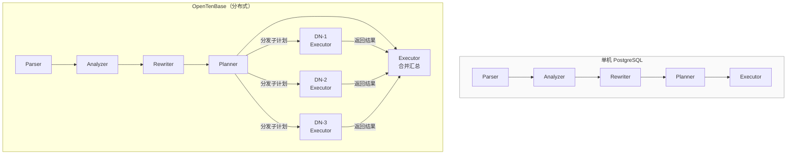
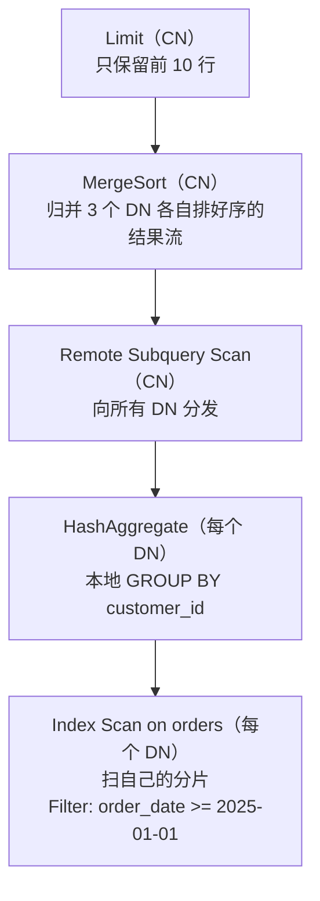
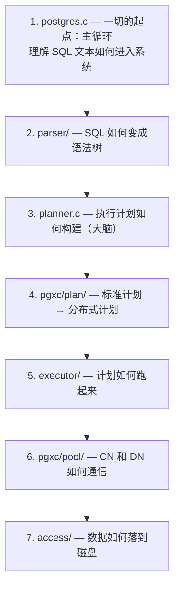
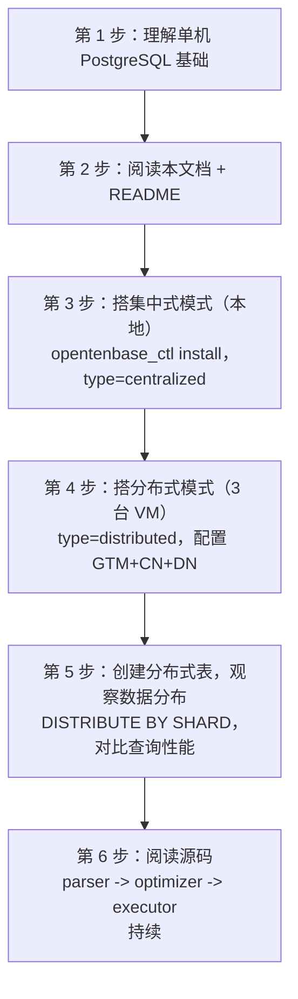

# OpenTenBase 核心术语表 & 新手导览

> 本文档面向**刚接触分布式数据库的新手**，用"先直觉 → 再原理 → 最后关联"的方式，解释 OpenTenBase 体系中最关键的 13 个术语。建议配合下方架构理解图一起阅读。

---

## 一、架构理解图（一张图看懂 OpenTenBase）

### 1.1 用户请求的完整旅程



### 1.2 一句话总结

| 谁 | 角色 | 生活类比 |
|:--|:-----|:---------|
| **CN** | "项目经理" | 客户的需求只找项目经理，项目经理拆成子任务分给不同的工程师，最后把结果汇总交付 |
| **DN** | "工程师" | 每人手里保管一部分图纸（数据），项目经理说查哪段就查哪段，只管好自己的抽屉 |
| **GTM** | "全局时钟 + 排队叫号机" | 确保所有人看到的数据版本是一致的——"在你开始干活之前，先领个号码牌" |

---

## 二、核心术语（由浅入深，13 个必知概念）

### 术语 1：CN（CoordinatorNode / 协调节点）

**简单来说**：就是你连接数据库的那个入口。你永远只和 CN 说话，CN 背后发生了什么你不需要知道。

**为什么需要它？** 在一个分布式系统里，数据散落在很多台机器上。如果你自己去每台机器上查数据再手动合并，那就太痛苦了。CN 的使命就是**让你像用单机 PostgreSQL 一样用分布式集群**——你写一条 `SELECT * FROM orders`，CN 自动帮你找到数据在哪、拆成子查询、下发执行、合并结果。

**关键理解**：CN 自己**不存业务数据**，它只存"元数据"——相当于一张地图，记录了"哪张表的哪个分片在哪个 DN 上"。它自身很轻量，可以部署多个来做负载均衡。

---

### 术语 2：DN（DataNode / 数据节点）

**简单来说**：DN 是真正存数据的地方。你的业务数据——订单表、用户表、日志表——最终都落在 DN 的磁盘上。

**为什么需要它？** 单台机器的磁盘和算力有上限。当一张表大到一台机器放不下时，就需要把它"切"成几块，分散到多个 DN 上。每个 DN 管自己那部分数据，CN 下发的查询片段它也只需要算自己那部分——这就是**并行计算**的来源。

**关键理解**：每个 DN 本质上就是一个"精简版 PostgreSQL 实例"。它有自己的存储引擎、自己的 Buffer Pool、自己的 WAL 日志。你不直接连 DN，只通过 CN 间接操作。

---

### 术语 3：GTM（Global Transaction Manager / 全局事务管理器）

**简单来说**：GTM 是分布式集群中的 **"全局时钟 + 排队叫号机"**。它不存业务数据，只管发号。

**为什么需要它？** 这是理解分布式数据库最关键的一点。想象一个场景：

> 你转账 100 元给朋友。CN 要同时更新两个 DN——DN-1 上你的账户扣 100，DN-2 上朋友的账户加 100。如果此时另一个人也在查余额，他应该看到"扣款前"还是"扣款后"的状态？

这就是分布式事务的**隔离性**问题。GTM 解决它的方式是：

1. 每个事务开始前，向 GTM 申请一个**全局唯一的递增编号**（事务 ID）
2. GTM 维护一个**全局快照**——"在某个时刻，哪些事务已提交、哪些还在进行"
3. 所有 DN 以同一个全局快照为基准判断数据可见性，保证**所有人看到的是一致的**

没有 GTM，分布式数据库的事务隔离就是空中楼阁。

---

### 术语 4：分布式模式（Distributed Mode）

**简单来说**：就是"完整形态"——你有 GTM、有 CN、有多个 DN，是标准的分布式集群。

**什么时候用它？**
- 你的数据量单机放不下（TB 级别）
- 你需要水平扩展——加机器就能加容量和算力
- 你需要高可用——CN、DN、GTM 各自配 Slave

**配置标识**：在 `opentenbase_config.ini` 中写 `type=distributed`

---

### 术语 5：集中式模式（Centralized Mode）

**简单来说**：就是一个"降级版"——没有 GTM，没有 CN，只有一个或少数几个 DN。本质上就是一个单机 PostgreSQL，只不过用的是 OpenTenBase 的内核。

**为什么会有这种模式？**
- **开发测试**：你在本地写代码时不需要搭一套完整分布式集群
- **小规模应用**：数据量不大的时候，分布式反而是负担
- **平滑过渡**：你可以先集中式跑起来，数据大了再切到分布式模式

**配置标识**：在 `opentenbase_config.ini` 中写 `type=centralized`（只需配置 DN 段，GTM 和 CN 可以省略）

**对比理解**：

| 维度 | 分布式模式 | 集中式模式 |
|:-----|:----------|:----------|
| 节点类型 | GTM + CN + DN | 仅 DN |
| 数据分布 | 分片存储在多台机器 | 所有数据在一组 DN 中 |
| 适用场景 | 生产环境、大数据量 | 开发测试、小规模部署 |
| 水平扩展 | ✅ 加节点即可 | ❌ 需迁移到分布式 |

---

### 术语 6：Node Group（节点组）

**简单来说**：Node Group 是一个逻辑容器，把多个 DN 归为一个"组"。你可以把不同的表放到不同的 Node Group 上，实现**数据隔离和资源隔离**。

**为什么需要它？**
设想你有两类业务数据——核心交易表（需要高配 SSD 机器）和归档日志表（可以放在低配 HDD 机器）。通过 Node Group，你可以：
- 把重要表的 Node Group 部署在 SSD 节点上
- 把次要表的 Node Group 部署在 HDD 节点上
- 同一组内的 DN 互相冗余，组与组之间物理隔离

**关键理解**：Node Group 是 OpenTenBase 实现**多租户**和**分级存储**的核心机制。

---

### 术语 7：opentenbase_ctl（集群管理工具）

**简单来说**：这是你的"集群遥控器"——一条命令完成整个集群的安装、启动、停止、扩容、状态查看。

**类比**：就像你用 `docker-compose up` 一次性启动一堆容器，`opentenbase_ctl` 一次性把 GTM、CN、DN 全拉起来。

**常用命令**：

```bash
# 根据配置文件一键安装整个集群
opentenbase_ctl install -c opentenbase_config.ini

# 查看集群各节点运行状态
opentenbase_ctl status -c opentenbase_config.ini

# 启动/停止集群
opentenbase_ctl start -c opentenbase_config.ini
opentenbase_ctl stop  -c opentenbase_config.ini
```

---

### 术语 8：pgxc_ctl（底层集群编排组件）

**简单来说**：`pgxc_ctl` 是 `opentenbase_ctl` 的"底层引擎"。`opentenbase_ctl` 提供更友好的封装，而 `pgxc_ctl` 是直接从 Postgres-XL 继承来的原始工具。

**关系**：


你在源码目录中看到的 `contrib/pgxc_ctl/` 就是这个组件。

---

### 术语 9：MPP（Massively Parallel Processing / 大规模并行处理）

**简单来说**：MPP 是一种**"分而治之"**的计算架构。把一个大任务拆成很多小任务，同时在很多台机器上并行执行。

**在 OpenTenBase 中如何体现？**


三个 DN 同时干活，理论上查询速度是单机的 3 倍（忽略网络开销）。这就是 MPP 的价值。

---

### 术语 10：Shard（分片）与 DISTRIBUTE BY SHARD

**简单来说**：分片就是把一张大表"切成"很多小块，每一块叫一个 Shard，不同 Shard 放在不同的 DN 上。

**建表语法**：
```sql
CREATE TABLE orders (
    id BIGSERIAL,
    user_id INT,
    amount NUMERIC(10,2)
) DISTRIBUTE BY SHARD(id);
```

`DISTRIBUTE BY SHARD(id)` 的意思是：**按照 `id` 列的哈希值来决定每一行数据落到哪个 DN 上**。

**为什么按 id 分片？**
- 哈希分片保证数据**均匀分布**（每个 DN 数据量差不多）
- 按主键分片，查单条数据时可以**直接定位**到唯一的 DN（不需要广播）
- **不好的分片键**：比如按 `status`（只有 0/1 两个值），会导致数据全部挤在少数 DN 上

**关键理解**：选分片键是分布式数据库最重要的事之一。好的分片键 = 数据均匀 + 查询能精确路由。

---

### 术语 11：Master / Slave（主节点 / 备节点）

**简单来说**：Master 是"正在干活的"，Slave 是"随时准备接班的"。Master 挂了，Slave 顶上。

**在 OpenTenBase 中**：CN、DN、GTM 三类节点都可以配 Slave。

```
配置片段：
[gtm]
master=172.16.16.49          ← GTM 主节点，负责发号
slave=172.16.16.50,172.16.16.131  ← 两个备节点，随时接班

[datanodes]
master=172.16.16.49,172.16.16.131   ← 两台机器各跑一个 DN Master
slave=172.16.16.131,172.16.16.49    ← Slave 交叉部署（避免单机故障）
```

**为什么 Slave 交叉部署？** 如果 Master 和 Slave 在同一台机器上，机器一挂两个都完蛋，高可用就没有意义了。

---

### 术语 12：pool_nodes

**简单来说**：这是一条 SQL 命令，让你随时看到集群的"全家福"——哪些节点在线、什么角色、数据分布如何。

```sql
-- 在 psql 中执行
SHOW pool_nodes;
```

会列出当前集群中所有 CN 和 DN 的 IP、端口、角色（Master/Slave）、状态（在线/离线）。这是**排查问题的第一站**——服务慢了，先 `SHOW pool_nodes` 看看是不是有节点挂了。

---

### 术语 13：Postgres-XL（OpenTenBase 的"血缘祖先"）

**简单来说**：OpenTenBase 不是从零写的，它站在 **Postgres-XL** 这个项目的肩膀上。Postgres-XL 也是一个基于 PostgreSQL 的分布式数据库，提出了 CN-DN-GTM 这个经典架构。

**演进关系**：


了解 Postgres-XL 能帮你理解：OpenTenBase 的哪些部分是"继承的"，哪些是"自研的"。

---

## 三、术语速查表

| # | 术语 | 一句话解释 | 我能直接操作它吗？ |
|:--|:-----|:----------|:-----------------|
| 1 | **CN** | 数据库入口，解析 SQL 并分发到 DN | ✅ 你连的就是 CN |
| 2 | **DN** | 真正存数据的地方，每个 DN 管一部分分片 | ❌ 通过 CN 间接操作 |
| 3 | **GTM** | 全局"发号机"，保证分布式事务一致性 | ❌ 集群自动管理 |
| 4 | **分布式模式** | 完整集群（GTM+CN+DN），适合生产环境 | ✅ 配置文件选 `type=distributed` |
| 5 | **集中式模式** | 简化版（仅 DN），适合测试开发 | ✅ 配置文件选 `type=centralized` |
| 6 | **Node Group** | DN 的逻辑分组，实现多租户隔离 | ✅ 建表时指定 |
| 7 | **opentenbase_ctl** | 集群管理遥控器 | ✅ 命令行直接用 |
| 8 | **pgxc_ctl** | 底层集群编排引擎 | ⚠️ 一般通过 opentenbase_ctl 间接调用 |
| 9 | **MPP** | "分而治之"的并行计算架构 | ❌ 架构层面概念 |
| 10 | **Shard（分片）** | 大表切小块的机制 | ✅ 建表时选 `DISTRIBUTE BY SHARD(col)` |
| 11 | **Master/Slave** | 主备高可用 | ✅ 配置文件里配 IP |
| 12 | **pool_nodes** | 查看集群节点状态 | ✅ `SHOW pool_nodes;` |
| 13 | **Postgres-XL** | OpenTenBase 的上游项目 | ❌ 历史概念 |

---

## 四、新手常见问题 FAQ

### Q1：我该怎么理解"分布式数据库"和普通 PostgreSQL 的区别？

**一句话**：PostgreSQL 是"一个人干所有活"，OpenTenBase 是"一个项目经理（CN）带一群工程师（DN）分工协作"。

| | PostgreSQL（单机） | OpenTenBase（分布式） |
|:--|:-----------------|:---------------------|
| 数据存放 | 全部在一台机器 | 分散在多台机器（DN） |
| 查询执行 | 自己解析、自己执行 | CN 解析→分发各 DN 并行执行→CN 汇总 |
| 事务 | 本地事务，自己管 | 分布式事务，GTM 统一协调 |
| 扩展方式 | 升配硬件（Scale-Up） | 加机器（Scale-Out） |
| SQL 兼容 | 100% | 大部分兼容，部分需注意分片键 |

### Q2：集中式模式和分布式模式，我该选哪个？

```
数据量 < 100GB 且没有扩展需求 → 集中式模式（省资源、易维护）
数据量 > 100GB 或需要水平扩展  → 分布式模式
```

集中式也可以后续迁移到分布式，不是"二选一的一辈子"。

### Q3：GTM 挂了怎么办？

GTM 支持 Master-Slave 高可用配置。Master 挂了，Slave 自动接管。但 GTM 是集群的"单点瓶颈"——所有事务都要向它申请 ID——所以 GTM 节点要配好一点的机器（CPU 高、网络快）。

### Q4：我写 `SELECT * FROM table` 的时候，到底发生了什么？

1. CN 收到 SQL → 解析器拆出"你要查 table 这张表"
2. CN 查元数据 → "table 分了 3 个分片，分别在 DN-1、DN-2、DN-3"
3. CN 向 GTM 获取事务 ID 和快照
4. CN 生成 3 个子查询 → 并行发给 3 个 DN
5. 每个 DN 执行自己那部分 → 返回局部结果
6. CN 合并三个局部结果 → 排序（如果需要）→ 返回给你

### Q5：分片键选错了会怎样？

选了不好的分片键（比如只有少量不同值的列），会导致**数据倾斜**——某些 DN 数据特别多、某些特别少。结果：热点 DN 被打满，其他 DN 闲得发慌，并行计算的优势就没了。

---

## 五、查询执行流程——从 SQL 到结果

> 上方的 FAQ Q4 给出了简要回答。本节深入内部流水线——数据库引擎在每个阶段到底做了什么，以及 CN 和 DN 是如何分工的。

### 5.1 五阶段总览

每条 SQL 查询在数据库内部都要经过五个阶段：



### 5.2 CN 与 DN：到底谁干了什么？

这是与单机 PostgreSQL 最关键的差异：



**一句话**：CN 动脑（阶段 1–4），DN 出力（阶段 5，并行执行）。

### 5.3 带着一条真实查询，逐阶段走一遍

我们用这条查询贯穿全文：

```sql
SELECT customer_id, SUM(amount) AS total
FROM orders
WHERE order_date >= '2025-01-01'
GROUP BY customer_id
ORDER BY total DESC
LIMIT 10;
```

**阶段 1 — Parser（仅 CN）**

解析器（用 Lex + Yacc 构建）把 SQL 字符串转成一棵 C 结构体树，称为*语法解析树*。每个关键字（`SELECT`、`FROM`、`WHERE` 等）变成一个节点。这个阶段只检查语法——`SELECTT` 这样的拼写错误会在这里失败，但 `SELECT * FROM 不存在的表` 会通过（它语法合法，语义对不对是下一阶段的事）。

对应源码：`src/backend/parser/gram.y` ——这是整个项目中最大的源文件之一。

**阶段 2 — Analyzer（仅 CN）**

分析器遍历语法解析树，将其转换为*查询树*。对每张表、每个列名，它去查系统目录（即数据库自己的元数据表）：

- `orders` → 在系统目录中找到 → 表 OID 12345 → 有 3 个分片在 [DN-1, DN-2, DN-3]
- `customer_id` → `orders` 中存在此列 → 类型是 `INT`
- `SUM(amount)` → `amount` 类型是 `NUMERIC(10,2)`，SUM 结果也是 `NUMERIC`
- `order_date >= '2025-01-01'` → `order_date` 是 `DATE`，字符串字面量被转型

此阶段结束，数据库"知道查询是什么意思"。但它还"不知道怎样最高效地执行"。

对应源码：`src/backend/parser/analyze.c`

**阶段 3 — Rewriter（仅 CN）**

重写器应用各种规则。如果 `orders` 实际上是一个视图，视图定义会在这里被展开。如果启用了行级安全（RLS），过滤条件 `AND (user_id = current_user_id())` 会被注入。

本例中，`orders` 是真实表，没有 RLS——查询原封不动通过。

对应源码：`src/backend/rewrite/rewriteHandler.c`

**阶段 4 — Planner/Optimizer（仅 CN）**

CN 问："执行这条查询最便宜的方案是什么？"

对于含有 `GROUP BY customer_id` 的查询，规划器考虑：

| 决策 | 选项 | 最终选择 |
|:-----|:-----|:---------|
| 怎么扫描 `orders`？ | Seq Scan vs Index Scan | 如果 `order_date` 有索引就用 Index Scan，否则 Seq Scan |
| WHERE 过滤在哪做？ | 所有数据拉到 CN 再筛选？ | ❌ 绝不——**始终把过滤条件下推到 DN（谓词下推）** |
| GROUP BY 在哪做？ | 所有行拉到 CN 再分组？ | ❌ 浪费——DN 先做本地 GROUP BY，CN 再合并（两阶段聚合） |
| ORDER BY 在哪做？ | CN 自己对所有数据排序？ | ❌ 各 DN 先本地排序，CN 做归并排序（MergeSort） |
| LIMIT 10 怎么处理？ | 全部算完再截断？ | ❌ 各 DN 只需把本地 top-10 发给 CN，CN 从中取全局 top-10 |

规划器生成的分布式计划：



对应源码：`src/backend/optimizer/plan/planner.c`、`src/backend/pgxc/plan/`

**阶段 5 — Executor（CN + 全部 DN）**

执行器采用**拉取模型**（Volcano 迭代器模型）：

1. CN 从计划树顶部的 `Limit` 节点开始，调用"给我一行数据"
2. `Limit` 问 `MergeSort` 要一行 → `MergeSort` 问各 `Remote Subquery` 要一行
3. 每个 DN 收到自己的子计划片段，各自独立执行：
   - DN-1 扫 `orders` 的分片 1，按日期过滤，按客户分组，把自己本地 top-10 发回
   - DN-2、DN-3 并行做同样的事
4. CN 的 `MergeSort` 归并三路已排序的数据流
5. `Limit` 拿到 10 行后立即停止——不需要等所有 DN 全部算完

**为什么这样高效**：如果每个 DN 上有 100 万条订单，总计 300 万条，查询不会把 300 万行全拉到 CN。每个 DN 在本地做了聚合，只发回约 10 行数据。CN 最多合并约 30 行。

对应源码：`src/backend/executor/`、`src/backend/pgxc/pool/`、`src/backend/tcop/postgres.c`

### 5.4 三类常见查询的执行路径

**模式 1：点查（按主键查单行）**

```sql
SELECT * FROM orders WHERE id = 12345;
```

执行路径：CN 对 `id=12345` 做哈希 → 确定落在 DN-2 → **只向 DN-2** 发查询（不广播）→ DN-2 返回 1 行 → CN 返回客户端。

这是分布式数据库的**最快路径**——单跳路由，无需聚合。这就是为什么"选对分片键"如此重要。

**模式 2：全表扫描 + 聚合**

```sql
SELECT COUNT(*) FROM orders;
```

执行路径：CN 广播到**所有 DN** → 每个 DN 对自己的分片计数 → CN 把几个数加起来。

速度很快（每个 DN 只送回一个整数），但仍然触碰了所有 DN。

**模式 3：跨分片 JOIN（最贵的一种）**

```sql
SELECT o.*, u.name
FROM orders o JOIN users u ON o.user_id = u.id
WHERE o.amount > 100;
```

如果 `orders` 按 `id` 分片，`users` 按 `id` 分片，则 `o.user_id = u.id` 是**跨分片 JOIN**——`orders` 的某行在 DN-1，匹配的 `users` 行可能在 DN-3。

规划器的策略：
- **Broadcast（广播）**：把较小的表（`users`）复制到每个 DN 上，各 DN 本地执行 JOIN
- **Re-shard（重分布）**：按 JOIN 键将两张表临时重新分布到各 DN，再本地 JOIN
- **Pull to CN（拉到 CN）**：把所有相关行拉到 CN，在 CN 上 JOIN（最坏情况）

规划器根据表大小和可用内存选出代价最低的策略。

### 5.5 单机 PostgreSQL vs OpenTenBase 快速对比

| 阶段 | 单机 PostgreSQL | OpenTenBase（分布式） |
|:-----|:---------------|:---------------------|
| Parser | 本地，单进程 | 仅 CN（同一套代码） |
| Analyzer | 本地 | 仅 CN（同代码 + 分布式元数据） |
| Rewriter | 本地 | 仅 CN（同一套代码） |
| Planner | 本地——找最省的单机方案 | CN——**还要决定每个 DN 做什么** |
| Executor | 单进程，本地 I/O | CN 分发 → N 个 DN 并行执行 → CN 汇总 |
| 瓶颈在哪 | CPU / 磁盘 I/O | CN ↔ DN 网络延迟 + GTM 往返 |

---

## 六、参考阅读位置

当你准备深入源码时，这里是一张地图。

### 6.1 源码目录地图

```
OpenTenBase/
├── README.md                  ← 项目概览和快速上手
├── doc/
│   ├── BeginnerGuider.md      ← 新手导览（英文）
│   ├── BeginnerGuider_ZH.md   ← 本文档（中文）
│   ├── terminology.md         ← 核心术语表（中文）
│   ├── terminology-en.md       ← 核心术语表（英文）
│   ├── terminology-with-mermaid.md ← 架构图（Mermaid 流程图版）
│   ├── how-to-submit-pr.md    ← PR 提交教程
│   └── ai-usage-report.md     ← AI 使用策略报告
├── src/
│   ├── backend/
│   │   ├── parser/            ← 阶段 1-2：SQL 解析与语义分析
│   │   │   ├── gram.y          — 语法定义（Bison/Yacc；项目最大文件之一）
│   │   │   ├── scan.l          — 词法定义（Flex/Lex）
│   │   │   └── analyze.c       — 语义分析入口
│   │   ├── rewrite/            ← 阶段 3：查询重写规则
│   │   │   └── rewriteHandler.c
│   │   ├── optimizer/          ← 阶段 4：查询规划与优化
│   │   │   ├── plan/
│   │   │   │   └── planner.c   — 主规划器入口
│   │   │   └── path/
│   │   │       └── costsize.c  — 代价估算（用于比较多个候选计划）
│   │   ├── executor/           ← 阶段 5：查询执行引擎
│   │   │   ├── execMain.c      — 执行器主循环（Volcano 迭代器模型）
│   │   │   ├── nodeSeqscan.c   — 顺序扫描执行节点
│   │   │   ├── nodeIndexscan.c — 索引扫描执行节点
│   │   │   ├── nodeHashjoin.c  — Hash Join 执行节点
│   │   │   └── nodeAgg.c       — 聚合执行节点
│   │   ├── pgxc/               ← ** OpenTenBase 分布式层 **
│   │   │   ├── plan/           — 分布式查询规划（CN → DN 计划拆分）
│   │   │   ├── pool/           — 连接池（CN ↔ DN 通信协议）
│   │   │   ├── locator/        — 数据定位服务（基于哈希的分片路由）
│   │   │   └── shardmap.c      — 分片到 DN 的映射
│   │   ├── tcop/               ← Traffic Cop：Postgres 主循环
│   │   │   └── postgres.c      — 主入口：收 SQL → 解析 → 规划 → 执行
│   │   ├── access/             ← 存储与索引访问方法
│   │   │   ├── heap/           — 堆表扫描 / 插入 / 更新 / 删除
│   │   │   └── transam/        — 事务与快照管理（与 GTM 交互）
│   │   └── catalog/            ← 系统目录（元数据表）
│   ├── bin/
│   │   └── opentenbase_ctl     ← 集群管理 Shell 工具
│   └── include/                ← C 头文件（.h）——结构体定义的好入口
├── contrib/
│   └── pgxc_ctl/               ← 底层集群编排（继承自 Postgres-XL）
└── doc/                        ← 项目文档
```

### 6.2 各概念对应的关键文件

| 你想了解什么 | 去哪里看 | 看什么 |
|:------------|:--------|:-------|
| SQL 文本如何被解析 | `src/backend/parser/gram.y` | `SELECT` 语句的语法规则、表达式文法 |
| CN 如何判断数据在哪个 DN | `src/backend/pgxc/locator/` | 哈希函数、分片映射查找 |
| CN 如何与 DN 通信 | `src/backend/pgxc/pool/` | 远程查询分发、连接池管理 |
| 分布式查询如何规划 | `src/backend/pgxc/plan/` | `RemoteSubquery` 计划节点 |
| 分布式事务如何工作 | `src/backend/access/transam/` | 事务 ID、快照、两阶段提交（2PC） |
| GTM 如何发放事务 ID | `src/backend/access/transam/gtm.c` | GTM 客户端协议 |
| 集群管理工具 | `src/bin/opentenbase_ctl` | Shell 脚本；`install`、`start`、`stop` 命令 |
| Postgres 主事件循环 | `src/backend/tcop/postgres.c` | `PostgresMain()` 函数 |

### 6.3 建议阅读顺序（面向贡献者）



### 6.4 外部参考资料

- [PostgreSQL 官方文档](https://www.postgresql.org/docs/) — OpenTenBase 继承了 PostgreSQL 的 SQL 引擎，大部分 PG 文档适用
- [Postgres-XL 文档](https://www.postgres-xl.org/documentation/) — 理解最原始的分布式架构
- [OpenTenBase GitHub](https://github.com/OpenTenBase/OpenTenBase) — Issues、PR、发布记录

---

## 七、学习路径建议



---

> **最后的话**：OpenTenBase 作为一个分布式数据库，核心思想只有三个——**分片（把数据拆开存）、协调（CN 做指挥官）、全局一致（GTM 做裁判）**。理解这三个关键词，剩下的都是工程细节。祝学习愉快！ 🚀
