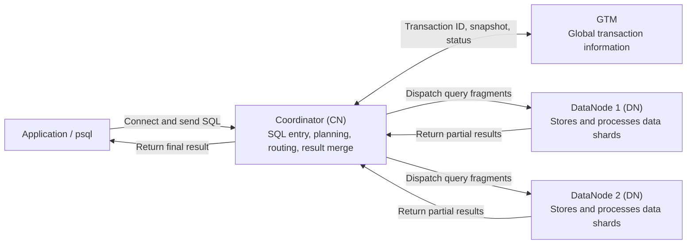

<!--
Copyright (C) 2026 OpenTenBase Authors. All rights reserved.
Licensed under the BSD 3-Clause License. See LICENSE.txt in the repository root.
-->

# OpenTenBase architecture glossary

**Language**: [English](GLOSSARY.md) | [简体中文](GLOSSARY_ZH.md)

This guide explains the main OpenTenBase architecture terms used in the README, source tree, and deployment configuration. It focuses on the V5 topology managed by `opentenbase_ctl` and gives newcomers a mental model before they deploy or operate a cluster.

## Architecture at a glance

The following diagram shows the normal SQL path in **distributed mode**. It is intentionally simplified: depending on the execution plan, DataNodes may also exchange intermediate data with one another.

| Component | What it does | What it does not do |
| --- | --- | --- |
| Client | Connects to a CN and sends SQL in distributed mode. | It does not need to know which DN owns each row. |
| Coordinator (CN) | Stores cluster metadata, plans and routes SQL, coordinates work on DNs, and combines results. | It normally does not store user table rows. |
| DataNode (DN) | Stores user data and executes local scans, joins, aggregations, and writes requested by the CN. | A DN does not provide the cluster-wide SQL routing view. |
| GTM | Manages global transaction information, including global transaction identifiers and snapshots, and global objects such as sequences. | It does not store user tables or execute query plans. |

A typical distributed query follows these steps:

1. The client connects to a CN and sends SQL.
2. The CN parses and plans the statement, then uses table distribution metadata to choose the relevant DN or DNs.
3. When global transaction information is needed, the CN obtains it from GTM.
4. The CN dispatches query fragments. Each selected DN processes its local data and returns a partial result; some plans also redistribute intermediate data between DNs.
5. The CN merges the results and returns one result set to the client. A write involving multiple DNs uses a distributed commit protocol so that all participants reach one outcome.

## Core terms

### 1. Coordinator (CN)

The SQL entry point for a distributed OpenTenBase cluster. A CN holds metadata such as schemas, node information, and table placement, creates distributed execution plans, routes work to DNs, and combines their results. Applications normally connect to a CN instead of directly modifying a DN.

### 2. DataNode (DN)

The node that stores actual user data and performs data-local work. Different primary DNs can own different portions of a distributed table, allowing storage and computation to scale horizontally.

### 3. GTM (Global Transaction Manager)

The service that supplies cluster-wide transaction information in distributed mode. It manages items such as global transaction identifiers, snapshots, transaction state, and global sequences so that CNs and DNs can share a consistent transaction view. GTM is neither a SQL gateway nor a business-data store.

### 4. Distributed mode (`distributed`)

An `opentenbase_ctl` deployment mode containing GTM, CN, and DN roles. Clients connect to a CN, while data can be divided across multiple primary DNs and work can run in parallel. Adding DNs only helps when table placement and data distribution use them effectively.

### 5. Centralized mode (`centralized`)

A simplified `opentenbase_ctl` deployment mode. The tool ignores GTM and CN configuration and deploys one DataNode group, so clients connect to the DN rather than following the distributed CN-to-DN path. It is a different topology, not all three distributed roles merged into one process.

### 6. Shared-nothing architecture

An architecture in which each primary DN has its own compute, memory, and storage and communicates with other nodes over the network. This enables horizontal scaling and parallel work, while making distribution choices and cross-node traffic important to performance.

### 7. Node group

A named logical set of primary DNs used as a data-placement boundary. Tables and shards can be assigned to a group rather than to every DN in the cluster. During installation, `opentenbase_ctl` creates a `default_group` from the configured primary DNs. A node group is not a group of CNs or GTMs, and it is not a primary/standby pair.

### 8. `opentenbase_ctl`

The OpenTenBase V5 command-line deployment and operations tool. It reads `opentenbase_config.ini` and supports tasks such as install, delete, start, stop, status, remote shell, SQL execution, file copy, and GUC management. It configures and controls database processes; it is not a database server process itself.

### 9. Data shard and sharding

A shard is a subset of a logical table's rows stored on a DN; sharding is the act of spreading those subsets across DNs. Shards provide data-level horizontal scaling. They are different from standby replicas, which copy a primary node for availability, and from PostgreSQL table partitions, which are a separate table-design feature.

### 10. Distribution key

One or more table columns whose values help determine the target DN for a row, for example in `DISTRIBUTE BY HASH(user_id)` or `DISTRIBUTE BY SHARD(user_id)`. A useful key spreads rows evenly and often aligns with filters or joins, reducing the number of DNs and the amount of network traffic needed by common queries.

### 11. Distributed table

A table whose rows are placed across DNs according to a distribution rule such as `HASH`, `SHARD`, `MODULO`, or `ROUNDROBIN`. Each row is routed to the location selected by that rule, so one DN normally stores only part of the table. This distributes capacity and work but may require data movement for queries that cross placements.

### 12. Replicated table

A table declared with `DISTRIBUTE BY REPLICATION`, for which each participating DN in the placement scope keeps a full copy. Replication can make small lookup tables available next to distributed data, but every write and every copy consumes additional work and storage. A replicated table is not the same as an HA standby.

### 13. Distributed query plan

The CN's plan for executing one SQL statement across the cluster. The CN can route a key-based lookup to a small set of DNs, push scans or aggregations down, request data redistribution for cross-shard operations, and merge partial results. Not every query contacts every DN.

### 14. Global transaction, GXID, and global snapshot

A global transaction is one logical transaction whose work must be understood consistently across nodes. GTM provides a cluster-wide transaction identifier (GXID) and snapshot information used to establish a consistent visibility view. These are transaction-control metadata, not copies of application data.

### 15. Two-phase commit (2PC)

A protocol used when a write transaction has multiple participating nodes. The coordinating CN first asks participants to prepare; it then tells all of them to commit if preparation succeeded, or to roll back if it did not. 2PC gives the distributed write one atomic outcome, while GTM supplies the global transaction context.

## Common distinctions

| Often confused | The practical difference |
| --- | --- |
| CN vs. GTM | A CN plans and coordinates SQL. GTM manages global transaction information and global objects. |
| Node group vs. shard | A node group is a set of DNs; a shard is a subset of table data placed on a DN in that group. |
| Distributed table vs. replicated table | A distributed table divides rows among DNs; a replicated table stores a full copy on every participating DN. |
| Replicated table vs. standby | Table replication is a table placement strategy across active DNs. A standby is an HA copy of a node and is not another writable shard. |
| `opentenbase_ctl` vs. OpenTenBase server | The tool deploys and controls nodes. The GTM and database processes provide the running services. |

## Further reading

- [Project overview and deployment example](../README.md)
- [`opentenbase_ctl` reference](../contrib/opentenbase_ctl/README.md)
- [Table distribution documentation](src/sgml/ddl.sgml)
