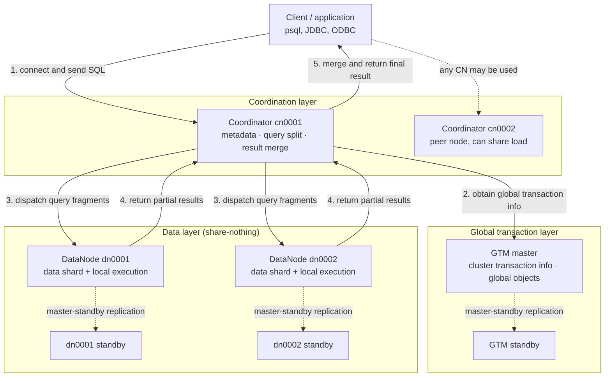

<!--
Copyright (C) 2019-2025 OpenTenBase Authors. All rights reserved.
SPDX-License-Identifier: BSD-3-Clause
-->

# OpenTenBase Architecture Glossary and Newcomer Guide

**Language**: [English](GLOSSARY.md) | [简体中文](GLOSSARY_ZH.md)

This guide is written for readers who are new to OpenTenBase. The goal is to build a complete architectural map before you follow the build and deployment steps in the README: which roles form a cluster, how a single SQL statement is executed, how data is distributed, and what each deployment configuration field actually means.

Every statement below points to its evidence inside this repository. The baseline is commit `b612d77c` on `master`. Anything that cannot be confirmed from the current repository is not included.

---

## Table of contents

- [1. The thirty-second overview](#1-the-thirty-second-overview)
- [2. Architecture diagram](#2-architecture-diagram)
- [3. The journey of one SQL statement](#3-the-journey-of-one-sql-statement)
- [4. Core glossary (15 terms)](#4-core-glossary-15-terms)
- [5. Data distribution strategies](#5-data-distribution-strategies)
- [6. Distributed mode versus centralized mode](#6-distributed-mode-versus-centralized-mode)
- [7. Six boundaries that are easy to confuse](#7-six-boundaries-that-are-easy-to-confuse)
- [8. Newcomer FAQ](#8-newcomer-faq)
- [9. Common deployment pitfalls](#9-common-deployment-pitfalls)
- [10. Suggested learning path](#10-suggested-learning-path)
- [11. Evidence index](#11-evidence-index)

---

## 1. The thirty-second overview

OpenTenBase is a distributed database management system based on prior work of the Postgres-XL project. Instead of one process owning all data as in single-node PostgreSQL, it splits responsibilities across three roles:

| Role | Responsibility in one line | Stores user data |
| --- | --- | --- |
| **Coordinator (CN)** | Cluster entry point. Accepts SQL, holds metadata, splits queries, collects results | No, metadata only |
| **DataNode (DN)** | Stores actual user data and executes work assigned to this node | Yes |
| **GTM** | Global transaction management and cluster-wide objects | No |

The single most important sentence to remember:

> **Clients always connect to a CN, never directly to a DN. All user data lives in DNs. GTM gives cross-node transactions a consistent global view.**

Evidence: `README.md` Overview states "All user data resides in the DataNodes, the CoordinateNode contains only metadata, the GTM is for global transaction management" and "Users always connect to the CoordinateNodes".

---

## 2. Architecture diagram



Three clarifications about this diagram, to avoid building a wrong mental model:

1. **It shows responsibilities, not a fixed sequence.** Which DNs a statement actually touches depends on the table distribution, the SQL predicates, and the execution plan. A point lookup may reach only one DN.
2. **GTM is drawn with dashed lines** because it neither splits queries nor stores user data. It provides cluster transaction information and manages global objects. Its internal protocol is out of scope here.
3. **Master-standby replication is instance-level high availability.** It is a completely different concept from a replicated table, which is table-level. Section 7 separates the two explicitly.

---

## 3. The journey of one SQL statement

Consider an aggregate query grouped by department:

```sql
SELECT department, COUNT(*)
FROM employee
GROUP BY department;
```

A newcomer can read it as five steps:

| Step | What happens | Who does it |
| --- | --- | --- |
| 1. Entry | The client connects to a CN and submits SQL | Client → CN |
| 2. Transaction setup | Global transaction information is obtained for this execution | CN ↔ GTM |
| 3. Split and dispatch | The CN uses metadata to split the query into fragments and dispatches them | CN → DN |
| 4. Local execution | Each relevant DN scans its own data and performs its assigned work | DN |
| 5. Merge and return | DNs return partial results; the CN merges them and replies | DN → CN → Client |

In shorthand:

```text
Client → CN → DN
Client ← CN ← DN
        ↑
       GTM (global transaction info)
```

**One important performance intuition**: when the `WHERE` clause matches the distribution key, the CN can route the query to a single DN. When it does not, multiple DNs must be visited and the CN merges the results. This is exactly why distribution key design matters so much.

Evidence: `README.md` states the CN will "divide up the query into fragments that are executed in the DataNodes, and collect the results". GTM responsibilities come from `README_ZH.md` and `src/gtm/README`.

---

## 4. Core glossary (15 terms)

Terms are ordered from components, to deployment, to data and transactions.

### 4.1 Coordinator / CoordinateNode (CN)

- **Plain explanation**: the front desk and the dispatcher of the cluster.
- **Responsibilities**: the business access entry. It accepts SQL, stores global system metadata, plans queries, dispatches fragments to DNs, and merges results. It does not store actual business data.
- **Multi-node behaviour**: multiple CNs can be configured. They are peers and each presents the same database view.
- **Evidence**: `README.md` Overview; `README_ZH.md`; the `[coordinators]` section of `opentenbase_config.ini`.

### 4.2 DataNode (DN)

- **Plain explanation**: the warehouse and the worker.
- **Responsibilities**: stores shards of business data and executes the requests dispatched by a CN. Each DN owns its storage and compute resources.
- **Evidence**: `README.md` "All user data resides in the DataNodes"; `README_ZH.md`.

### 4.3 GTM (Global Transaction Manager)

- **Plain explanation**: the cluster registry for global transactions.
- **Responsibilities**: manages cluster transaction information and cluster-wide global objects such as sequences.
- **Boundary**: GTM is not a query entry point, does not hold user tables, and does not split SQL.
- **Deployment constraint**: `[gtm]` accepts exactly one `master` IP; multiple `slave` IPs are allowed.
- **Evidence**: `README_ZH.md`; `src/gtm/README`; `contrib/opentenbase_ctl/src/config/config.h`, where `ConfigFileGtm` documents a single master IP.

### 4.4 Share-nothing architecture

- **Plain explanation**: every node owns its CPU, memory, and disk, shares nothing, and communicates over the network.
- **Why it matters**: scaling means adding machines rather than buying a bigger one, and commodity x86 servers are sufficient to run a cluster.
- **Trade-off**: cross-node data exchange costs network time, so keeping computation close to data is what delivers performance.
- **Evidence**: the official quickstart documentation describes the architecture as share-nothing.

### 4.5 Metadata

- **Plain explanation**: data describing which tables exist and how they are distributed, not the business data itself.
- **Responsibilities**: the CN stores only global system metadata and uses it for planning and routing.
- **Note**: CNs and DNs share the same schema but carry different responsibilities.
- **Evidence**: `README.md` "the CoordinateNode contains only metadata" and "share the same schema".

### 4.6 Distributed mode

- **Plain explanation**: the complete form of OpenTenBase.
- **Meaning**: with `type=distributed`, GTM, Coordinator, and DataNode are all required.
- **Evidence**: `README_ZH.md` configuration table; the `ConfigFileInstance::type` comment in `config.h`.

### 4.7 Centralized mode

- **Plain explanation**: no GTM and no CN are built; only one group of DataNodes is deployed.
- **Meaning**: with `type=centralized`, the tool **ignores the GTM and Coordinator configuration and keeps a single group of DataNodes**.
- **Important**: this is not "all three roles merged into one process", so do not transfer the distributed query path to a centralized instance.
- **Evidence**: the original comment in `config.h` states that centralized mode ignores GTM and Coordinator configuration and keeps one group of data nodes; the centralized example in `README_ZH.md` configures only `[datanodes]`.

### 4.8 Instance

- **Plain explanation**: one OpenTenBase deployment managed by `opentenbase_ctl`.
- **Meaning**: the `[instance]` section identifies the deployment through `name`, selects the mode through `type`, and points to the software package through `package`.
- **Evidence**: `README_ZH.md`; `ConfigFileInstance` in `config.h`.

### 4.9 Master and slave nodes

- **Plain explanation**: instance-level redundancy so that one failure does not stop service.
- **Rules**: GTM allows only one master IP. For CN and DN, the number of slave IPs must be an integer multiple of the master count; with one master and two slaves, the slave IP count is twice the master count.
- **Install order**: the tool installs the GTM master first, then CN and DN masters, and finally the slave nodes.
- **Evidence**: `README_ZH.md` configuration table; comments in `config.h`; steps 3 to 5 of the installation log in `README.md`.

### 4.10 `nodes-per-server`

- **Plain explanation**: how many nodes of that type run on each server.
- **Meaning**: optional, default `1`. With 3 master IPs and a value of 2, six nodes are deployed in total.
- **Common misreading**: it is not the total number of servers.
- **Evidence**: `README_ZH.md`; the `nodes_per_server` comments in `config.h`.

### 4.11 Node group

- **Plain explanation**: a logical grouping of DNs.
- **Implementation detail**: the distributed installation flow creates a default node group named `default_group` from the **DN master nodes** in the configuration, then creates a sharding group. The statements are:

  ```sql
  CREATE DEFAULT node group default_group with (dn0001,dn0002);
  CREATE sharding group to group default_group;
  ```

- **Boundary**: it groups DNs. It is neither a group of physical servers nor a Kubernetes node group.
- **Evidence**: `build_create_node_group_cmd()` in `contrib/opentenbase_ctl/src/cluster/cluster.cpp` collects only `NODE_TYPE_DN_MASTER` and issues the statements above; the installation log prints `Create node group successfully`.

### 4.12 Distribution key (shard key)

- **Plain explanation**: the column that decides which DN a row lands on.
- **Meaning**: specified at table creation with `distribute by shard(column)`; rows are routed to a specific DN accordingly.
- **Design guidance**: choose a high-cardinality column that appears often in predicates and join conditions, to avoid skew and unnecessary cross-node traffic.
- **Evidence**: the `OptDistributeByInternal` rule in `src/backend/parser/gram.y`; the official usage documentation.

### 4.13 Sharded tables and replicated tables

- **Sharded table**: rows are spread across DNs by the distribution key. Suitable for large tables.
- **Replicated table**: each participating DN keeps a full copy. Suitable for small dimension tables that are joined frequently, because it removes cross-node data movement.
- **Examples**:

  ```sql
  -- Sharded: rows spread across DNs by id
  CREATE TABLE orders(id bigint, amount numeric) DISTRIBUTE BY SHARD(id);

  -- Replicated: every DN keeps a complete copy
  CREATE TABLE city_dict(code int, name text) DISTRIBUTE BY REPLICATION;
  ```

- **Evidence**: `DISTTYPE_SHARD` and `DISTTYPE_REPLICATION` in `gram.y`; the official usage documentation covers shard tables, hot/cold partitioned tables, and replicated tables.

### 4.14 `opentenbase_ctl`

- **Plain explanation**: the cluster operations command-line tool, not the database server process itself.
- **Subcommands**: `install`, `delete`, `start`, `stop`, `status`, `scp`, `shell`, `sql`, `guc`.
- **Typical usage**:

  ```bash
  opentenbase_ctl install -c opentenbase_config.ini   # install an instance
  opentenbase_ctl status  -c opentenbase_config.ini   # node status and CN connection info
  ```

- **Evidence**: the `-h` output in `contrib/opentenbase_ctl/README.md`; the installation and status sections of `README.md`.

### 4.15 `opentenbase_config.ini`

- **Plain explanation**: the single configuration entry describing cluster topology.
- **Sections**: `[instance]`, `[gtm]`, `[coordinators]`, `[datanodes]`, `[server]`, `[log]`.
- **Easily missed fields**: `[coordinators]` and `[datanodes]` accept an optional `conf` item that overrides tool defaults item by item; `ssh-port` in `[server]` must match the real SSH port.
- **Evidence**: the configuration table in `README_ZH.md`; the structures and comments in `config.h`.

---

## 5. Data distribution strategies

The grammar in `src/backend/parser/gram.y` confirms the following distribution types at the syntax level:

| Syntax | Internal type | Column required | Typical use |
| --- | --- | --- | --- |
| `DISTRIBUTE BY SHARD(col)` | `DISTTYPE_SHARD` | Yes | Primary choice for large tables, used by v5 examples |
| `DISTRIBUTE BY HASH(col)` | `DISTTYPE_HASH` | Yes | Hash-based spreading |
| `DISTRIBUTE BY MODULO(col)` | `DISTTYPE_MODULO` | Yes | Modulo-based placement |
| `DISTRIBUTE BY REPLICATION` | `DISTTYPE_REPLICATION` | No | Small dimension tables, avoids cross-node joins |
| `DISTRIBUTE BY ROUNDROBIN` | `DISTTYPE_ROUNDROBIN` | No | Even spreading with no natural key |

The grammar also accepts Greenplum-style syntax, which helps migration:

| Compatible syntax | Equivalent to |
| --- | --- |
| `DISTRIBUTED BY (col)` | `HASH` |
| `DISTRIBUTED RANDOMLY` | `ROUNDROBIN` |
| `DISTSTYLE KEY DISTKEY(col)` | `HASH` |
| `DISTSTYLE EVEN` | `ROUNDROBIN` |
| `DISTSTYLE ALL` | `REPLICATION` |

**Newcomer note**: syntax support does not guarantee that every build treats all types identically. If you hit `unrecognized distribution option` or a message such as `Cannot support distribute type`, trust the behaviour of your build. The official usage documentation and the v5 examples use `SHARD`.

Evidence: the `OptDistributeByInternal` rule starting near line 4732 of `gram.y`, and the comment near line 3753 listing `DISTRIBUTE BY ( HASH(column) | MODULO(column) | REPLICATION | ROUNDROBIN )`.

---

## 6. Distributed mode versus centralized mode

| Dimension | Distributed mode | Centralized mode |
| --- | --- | --- |
| Configuration value | `type=distributed` | `type=centralized` |
| Components handled by the tool | GTM, Coordinator, DataNode | One group of DataNodes |
| GTM / CN configuration | Required | Ignored |
| Client connects to | CN | DN |
| Data distribution | Spread across DNs by distribution key | Single group of data nodes |
| Scaling approach | Add DNs horizontally | Mainly master-standby and single-machine resources |
| Suitable for | Large data volume, high concurrency, horizontal growth | Smaller data sets, development and testing, lightweight setups |

A minimal distributed configuration, following the structure in `README_ZH.md`:

```ini
[instance]
name=opentenbase01
type=distributed
package=/data/opentenbase/install/opentenbase-5.21.8-i.x86_64.tar.gz

[gtm]
master=172.16.16.49

[coordinators]
master=172.16.16.49
nodes-per-server=1

[datanodes]
master=172.16.16.49,172.16.16.131
nodes-per-server=1

[server]
ssh-user=opentenbase
ssh-password=
ssh-port=36000

[log]
level=DEBUG
```

Evidence: the configuration examples in `README_ZH.md`; the `type` comment in `config.h`.

---

## 7. Six boundaries that are easy to confuse

| Common misconception | More accurate understanding | Evidence |
| --- | --- | --- |
| CNs also store business data | CNs hold only global metadata; user data lives in DNs | `README.md` Overview |
| Clients should connect to DNs | In distributed mode clients connect to a CN, which coordinates DNs | `README.md` |
| GTM splits SQL or executes joins | GTM manages cluster transaction information and global objects; the CN splits queries | `README_ZH.md`, `src/gtm/README` |
| A replicated table is the same as a standby node | A replicated table is a **table-level** distribution choice; master-standby is **instance-level** high availability | `gram.y`, `config.h` |
| A node group is a set of physical servers | It is a logical grouping of DNs, named `default_group` by default | `cluster.cpp` |
| Centralized mode is just distributed mode with fewer nodes | It ignores GTM and CN configuration and builds one group of DNs | `config.h` |

---

## 8. Newcomer FAQ

**Q1: Why must I connect to a CN instead of a DN?**

Only the CN holds the complete global metadata and routing information needed to split a statement across the relevant DNs and merge the results. Connecting to a single DN exposes only that node's local data.

**Q2: What happens if I choose the wrong distribution key?**

Two typical consequences. First, data skew, where one DN holds far more rows than the others. Second, queries that cannot be routed to a single node, producing heavy cross-node traffic. The key is fixed at table creation and expensive to change later, so it deserves careful design.

**Q3: When should I use a replicated table?**

When a table is small, rarely updated, and frequently joined with large tables. As a replicated table it lets each DN complete the join locally. Region tables, dictionaries, and configuration tables are typical cases.

**Q4: How does `nodes-per-server` relate to the number of servers?**

It is the number of nodes deployed per IP. Three master IPs with a value of 2 produce six nodes, two per server. It does not represent the total server count.

**Q5: Is centralized mode the same as single-node PostgreSQL?**

Not exactly. In centralized mode the deployment tool builds only one group of DataNodes and ignores GTM and Coordinator configuration. It suits lightweight scenarios but remains an OpenTenBase deployment form; rely on the behaviour of your version.

**Q6: What does `Create node group` in the installation log mean?**

The tool is creating the default node group `default_group` from the DN master nodes, then creating a sharding group. This is the step that tells the cluster which DNs data should be distributed across.

---

## 9. Common deployment pitfalls

The following issues were derived by cross-checking the deployment flow and the configuration parsing code. Newcomers following the README literally tend to meet them.

| Symptom | Likely cause | Where to look |
| --- | --- | --- |
| `psql: command not found` or shared library errors | `PATH` and `LD_LIBRARY_PATH` do not point to the install directory | Re-export the environment variables from the README preparation section |
| Configuration parsing fails | A missing section, a misspelled field, or a non-absolute path | Check `[instance]`, `[gtm]`, `[coordinators]`, `[datanodes]`, `[server]`, `[log]` one by one |
| Remote node installation fails | `ssh-port` does not match the real port, or accounts are not identical | The tool expects identical accounts across servers; verify SSH manually first |
| Slave count validation fails | CN/DN slave IP count is not an integer multiple of the master count | Align with the one-master-one-slave or one-master-two-slaves ratio |
| Package not found | Wrong `package` path or the archive was never created | Prefer a full path and confirm the `*.tar.gz` exists |
| Table creation reports an unsupported distribution type | The syntax is not enabled in your build | Prefer `DISTRIBUTE BY SHARD(column)` as used by the official v5 examples |

Evidence: the preparation and installation sections of `README.md` and `README_ZH.md`; the field constraints in `config.h`; `contrib/opentenbase_ctl/README.md`.

---

## 10. Suggested learning path

1. **Read this guide** to build the CN / DN / GTM map.
2. **Follow the README build section** to compile from source and create the package.
3. **Deploy a minimal cluster** with `opentenbase_ctl install`, for example 1 GTM + 1 CN + 2 DN.
4. **Confirm node status** with `opentenbase_ctl status` and note the CN connection details.
5. **Create a sharded table on the CN**, insert rows, and query them to verify the path.
6. **Create a replicated table and compare a join** to feel the difference between the two strategies.
7. **Move on to the advanced official documentation** for execution plans, scaling, and tuning.

A minimal verification for step 5:

```sql
CREATE TABLE foo(id bigint, str text) DISTRIBUTE BY SHARD(id);
INSERT INTO foo VALUES (1, 'tencent'), (2, 'shenzhen');
SELECT * FROM foo;
```

Evidence: the usage example in the official quickstart documentation.

---

## 11. Evidence index

Every architectural claim in this guide can be traced to the following repository content:

| File | What it supports |
| --- | --- |
| [`README.md`](../README.md) | CN / DN / GTM responsibilities, shared schema, client connection target, installation flow and logs |
| [`README_ZH.md`](../README_ZH.md) | Chinese overview, configuration field table, distributed and centralized examples |
| [`contrib/opentenbase_ctl/README.md`](../contrib/opentenbase_ctl/README.md) | Subcommands and operations supported by `opentenbase_ctl` |
| [`contrib/opentenbase_ctl/src/config/config.h`](../contrib/opentenbase_ctl/src/config/config.h) | Centralized mode ignoring GTM/CN, single GTM master IP, integer-multiple slave rule, `nodes-per-server`, optional `conf` |
| [`contrib/opentenbase_ctl/src/cluster/cluster.cpp`](../contrib/opentenbase_ctl/src/cluster/cluster.cpp) | Default node group `default_group` built from DN masters, followed by sharding group creation |
| [`src/backend/parser/gram.y`](../src/backend/parser/gram.y) | SHARD / HASH / MODULO / REPLICATION / ROUNDROBIN distribution types and Greenplum-compatible syntax |
| [`src/gtm/README`](../src/gtm/README) | GTM source layout and server-side components |

This guide deliberately avoids the internals of the distribution algorithm, the query optimizer, and the GTM protocol. Those topics require the design documents and source code of a specific version.
