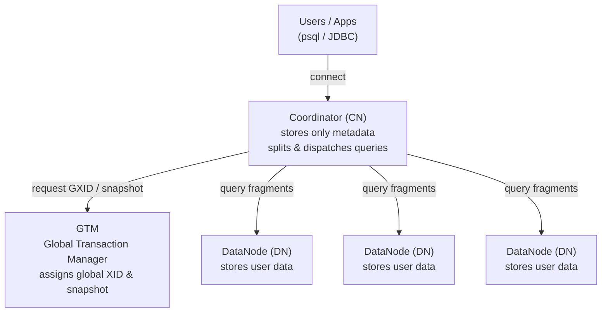

# OpenTenBase Architecture Glossary & Newcomer Guide

New to OpenTenBase? The README frequently mentions Coordinator, DataNode, GTM, node group, distributed/centralized modes, and more. This document explains these core terms in plain language and includes an architecture diagram to show how they all fit together.

> OpenTenBase is an enterprise-grade distributed database evolved from Postgres-XL. In a distributed cluster, data is split across many nodes, but to the user it still looks and behaves like a single database.

---

## 1. Architecture Overview

An OpenTenBase cluster consists of three node types, each with a distinct role:

**How a query flows through the cluster:**

| Step | Who | What |
|------|-----|------|
| 1 | User | Connects to a **CN** via psql / JDBC (never directly to a DN) |
| 2 | CN | Parses the SQL, uses metadata to determine which DNs hold the data, splits the query into fragments |
| 3 | GTM | Assigns a global transaction ID and global snapshot, ensuring all DNs see a consistent view |
| 4 | DNs | Each DN executes its query fragment locally on its own data |
| 5 | CN | Collects results from all DNs, merges them, and returns the final result to the user |

---

## 2. Core Glossary

### 1. Coordinator (CN)
The entry point for all user connections. Users and applications **always connect to a CN**, never directly to a DN. A CN receives SQL, parses it, generates a distributed execution plan, splits the query into fragments, dispatches them to the relevant DNs, and merges the results back to the user.
CNs store **only metadata** (table schemas, distribution rules, node topology) — never user data. Multiple CNs can be deployed to distribute connection load.

### 2. DataNode (DN)
The storage layer where **all user data resides.** Each DN holds a portion (shard) or a full copy (replica) of a table, and executes query fragments locally on behalf of the CN.
A common point of confusion for newcomers: CNs and DNs share the same table schemas, but data only exists on DNs. When you query a table, multiple DNs typically work in parallel. This parallelism is what enables horizontal scaling.

### 3. GTM (Global Transaction Manager)
The global transaction coordinator. In a single-node database, transaction IDs and snapshots are managed locally. In a distributed system, a transaction can span multiple DNs. A single, central authority must issue **global transaction IDs (GXIDs)** and **global snapshots** so that cross-node consistency is maintained — for example, to prevent a transaction that has committed on DN1 but is still in-flight on DN2 from being visible as partially-committed data. The GTM source code is located at `src/gtm/`.

### 4. Global Transaction ID & Global Snapshot (GXID / Global Snapshot)
Two pieces of information that the GTM provides. A **global transaction ID** is a cluster-wide unique number assigned to each transaction. A **global snapshot** describes which transactions are committed and which are still in-flight at a given moment. All DNs use the same snapshot to determine data visibility, so that data spread across multiple nodes remains as consistent as in a single database.

### 5. Distributed Mode
A deployment topology that uses **all three node types: GTM + Coordinator + DataNode.** Data is sharded across multiple DNs, enabling horizontal scaling and high concurrency. This is the primary deployment mode for OpenTenBase. Set via `type=distributed` in `opentenbase_config.ini`.

### 6. Centralized Mode
A deployment topology that uses **only DataNodes** (with optional masters/slaves) — no CNs, no GTM. Suitable for workloads with modest data volume and concurrency that only need a highly-available single-node setup. Set via `type=centralized` in the config file. Understanding the difference between these two modes is essential for reading the deployment docs.

### 7. Distribution Strategy
How a table's rows are spread across DNs, specified with `DISTRIBUTE BY` at table creation. OpenTenBase supports several strategies:

| Strategy | Meaning | Typical Use |
|----------|---------|-------------|
| `DISTRIBUTE BY SHARD` | Split data evenly across DNs by a shard key (the recommended default) | Large tables needing parallel computation |
| `DISTRIBUTE BY REPLICATION` | Every DN holds a full copy | Small dimension tables frequently used in JOINs |
| `DISTRIBUTE BY HASH` | Distribute by hashing a column's value | Even spread by key |
| `DISTRIBUTE BY MODULO` | Distribute by modulo on a column's value | Even spread on integer keys |
| `DISTRIBUTE BY ROUNDROBIN` | Distribute round-robin, independent of any column | Flat distribution when no suitable key exists |

Picking the right strategy directly affects query performance: co-locating tables that are frequently joined together by the same shard key lets JOINs happen locally on each DN, avoiding expensive cross-node data redistribution.

### 8. Node Group
A logical collection of DataNodes. You can specify which node group a table's data should reside in at creation time, enabling grouped data management and isolation. The last step of cluster installation (see README install log: `step 6: Create node group`) organizes DNs into a default node group — tables created afterwards are assigned to this default group.

### 9. Master / Slave
Every node type (GTM, CN, DN) can be configured with **one master + one or more slaves** for high availability. The master handles reads and writes; slaves keep in sync via streaming replication. If the master fails, a slave can be promoted. In the config file, `master=` lists primary IPs and `slave=` lists standby IPs.

### 10. Shared-Nothing Architecture
The architectural model underlying OpenTenBase: each DN has its own independent CPU, memory, and disk. Nodes **share no storage** and only communicate over the network. Adding more machines increases both storage capacity and compute power (horizontal scaling), with no shared-storage bottleneck.

### 11. opentenbase_ctl (Cluster Management Tool)
The recommended tool for managing an OpenTenBase cluster: install, start, stop, and check status with a single command. It reads `opentenbase_config.ini` and uses the topology defined there to deploy the entire cluster across multiple servers. The README's installation chapter demonstrates its usage.

### 12. pgxc_ctl (Legacy Management Tool)
An older cluster management tool inherited from Postgres-XL, found at `contrib/pgxc_ctl/`. Functionally similar to opentenbase_ctl, it predates the newer tool. For new deployments, use opentenbase_ctl. pgxc_ctl is mainly relevant when reading older documentation.

### 13. Metadata vs. User Data
The key distinction for understanding CN/DN division of labor. **Metadata** describes the structure of data — column definitions, distribution rules, node topology — and is stored on CNs. **User data** is the actual rows in your tables, and is stored on DNs.

### 14. opentenbase_config.ini (Cluster Configuration File)
The central configuration file that describes your cluster topology. Its sections — `[instance]`, `[gtm]`, `[coordinators]`, `[datanodes]`, `[server]`, `[log]` — declare the instance name, deployment mode, master/slave IPs for each node type, SSH credentials, and log level. opentenbase_ctl uses this file to install and manage the cluster.

---

## 3. FAQ

**Q: Which node should I connect to for running SQL?**
Connect to a **CN master node.** Users never connect directly to DNs. After installation, `opentenbase_ctl status` prints the CN connection info (IP, port, psql command).

**Q: Where is my data actually stored? Does the CN store any data?**
All data lives on **DNs.** CNs only store metadata — no user data.

**Q: Distributed vs. centralized mode — which one should I pick?**
Need horizontal scaling and high concurrency? → Distributed (GTM + CN + DN). Need a highly-available single-node database with modest data volume? → Centralized (DN master/slave only).

**Q: Why does OpenTenBase need a GTM? Single-node databases don't have one.**
Because a single transaction can modify data on multiple DNs simultaneously. A central transaction coordinator is required to hand out consistent transaction IDs and snapshots across all nodes. A single-node database manages everything locally, so it does not need a separate transaction manager.

**Q: What happens if I create a table without specifying a distribution strategy?**
It defaults to `SHARD`, spreading data across all DNs in the default node group. If your table is small and frequently used in JOINs, consider using `REPLICATION` instead.

---

## 4. Further Reading

- Project home: <https://www.opentenbase.org/>
- Official docs: <https://docs.opentenbase.org/>
- Quickstart: <https://www.opentenbase.org/blog/01-quickstart/>
- Installation & deployment: see [README.md](../README.md)
- GTM source: see [`src/gtm/README`](../src/gtm/README)
