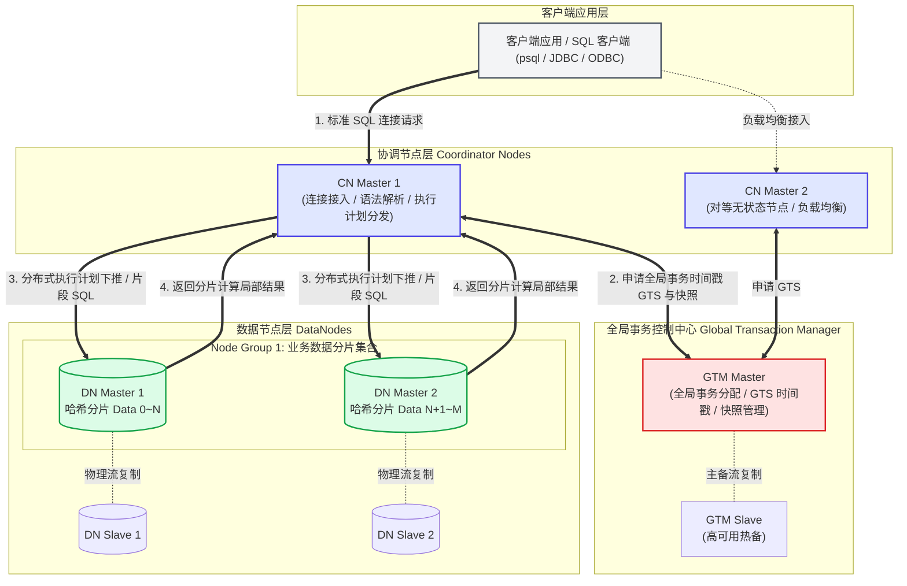

# OpenTenBase 核心术语表与新手架构导览

> **导言**  
> OpenTenBase 是一个先进的企业级**无共享（Shared-Nothing）分布式关系型数据库管理系统**。初次阅读 OpenTenBase 部署与架构文档时，新手开发者常涉及 **Coordinator Node (CN)**、**DataNode (DN)**、**GTM (全局事务管理器)**、**分布式模式**、**Node Group** 等一系列专业术语。  
> 本指南专为新手设计，深入浅出地剖析 OpenTenBase 的系统架构与设计理念，并系统整理了 14 个核心分布式术语，帮助初学者快速构建准确稳定的架构理解模型。

---

## 一、 OpenTenBase 分布式架构核心协同图解

在分布式关系型数据库中，如何将海量计算压力和存储数据分散到多个节点，同时保持对待应用层完全“像一个单体数据库一样”的透明体验与标准 SQL 兼容性？OpenTenBase 通过 **CN（协调节点）**、**DN（数据节点）** 与 **GTM（全局事务管理节点）** 三驾马车的高效分工协同来实现这一目标。

### 1. 核心架构关系流转图 (Mermaid 流程图)

---

### 2. 用户、CN、DN 与 GTM 的职责与关系对比表

| 核心组件 / 角色 | 全称与定位 | 在系统架构中的核心职责 | 与客户端 / 其它节点之间的协同关系 |
| :--- | :--- | :--- | :--- |
| **客户端 (Client)** | 业务应用或查询客户端 | 发起标准的 PostgreSQL 语法请求（DDL / DML / DQL）及事务处理命令。 | **只直连 CN 节点**，无需感知底层存在多少个 DN 分片或 GTM 节点。 |
| **CN (协调节点)** | Coordinator Node *“全网网关与大脑”* | **不存储业务真实表数据**，仅保存全库系统目录与元数据信息（表结构、分布策略、路由规则）。负责接收应用 SQL、解析鉴权、优化生成分布式执行计划，并将计算任务分发下推到具体的 DN，最后对返回结果进行排序、合并返回给用户。 | 对外向应用提供一致的 SQL 接口；对内向 GTM 申请全局事务 ID/快照，并向相关的 DN 发送片段执行计划。支持多 CN 对等横向扩展。 |
| **DN (数据节点)** | DataNode *“分布式存储与计算底层”* | **负责真实分片数据的持久化存储与局部 SQL 计算**。每个 DN 管理属于该节点哈希桶的数据，执行 CN 下推的过滤、局部聚合、索引查找及关联计算，并在本地实施并发控制。 | 不直接接受用户业务连接；听从 CN 发来的查询片段与两阶段提交指令，并在必要时由 CN 引导或节点间传递分片计算结果。 |
| **GTM (全局事务管理)** | Global Transaction Manager *“时钟与一致性中枢”* | 负责集群全局唯一事务 ID (GXID) 与**全局单调递增时间戳 (GTS)** 的生成，协调全网事务快照可见性，保障分布在多个 DN 上的跨节点事务符合企业级 ACID 标准。 | 接受来自 CN / DN 的全局时间戳请求，实现跨 DN 事务多版本读写的一致性快照感知。 |

---

### 3. 一条 SQL 在 OpenTenBase 分布式集群中的执行生命周期

为了让初学者更直观地理解分布式查询流转，以下阐述一条典型跨分片查询 `SELECT count(*), city FROM users WHERE age > 25 GROUP BY city;` 的处理链路：

1. **统一接入与鉴权**：客户端发起 SQL 请求连接至某个任意的 CN Master 节点。CN 对 SQL 进行语法检查和权限验证。
2. **事务快照获取**：CN 向 GTM 节点发送通信请求，申请本次查询的全局一致性快照与全局时间戳 (GTS)，确保全表查询遵循统一的 MVCC 时间基线。
3. **优化与下推分析**：CN 内核根据系统表存储的 `users` 表分片分布策略，生成优化后的分布式执行计划，识别出谓词过滤 `age > 25` 和局部聚合 `GROUP BY city` 可直接下推。
4. **分片执行分发**：CN 并行将带有局部过滤和聚合算子的 SQL 片段发送至所有保存了 `users` 表数据的 DN 节点（例如 DN1 和 DN2）。
5. **底层并行加速**：DN1 与 DN2 利用本地多处理进程读取各自硬盘上的哈希分片数据，快速完成过滤并返回各分片的中间聚合统计结果给 CN。
6. **汇聚与应答**：CN 收到全部 DN 的分片中间数据后，在协调层执行二次全局聚合与排序，将完整最终结果呈现给客户端。

---

## 二、 OpenTenBase 核心术语表 (14 个核心概念简明释义)

为了降低新手的理解门槛，以下 14 个核心术语按照**核心节点**、**部署与系统模式**、**数据分布与资源组**、**事务与计算执行**、**运维管理工具**五大维度进行整理。

### （一） 核心组件与物理角色类

#### 1. Coordinator Node (CN / 协调节点)
* **新手简明解释**：分布式集群的“对应用统一门户”与“智能调度大脑”。业务客户端的所有 SQL 请求均连接至 CN。CN 不存储用户的真正业务数据（只存系统表元数据和数据节点分布路由图）。它负责把 SQL 拆解为分布式子任务，交给各个具体的 DN 执行，并将处理完毕的数据合并返回。集群中可部署多个无状态 CN 以分担高并发请求。

#### 2. DataNode (DN / 数据节点)
* **新手简明解释**：分布式集群的“存储仓库”与“计算工蜂”。每个 DN 节点独立拥有本地 CPU、内存与磁盘，存储被分布式策略切割后的一部分用户数据。DN 既负责本地真实数据的持久化，又负责执行 CN 发送到本节点的 SQL 子任务（如通过本地索引扫描查询、局部关联等）。

#### 3. Global Transaction Manager (GTM / 全局事务管理器)
* **新手简明解释**：分布式集群的“统一时钟指挥部”。因为数据被分割到了多个 DN 节点，分布式并发修改时为了保证查询不读到脏数据或半条数据，必须有一位唯一权威的主管为全网分配事务序列号（GXID）和全局时间戳（GTS）。GTM 正是承担该角色的控制节点。

---

### （二） 集群架构与运行模式类

#### 4. 分布式模式 (Distributed Mode)
* **新手简明解释**：OpenTenBase 的标准企业级全功能架构模式。在部署形态上完整涵盖 `GTM` + `CN` + `DN` 三类组件。数据天然水平切分到多个服务器，无论是海量数据存储（数十 TB ~ PB 级）还是超高并发事务，都可以通过向集群不断追加物理节点来横向扩展性能。

#### 5. 集中式模式 (Centralized Mode)
* **新手简明解释**：面向轻量化场景或中小型数据库的单机/高可用备用模式。在配置为 `centralized` 时，集群不额外启动或依赖独立的分布式 CN/GTM 交互逻辑，数据全部存放在单一实例主库中，具备类似原生 PostgreSQL 主从数据库的便捷性与零运维通信损耗。

#### 6. 无共享架构 (Shared-Nothing Architecture)
* **新手简明解释**：企业级分布式存储与数据库的基础架构哲学。每个硬件服务器节点拥有独自私有的 CPU、本地内存和独立磁盘，节点彼此之间完全无竞争共享。若需要协同处理事务或计算，全靠告诉以太网网络进行消息互通，从根本上打破了单台高端主机硬件能力的“天花板”。

---

### （三） 数据分布与多租户隔离类

#### 7. Node Group (节点组)
* **新手简明解释**：由多个 DN 节点组合而成的“数据承载资源单元”。Node Group 是 OpenTenBase 支持多租户资源隔离和水平扩缩容的逻辑基础。运维人员可以将不同的业务大表指定分布在特定的 Node Group 上，避免重要业务受到一般分析报表业务的资源争抢。

#### 8. 哈希分布表 (Hash Distributed Table)
* **新手简明解释**：在建表时指定一个或几个关键列作为“分布键（Distribution Key，例如用户表中的 `user_id`）”。写入数据时，数据库内核对分布键求 Hash 值，将其按照算法稳定地定位并写入对应的某一个特定 DN 节点中。这能保证海量数据在整个集群各个物理机器间保持平缓且均衡。

#### 9. 复制表 / 广播表 (Replicated Table)
* **新手简明解释**：与哈希切分不同，复制表是指在每一个 DN 节点上都保存一份全量表数据副本。常用于系统中数据量很小、不常修改但需要频繁被各大表做 `JOIN` 关联查询的字典表/配置表（如省市行政区码表）。这极大地避免了关联查询时的跨网路数据分发（Shuffle）。

---

### （四） 分布式事务与计算优化类

#### 10. 全局时间戳 (GTS / Global Timestamp)
* **新手简明解释**：由 GTM 统一发行的物理/逻辑递增序列号。在分布式事务中，每个写操作与查询操作都会向 GTM 申请一个对应的 GTS 作为“当前事务快照时间版本”。任何 DN 在读取数据版本时，利用 GTS 一律能做到毫秒级精准的读一致性。

#### 11. 两阶段提交 (2PC / Two-Phase Commit)
* **新手简明解释**：确保跨多个 DN 节点并发写操作“要么一起成功、要么一起取消（ACID）”的核心协议。由 CN 节点任协调员，第一阶段询问所有参与修改的 DN 节点是否准备好（Prepare），待各方均确认落盘锁定无误后，第二阶段才发出正式确认指令（Commit）。

#### 12. 算子下推与分片查询 (Query Pushdown)
* **新手简明解释**：分布式数据库优化的黄金准则：“让计算靠近数据”。CN 在规划 SQL 执行时，把 WHERE 条件过滤、局部 `SUM/COUNT` 统计等尽量打包直接下放到各底层 DN 上执行。只有经过过滤减负后的精简结果才会被回送到 CN 上，减少网络传输负担。

---

### （五） 运维与高可用管理工具类

#### 13. opentenbase_ctl (自动化集群管控工具)
* **新手简明解释**：OpenTenBase 官方出品的 Python / C++ 一站式自动化命令行运维工具。它由包含节点的 `opentenbase_config.ini` 配置文件驱动，一条指令即可全自动在多台 Linux 主机之间建立免密分发、编译环境验证、一键化安装部署、启动停止及健康监控。

#### 14. 在线重分布 (Online Redistribution)
* **新手简明解释**：当原有数据库集群存储容量已近极限并新添了一批服务器 DN 节点时，触发重分布机制可以自动调整原有哈希映射，在不中业务服务读取的前提下，平稳把部分老哈希分片切出搬迁到新服务器节点上，实现无损平滑扩容。

---

## 三、 新手快速上手 FAQ

* **Q1：为什么应用代码只需要连接 CN 节点？我可以直连 DN 执行业务吗？**  
  **A**：业务应用应该**且绝大多情况下只能**连接 CN 节点。因为单个 DN 仅存放分片后的局部数据，且不持有全局事务可见性上下文；直接操作 DN 将导致无法正确识别全局强一致事务，亦无法访问存储在其它 DN 上的行记录。

* **Q2：配置 `opentenbase_config.ini` 时，`[coordinators]` 与 `[datanodes]` 下的 `conf` 参数到底指什么？**  
  **A**：该字段指定向各个待安装节点发送的 PostgreSQL 内核启动配置文件（GUC 参数文件，通常命名为 `postgres.conf`）。即使不需要特殊启动调优，为了满足语法校验，也需提前用 `touch postgres.conf` 创建空文件并在该字段填入其对应的绝对路径。

* **Q3：为什么执行 `./opentenbase_ctl install` 报 SSH 错误代码 `32512`？**  
  **A**：退出码 `32512` 对应 Bash 标准错误码 `127 (Command Not Found)`。这是由于安装命令的主机系统环境中缺失了非交互式远程传输软件 **`sshpass`** 引起。请使用操作系统包管理器（例如 `yum install -y sshpass` 或 `apt install -y sshpass`）将其装好即可修复。
