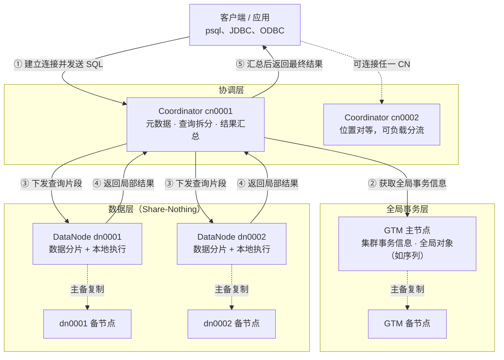

<!--
Copyright (C) 2019-2025 OpenTenBase Authors. All rights reserved.
SPDX-License-Identifier: BSD-3-Clause
-->

# OpenTenBase 架构术语表与新手导览

**语言**：[English](GLOSSARY.md) | [简体中文](GLOSSARY_ZH.md)

本文面向第一次接触 OpenTenBase 的读者。目标是在阅读 README 的编译与部署步骤之前，先建立一张完整的架构地图：集群由哪些角色组成、一条 SQL 如何被执行、数据如何分布、以及部署配置中的名词分别对应什么。

本文的每一条结论都标注了仓库中的依据位置。仓库基线为 `master` 分支的 `b612d77c`。无法从当前仓库确认的内容不写入本文。

---

## 目录

- [1. 三十秒建立整体印象](#1-三十秒建立整体印象)
- [2. 架构总览图](#2-架构总览图)
- [3. 一条 SQL 的完整旅程](#3-一条-sql-的完整旅程)
- [4. 核心术语表（15 条）](#4-核心术语表15-条)
- [5. 数据分布策略详解](#5-数据分布策略详解)
- [6. 分布式模式与集中式模式](#6-分布式模式与集中式模式)
- [7. 容易混淆的六个边界](#7-容易混淆的六个边界)
- [8. 新手 FAQ](#8-新手-faq)
- [9. 部署时最常踩的坑](#9-部署时最常踩的坑)
- [10. 建议的上手路径](#10-建议的上手路径)
- [11. 事实依据索引](#11-事实依据索引)

---

## 1. 三十秒建立整体印象

OpenTenBase 是基于 Postgres-XL 既有工作发展而来的分布式数据库管理系统。它把单机 PostgreSQL 的「一个进程管全部数据」拆成了三种角色：

| 角色 | 一句话职责 | 是否存放用户数据 |
| --- | --- | --- |
| **Coordinator（CN）** | 集群入口。接收 SQL、保存元数据、拆分查询、汇总结果 | 否，只有元数据 |
| **DataNode（DN）** | 真正存放用户数据，执行分配到本节点的计算 | 是 |
| **GTM** | 全局事务管理，管理集群事务信息与全局对象 | 否 |

最需要先记住的一句话：

> **客户端永远连接 CN，不直接连接 DN；用户数据全部在 DN；GTM 负责让跨节点事务有一致的全局认识。**

依据：`README.md` Overview 明确写出 "All user data resides in the DataNodes, the CoordinateNode contains only metadata, the GTM is for global transaction management" 与 "Users always connect to the CoordinateNodes"。

---

## 2. 架构总览图



关于这张图，有三点必须说明清楚，避免形成错误认知：

1. **它表达职责关系，不表达固定时序。** 一条 SQL 实际访问哪些 DN，取决于表的分布方式、SQL 条件和执行计划。点查可能只访问一个 DN。
2. **GTM 用虚线连接，是因为它不承担查询拆分与数据存储。** 它提供的是集群事务信息和全局对象管理能力。本文不展开其内部协议。
3. **主备复制是实例级高可用关系，与表级的复制表完全是两件事。** 这一点在第 7 节会专门区分。

---

## 3. 一条 SQL 的完整旅程

以一条按部门统计的聚合查询为例：

```sql
SELECT department, COUNT(*)
FROM employee
GROUP BY department;
```

新手可以按下面五步理解：

| 步骤 | 发生了什么 | 由谁完成 |
| --- | --- | --- |
| ① 接入 | 客户端连接 CN 并提交 SQL | 客户端 → CN |
| ② 事务准备 | 获取本次执行所需的全局事务信息 | CN ↔ GTM |
| ③ 拆分与分发 | CN 依据元数据把查询拆成片段，下发给相关 DN | CN → DN |
| ④ 本地执行 | 各 DN 扫描本节点数据，完成分配到本节点的计算 | DN |
| ⑤ 汇总返回 | DN 回传局部结果，CN 汇总处理后返回客户端 | DN → CN → 客户端 |

可以简记为：

```text
Client → CN → DN
Client ← CN ← DN
        ↑
       GTM（全局事务信息）
```

**一个重要的性能直觉**：如果 `WHERE` 条件命中了分布键，CN 可以把查询精准路由到单个 DN；如果没有命中，就需要访问多个 DN 并在 CN 汇总。这就是分布键设计如此关键的原因。

依据：`README.md` 说明 CN "divide up the query into fragments that are executed in the DataNodes, and collect the results"；GTM 职责见 `README_ZH.md` 与 `src/gtm/README`。

---

## 4. 核心术语表（15 条）

术语按认知顺序排列，从组件到部署，再到数据与事务。

### 4.1 Coordinator / CoordinateNode（CN，协调节点）

- **新手理解**：集群的「前台与调度中心」。
- **具体职责**：业务访问入口。接收 SQL、保存系统全局元数据、生成查询规划、把片段分发给 DN、汇总结果。功能上不存储实际业务数据。
- **多节点特性**：CN 可以配置多个，位置对等，每个节点提供相同的数据库视图。
- **依据**：`README.md` Overview；`README_ZH.md` 概览；`opentenbase_config.ini` 的 `[coordinators]` 段。

### 4.2 DataNode（DN，数据节点）

- **新手理解**：真正的「库房 + 工人」。
- **具体职责**：存储业务数据的分片，执行 CN 分发的执行请求。每个 DN 有自己的存储与计算能力。
- **依据**：`README.md` "All user data resides in the DataNodes"；`README_ZH.md`。

### 4.3 GTM（Global Transaction Manager，全局事务管理器）

- **新手理解**：集群的「全局事务登记处」。
- **具体职责**：负责管理集群事务信息，同时管理集群的全局对象，例如序列。
- **边界**：GTM 不是查询入口，不保存用户表，也不负责拆分 SQL。
- **部署约束**：`[gtm]` 的 `master` 只能配置一个 IP，`slave` 可配置多个。
- **依据**：`README_ZH.md` GTM 说明；`src/gtm/README`；`contrib/opentenbase_ctl/src/config/config.h` 中 `ConfigFileGtm` 注释「主节点，只有一个IP」。

### 4.4 Share-Nothing（无共享架构）

- **新手理解**：每个节点自带 CPU、内存和磁盘，互不共享，靠网络协议通信。
- **为什么重要**：这决定了扩展方式是「加机器」而不是「换更大的机器」，也意味着只需普通 x86 服务器即可部署集群。
- **代价**：跨节点数据交换要走网络，因此让计算贴近数据才有性能优势。
- **依据**：官方文档《快速入门》明确说明该架构为无共享（share nothing）模式。

### 4.5 元数据（Metadata）

- **新手理解**：描述「有哪些表、表怎么分布」的数据，不是业务数据本身。
- **具体职责**：CN 只存储系统的全局元数据，并依据它完成查询规划和路由。
- **注意**：CN 与 DN 共享相同的 schema，但承担的职责不同。
- **依据**：`README.md` "the CoordinateNode contains only metadata"、"share the same schema"。

### 4.6 分布式模式（Distributed Mode）

- **新手理解**：OpenTenBase 的完整形态。
- **具体含义**：配置 `type=distributed`，需要 GTM、Coordinator 和 DataNode 三类节点。
- **依据**：`README_ZH.md` 配置字段说明；`config.h` 中 `ConfigFileInstance::type` 注释。

### 4.7 集中式模式（Centralized Mode）

- **新手理解**：不建 GTM 和 CN，只部署一组数据节点。
- **具体含义**：配置 `type=centralized` 时，工具会**忽略 GTM 和协调节点的配置，只有 1 组数据节点**。
- **重要提醒**：它不是「把 GTM、CN、DN 合并进一个进程」，因此不要把分布式模式的查询路径原样套用过来。
- **依据**：`config.h` 原文注释：`centralized代表集中式，此时会忽略gtm和协调节点的配置，只有1组数据节点`；`README_ZH.md` 的集中式示例只配置 `[datanodes]`。

### 4.8 实例（Instance）

- **新手理解**：由 `opentenbase_ctl` 管理的一整套 OpenTenBase 部署。
- **具体含义**：`[instance]` 段用 `name` 标识实例，用 `type` 选择部署模式，用 `package` 指定安装包路径。
- **依据**：`README_ZH.md` 配置说明；`config.h` 中 `ConfigFileInstance`。

### 4.9 主节点与备节点（Master / Slave）

- **新手理解**：实例级的高可用冗余，坏一个还有替补。
- **配置规则**：GTM 主节点只能一个 IP；CN 和 DN 的备节点 IP 数量必须是主节点数量的整数倍。例如 1 主 2 备时，备节点 IP 数是主节点的两倍。
- **安装顺序**：工具先装 GTM 主节点，再装 CN/DN 主节点，最后装各备节点。
- **依据**：`README_ZH.md` 配置表；`config.h` 各结构体注释；`README.md` 安装日志的 step 3 至 step 5。

### 4.10 `nodes-per-server`

- **新手理解**：每台服务器上放几个同类型节点。
- **具体含义**：可选项，默认 `1`。若主节点配置了 3 个 IP 且该值为 2，则实际部署 6 个节点。
- **常见误解**：它不是集群服务器总数。
- **依据**：`README_ZH.md` 配置表；`config.h` 中 `nodes_per_server` 注释。

### 4.11 Node Group（节点组）

- **新手理解**：一组 DN 的逻辑分组。
- **实现细节**：分布式安装流程会用配置中的 **DN 主节点** 创建名为 `default_group` 的默认节点组，随后创建分片组。对应 SQL 形如：

  ```sql
  CREATE DEFAULT node group default_group with (dn0001,dn0002);
  CREATE sharding group to group default_group;
  ```

- **边界**：它组织的是 DN，不是物理服务器组，也不是 Kubernetes 的 Node Group。
- **依据**：`contrib/opentenbase_ctl/src/cluster/cluster.cpp` 中 `build_create_node_group_cmd()` 只收集 `NODE_TYPE_DN_MASTER`，并执行上述两条 SQL；安装日志中的 `Create node group successfully`。

### 4.12 分布键（Distribution Key / Shard Key）

- **新手理解**：决定「这一行数据存到哪个 DN」的字段。
- **具体含义**：建表时通过 `distribute by shard(列名)` 指定，系统据此把行路由到特定 DN。
- **设计要点**：应选择区分度高、且常出现在查询条件与 JOIN 条件中的列，以避免数据倾斜和不必要的跨节点通信。
- **依据**：`src/backend/parser/gram.y` 的 `OptDistributeByInternal` 规则；官方文档《基本使用》。

### 4.13 分片表与复制表（Sharded Table / Replicated Table）

- **分片表**：数据按分布键打散到多个 DN，适合大表。
- **复制表**：参与的每个 DN 各存一份完整副本，适合数据量小但频繁参与 JOIN 的维度表，可减少跨节点数据搬运。
- **建表示例**：

  ```sql
  -- 分片表：按 id 打散到各 DN
  CREATE TABLE orders(id bigint, amount numeric) DISTRIBUTE BY SHARD(id);

  -- 复制表：每个 DN 各存一份完整数据
  CREATE TABLE city_dict(code int, name text) DISTRIBUTE BY REPLICATION;
  ```

- **依据**：`gram.y` 中 `DISTTYPE_SHARD` 与 `DISTTYPE_REPLICATION`；官方文档《基本使用》介绍了 Shard 表、冷热分区表与复制表。

### 4.14 `opentenbase_ctl`

- **新手理解**：集群运维的命令行工具，不是数据库服务进程本身。
- **支持的子命令**：`install`、`delete`、`start`、`stop`、`status`、`scp`、`shell`、`sql`、`guc`。
- **典型用法**：

  ```bash
  opentenbase_ctl install -c opentenbase_config.ini   # 安装实例
  opentenbase_ctl status  -c opentenbase_config.ini   # 查看节点状态与 CN 连接信息
  ```

- **依据**：`contrib/opentenbase_ctl/README.md` 的 `-h` 输出；`README.md` 安装与状态检查章节。

### 4.15 `opentenbase_config.ini`

- **新手理解**：描述集群拓扑的唯一配置入口。
- **包含段落**：`[instance]`、`[gtm]`、`[coordinators]`、`[datanodes]`、`[server]`、`[log]`。
- **易漏字段**：`[coordinators]` 和 `[datanodes]` 支持可选的 `conf` 项，用于逐项替换工具默认配置；`[server]` 的 `ssh-port` 必须与服务器实际 SSH 端口一致。
- **依据**：`README_ZH.md` 配置字段表；`config.h` 中各结构体字段与注释。

---

## 5. 数据分布策略详解

从 `src/backend/parser/gram.y` 的语法定义可以确认，OpenTenBase 在语法层面支持以下分布类型：

| 语法写法 | 内部类型 | 是否需要列 | 适用场景 |
| --- | --- | --- | --- |
| `DISTRIBUTE BY SHARD(col)` | `DISTTYPE_SHARD` | 需要 | 大表主力方案，v5 文档示例采用 |
| `DISTRIBUTE BY HASH(col)` | `DISTTYPE_HASH` | 需要 | 按哈希打散 |
| `DISTRIBUTE BY MODULO(col)` | `DISTTYPE_MODULO` | 需要 | 按取模分布 |
| `DISTRIBUTE BY REPLICATION` | `DISTTYPE_REPLICATION` | 不需要 | 小维度表，减少跨节点 JOIN |
| `DISTRIBUTE BY ROUNDROBIN` | `DISTTYPE_ROUNDROBIN` | 不需要 | 均匀轮转，无明确分布键 |

此外语法还兼容 Greenplum 风格写法，便于迁移：

| 兼容写法 | 等价于 |
| --- | --- |
| `DISTRIBUTED BY (col)` | `HASH` |
| `DISTRIBUTED RANDOMLY` | `ROUNDROBIN` |
| `DISTSTYLE KEY DISTKEY(col)` | `HASH` |
| `DISTSTYLE EVEN` | `ROUNDROBIN` |
| `DISTSTYLE ALL` | `REPLICATION` |

**新手提示**：语法支持不等于所有版本的执行路径都完全等价。实际建表时若遇到 `unrecognized distribution option` 或 `Cannot support distribute type` 类报错，应以当前构建的实际行为为准；官方文档《基本使用》与 v5 示例使用的是 `SHARD`。

依据：`gram.y` 第 4732 行起的 `OptDistributeByInternal` 规则，以及第 3753 行的注释 `DISTRIBUTE BY ( HASH(column) | MODULO(column) | REPLICATION | ROUNDROBIN )`。

---

## 6. 分布式模式与集中式模式

| 对比维度 | 分布式模式 | 集中式模式 |
| --- | --- | --- |
| 配置值 | `type=distributed` | `type=centralized` |
| 工具处理的组件 | GTM、Coordinator、DataNode | 仅一组 DataNode |
| GTM / CN 配置 | 必需 | 会被忽略 |
| 客户端连接对象 | CN | DN |
| 数据分布 | 按分布键分散到多个 DN | 单组数据节点 |
| 扩展方式 | 增加 DN 横向扩展 | 主要靠主备与单机资源 |
| 适用场景 | 海量数据、高并发、需要横向扩容 | 数据量较小、开发测试、轻量部署 |

一份最小的分布式配置示例（源于 `README_ZH.md`，此处保留结构）：

```ini
[instance]
name=opentenbase01
type=distributed
package=/data/opentenbase/install/opentenbase-5.21.8-i.x86_64.tar.gz

[gtm]
master=172.16.16.49

[coordinators]
master=172.16.16.49
nodes-per-server=1

[datanodes]
master=172.16.16.49,172.16.16.131
nodes-per-server=1

[server]
ssh-user=opentenbase
ssh-password=
ssh-port=36000

[log]
level=DEBUG
```

依据：`README_ZH.md` 配置示例；`config.h` 中 `type` 字段注释。

---

## 7. 容易混淆的六个边界

| 常见误解 | 更准确的理解 | 依据 |
| --- | --- | --- |
| CN 也存业务数据 | CN 只存全局元数据，用户数据全部在 DN | `README.md` Overview |
| 客户端应该直连 DN | 分布式模式下客户端连接 CN，由 CN 协调 DN | `README.md` "Users always connect to the CoordinateNodes" |
| GTM 负责拆分 SQL 或执行 JOIN | GTM 管理集群事务信息与全局对象；查询拆分由 CN 完成 | `README_ZH.md`、`src/gtm/README` |
| 复制表就是主备节点 | 复制表是**表级**数据分布方式；主备是**实例级**高可用关系 | `gram.y`、`config.h` |
| Node Group 是一组物理服务器 | 它是 DN 的逻辑分组，默认组名为 `default_group` | `cluster.cpp` |
| 集中式模式只是节点更少的分布式模式 | 该模式会忽略 GTM 与 CN 配置，只构建一组 DN | `config.h` |

---

## 8. 新手 FAQ

**Q1：为什么必须连 CN，不能直接连 DN？**

因为只有 CN 持有完整的全局元数据和路由信息，能把一条 SQL 正确拆分到相关 DN 并汇总结果。直连单个 DN 只能看到该节点的局部数据。

**Q2：分布键选错了会怎样？**

两个典型后果：一是数据倾斜，某个 DN 数据量远超其他节点；二是查询无法被路由到单节点，导致大量跨节点通信。分布键在建表时确定，事后调整成本高，因此值得前期认真设计。

**Q3：什么时候该用复制表？**

表很小、更新不频繁、但经常与大表 JOIN 时。把它做成复制表后，每个 DN 本地即可完成 JOIN，避免跨节点搬数据。省份表、字典表、配置表是典型场景。

**Q4：`nodes-per-server` 和服务器数量是什么关系？**

它是「每个 IP 上部署几个节点」。主节点配 3 个 IP、该值设为 2，则总共部署 6 个节点，每台服务器 2 个。它不代表服务器总数。

**Q5：集中式模式和单机 PostgreSQL 是一回事吗？**

不能简单等同。集中式模式下部署工具只构建一组 DataNode，忽略 GTM 和 CN 配置。它适合轻量场景，但仍属于 OpenTenBase 的部署形态，具体能力应以当前版本行为为准。

**Q6：安装日志里的 `Create node group` 是在做什么？**

工具在用配置中的 DN 主节点创建默认节点组 `default_group`，并创建分片组。这是让集群知道「数据该分布在哪些 DN 上」的关键一步。

---

## 9. 部署时最常踩的坑

以下问题来自对部署流程与配置解析代码的核对，新手照抄 README 时较易遇到：

| 现象 | 可能原因 | 排查方向 |
| --- | --- | --- |
| `psql: command not found` 或共享库报错 | `PATH` 与 `LD_LIBRARY_PATH` 未指向安装目录 | 按 README 的「准备工作」重新导出环境变量 |
| 配置文件解析失败 | 段落缺失、字段拼写错误，或路径不是绝对路径 | 逐段核对 `[instance]`、`[gtm]`、`[coordinators]`、`[datanodes]`、`[server]`、`[log]` |
| 远程节点安装失败 | `ssh-port` 与服务器实际端口不一致，或账号密码未统一 | 工具要求所有服务器账号一致；先手工验证 SSH 可达 |
| 备节点数量校验不通过 | CN/DN 的备节点 IP 数量不是主节点的整数倍 | 按 1 主 1 备、1 主 2 备的倍数规则补齐 IP |
| 安装包找不到 | `package` 路径错误或未打包 | 推荐使用全路径；先确认 `*.tar.gz` 已生成 |
| 建表报分布类型不支持 | 使用了当前构建未启用的分布语法 | 优先使用官方 v5 示例的 `DISTRIBUTE BY SHARD(列)` |

依据：`README.md` / `README_ZH.md` 的准备工作与安装章节；`config.h` 的字段约束注释；`contrib/opentenbase_ctl/README.md`。

---

## 10. 建议的上手路径

1. **先读本文**，建立 CN / DN / GTM 的角色地图。
2. **读 README 的编译章节**，完成源码编译与打包。
3. **用 `opentenbase_ctl install` 部署最小集群**，例如 1 GTM + 1 CN + 2 DN。
4. **用 `opentenbase_ctl status` 确认节点状态**，并取得 CN 连接信息。
5. **连接 CN 建一张分片表**，插入数据并查询，验证链路通畅。
6. **再建一张复制表做 JOIN 对比**，直观感受两种分布方式的差异。
7. **最后读官方文档的进阶章节**，学习执行计划、扩缩容与优化。

第 5 步的最小验证示例：

```sql
CREATE TABLE foo(id bigint, str text) DISTRIBUTE BY SHARD(id);
INSERT INTO foo VALUES (1, 'tencent'), (2, 'shenzhen');
SELECT * FROM foo;
```

依据：官方文档《快速入门》的使用示例。

---

## 11. 事实依据索引

本文所有架构结论均可回溯到以下仓库内容：

| 依据文件 | 支撑的内容 |
| --- | --- |
| [`README.md`](../README.md) | CN / DN / GTM 职责、共享 schema、客户端连接对象、安装流程与日志 |
| [`README_ZH.md`](../README_ZH.md) | 中文概览、配置字段表、分布式与集中式示例 |
| [`contrib/opentenbase_ctl/README.md`](../contrib/opentenbase_ctl/README.md) | `opentenbase_ctl` 支持的子命令与运维操作 |
| [`contrib/opentenbase_ctl/src/config/config.h`](../contrib/opentenbase_ctl/src/config/config.h) | 集中式模式忽略 GTM/CN、GTM 主节点单 IP、备节点整数倍、`nodes-per-server`、`conf` 可选项 |
| [`contrib/opentenbase_ctl/src/cluster/cluster.cpp`](../contrib/opentenbase_ctl/src/cluster/cluster.cpp) | 默认节点组 `default_group` 仅由 DN 主节点组成，并创建分片组 |
| [`src/backend/parser/gram.y`](../src/backend/parser/gram.y) | SHARD / HASH / MODULO / REPLICATION / ROUNDROBIN 分布类型与 Greenplum 兼容语法 |
| [`src/gtm/README`](../src/gtm/README) | GTM 源码结构与服务端组件说明 |

本文有意不展开数据分布算法细节、查询优化器实现和 GTM 内部协议。这些内容需要结合具体版本的设计文档与源码单独学习。
