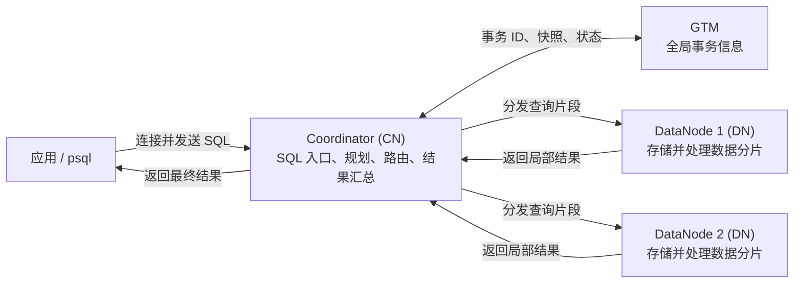

<!--
Copyright (C) 2026 OpenTenBase Authors. All rights reserved.
Licensed under the BSD 3-Clause License. See LICENSE.txt in the repository root.
-->

# OpenTenBase 架构术语表

**语言**：[English](GLOSSARY.md) | [简体中文](GLOSSARY_ZH.md)

本文解释 README、源码目录和部署配置中常见的 OpenTenBase 架构术语，重点介绍由 `opentenbase_ctl` 管理的 V5 拓扑，帮助新手在部署或运维集群前建立整体认识。

## 一张图理解架构

下图展示了**分布式模式**下常见的 SQL 路径。为了便于理解，图中省略了部分细节：实际执行时，某些计划还会在 DataNode 之间传输中间数据。

| 组件 | 负责什么 | 不负责什么 |
| --- | --- | --- |
| 客户端 | 在分布式模式下连接 CN 并发送 SQL。 | 不需要知道每行数据具体位于哪个 DN。 |
| Coordinator（CN） | 保存集群元数据，规划和路由 SQL，协调 DN 执行并汇总结果。 | 通常不保存用户表的数据行。 |
| DataNode（DN） | 保存用户数据，执行 CN 要求的本地扫描、连接、聚合和写入。 | 不提供覆盖整个集群的 SQL 路由视图。 |
| GTM | 管理全局事务标识、快照等事务信息，以及序列等全局对象。 | 不保存用户表，也不执行查询计划。 |

一次典型的分布式查询会经过以下步骤：

1. 客户端连接 CN 并发送 SQL。
2. CN 解析和规划语句，根据表的分布元数据选择相关 DN。
3. 需要全局事务信息时，CN 从 GTM 获取相应信息。
4. CN 分发查询片段，各 DN 处理本地数据并返回局部结果；部分计划还会在 DN 之间重新分布中间数据。
5. CN 汇总结果并向客户端返回一个结果集。写事务如果涉及多个 DN，则使用分布式提交协议让所有参与节点得到同一个结果。

## 核心术语

### 1. Coordinator（CN，协调节点）

分布式 OpenTenBase 集群的 SQL 入口。CN 保存模式、节点信息和表位置等元数据，生成分布式执行计划，把任务路由到 DN，并汇总执行结果。应用通常连接 CN，不应绕过 CN 直接修改某个 DN。

### 2. DataNode（DN，数据节点）

真正保存用户数据并执行本地计算的节点。不同主 DN 可以保存分布表的不同部分，因此可以横向扩展存储容量和计算能力。

### 3. GTM（Global Transaction Manager，全局事务管理器）

在分布式模式下提供集群级事务信息的服务。它管理全局事务标识、快照、事务状态和全局序列等信息，使 CN 与 DN 获得一致的事务视图。GTM 既不是 SQL 接入节点，也不保存业务数据。

### 4. 分布式模式（`distributed`）

包含 GTM、CN 和 DN 角色的 `opentenbase_ctl` 部署模式。客户端连接 CN，数据可以拆分到多个主 DN，并在多个节点上并行处理。只有表位置和数据分布真正使用新增 DN 时，增加 DN 才能带来扩展收益。

### 5. 集中式模式（`centralized`）

一种简化的 `opentenbase_ctl` 部署模式。工具会忽略 GTM 和 CN 配置，只部署一组 DataNode，客户端直接连接 DN，不再经过分布式模式中的 CN 到 DN 路径。它是一种不同的拓扑，并不是把三个分布式角色合并进同一个进程。

### 6. Shared-nothing（无共享）架构

每个主 DN 拥有自己的计算、内存和存储资源，节点通过网络通信。这种架构支持横向扩展和并行处理，同时意味着数据分布是否合理、跨节点传输是否过多会直接影响性能。

### 7. Node group（节点组）

由若干主 DN 组成的具名逻辑集合，用作数据放置边界。表和分片可以放到指定节点组，而不必使用集群中的每个 DN。安装时，`opentenbase_ctl` 会根据配置的主 DN 创建 `default_group`。节点组不包含 CN 或 GTM，也不等同于一组主备节点。

### 8. `opentenbase_ctl`

OpenTenBase V5 的命令行部署与运维工具。它读取 `opentenbase_config.ini`，支持安装、删除、启动、停止、状态查询、远程 shell、SQL 执行、文件复制和 GUC 管理等操作。它负责配置和控制数据库进程，但自身不是数据库服务进程。

### 9. 数据分片（Shard）与分片（Sharding）

数据分片是一张逻辑表中存放在某个 DN 上的部分数据行；分片则是把这些数据子集分散到多个 DN 的过程。分片用于数据层面的横向扩展，不同于为高可用复制主节点数据的备节点，也不同于 PostgreSQL 的表分区功能。

### 10. 分布键（Distribution key）

用于帮助系统决定一行数据目标 DN 的一个或多个列，例如 `DISTRIBUTE BY HASH(user_id)` 或 `DISTRIBUTE BY SHARD(user_id)`。合适的分布键应让数据尽量均匀，并尽可能贴合常用过滤或连接条件，从而减少查询涉及的 DN 数量和网络传输。

### 11. 分布表（Distributed table）

按照 `HASH`、`SHARD`、`MODULO` 或 `ROUNDROBIN` 等规则把数据行放置到不同 DN 的表。每行数据会被路由到规则选定的位置，因此一个 DN 通常只保存表的一部分。它能分散容量和计算，但跨位置查询可能需要传输数据。

### 12. 复制表（Replicated table）

使用 `DISTRIBUTE BY REPLICATION` 声明的表，放置范围内每个参与的 DN 都保存一份完整副本。复制表可以让小型查询表靠近分布数据，但每次写入和每份副本都会增加计算与存储开销。复制表不等同于高可用备节点。

### 13. 分布式查询计划

CN 为一条 SQL 制定的跨节点执行方案。CN 可以把包含分布键的查询路由到少量 DN，将扫描或聚合下推，在跨分片操作中要求数据重新分布，并汇总各节点的局部结果。并非每条查询都会访问所有 DN。

### 14. 全局事务、GXID 与全局快照

全局事务是需要在多个节点上一致理解的一个逻辑事务。GTM 提供集群范围的事务标识（GXID）和快照信息，用于建立一致的数据可见性视图。这些都是事务控制元数据，不是应用数据的副本。

### 15. 两阶段提交（2PC）

写事务存在多个参与节点时使用的提交协议。负责协调的 CN 先要求参与节点进入准备状态；全部准备成功后再通知所有节点提交，否则通知回滚。2PC 让分布式写入获得原子结果，GTM 则提供相应的全局事务上下文。

## 容易混淆的概念

| 容易混淆的概念 | 实际区别 |
| --- | --- |
| CN 与 GTM | CN 规划并协调 SQL；GTM 管理全局事务信息和全局对象。 |
| 节点组与数据分片 | 节点组是一组 DN；数据分片是放在组内某个 DN 上的一部分表数据。 |
| 分布表与复制表 | 分布表把不同数据行分给不同 DN；复制表在每个参与 DN 保存完整副本。 |
| 复制表与备节点 | 表复制是活跃 DN 之间的数据放置策略；备节点是某个节点的高可用副本，不是另一个可写分片。 |
| `opentenbase_ctl` 与 OpenTenBase 服务 | 工具负责部署和控制节点；GTM 与数据库进程才是实际运行的服务。 |

## 延伸阅读

- [项目概览与部署示例](../README_ZH.md)
- [`opentenbase_ctl` 使用说明](../contrib/opentenbase_ctl/README.md)
- [数据表分布说明](src/sgml/ddl.sgml)
