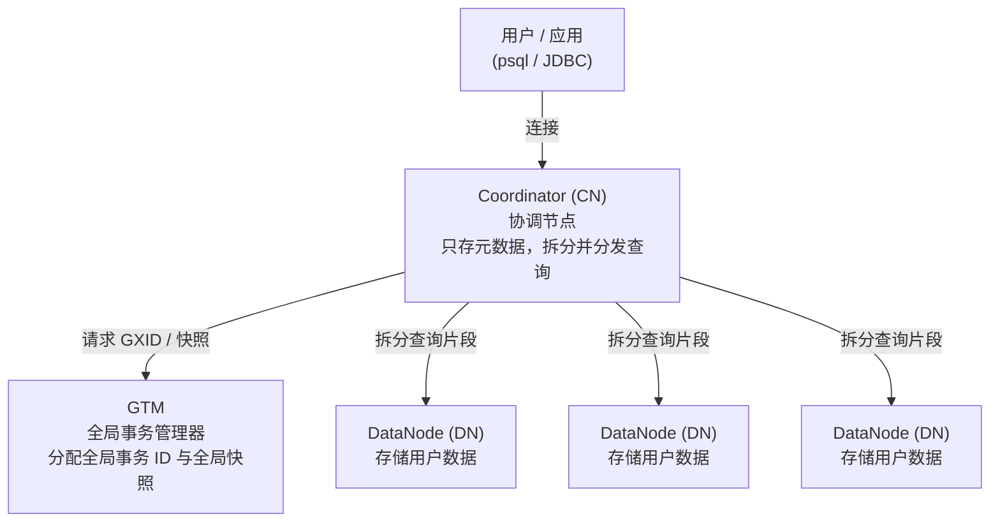

# OpenTenBase 架构术语表与新手导览

初次接触 OpenTenBase 时，README 里会频繁出现 Coordinator、DataNode、GTM、node group、分布式/集中式等概念。本文档面向新手，用通俗的语言解释这些核心术语，并配一张架构图说明它们之间如何协作。

> OpenTenBase 是基于 Postgres-XL 演进的企业级分布式数据库。在分布式集群中，数据被打散在多个节点上，但用户看到的仍是一个统一的数据库。

---

## 一、整体架构

一个 OpenTenBase 集群由三类节点组成，各司其职：

> 箭头表示请求的流向。结果沿相反路径返回：各 DN 把自己那部分结果返回给 CN，CN 汇总后返回给用户。

**一次查询的完整处理过程：**

| 步骤 | 谁在做 | 做什么                                                           |
| ---- | ------ | ---------------------------------------------------------------- |
| 1    | 用户   | 用 psql / JDBC 等连接到 **CN**（永远不直接连 DN）                |
| 2    | CN     | 解析 SQL，结合元数据判断数据分布在哪些 DN 上，把查询拆成片段     |
| 3    | GTM    | 为本次事务分配全局事务号和全局快照，保证各 DN 看到一致的数据视图 |
| 4    | DN     | 各自在本地执行查询片段，处理自己那部分数据                       |
| 5    | CN     | 收集各 DN 的返回结果，汇总后返回给用户                           |

---

## 二、核心术语表

### 1. 协调节点（Coordinator，CN）

所有用户连接的入口。用户和应用**永远连接到 CN**，而不是直接连 DN。CN 负责接收 SQL、解析并生成分布式执行计划，把查询拆分成片段下发到相关的 DN，最后收集结果返回给用户。
CN **只存储元数据**（表结构、分布规则等），不存放用户的实际数据。可以部署多个 CN 来分担连接压力。

### 2. 数据节点（DataNode，DN）

数据存储层，**所有用户数据都存储在 DN 上**。每个 DN 只保存整张表的一部分（分片）或副本，并在本地执行 CN 下发的查询片段。
新手容易混淆的一点：CN 和 DN 共享相同的表结构（schema），但数据只在 DN 里。查一张表时，通常是多个 DN 并行执行，这是分布式数据库能横向扩展的基础。

### 3. 全局事务管理器（Global Transaction Manager，GTM）

全局事务协调器。在单机数据库里，事务号和快照由本机管理即可；但在分布式环境下，一个事务可能横跨多个 DN，必须有一个统一的地方来分配**全局事务 ID（GXID）**和**全局快照（snapshot）**，才能保证跨节点事务的一致性——例如，避免一个事务在 DN1 上已提交、在 DN2 上还未提交时被读到不完整的数据。GTM 承担这个角色，其实现位于源码 `src/gtm/` 目录。

### 4. 全局事务 ID / 全局快照（GXID / Global Snapshot）

GTM 提供的两类关键信息。**全局事务 ID** 是每个事务在全集群唯一的编号；**全局快照** 描述此刻哪些事务已提交、哪些还在进行中。所有 DN 依据同一份快照判断数据的可见性，从而让分布在多个节点上的数据保持与单机数据库相同的一致性。

### 5. 分布式模式（Distributed）

集群的一种部署形态，需要 **GTM + Coordinator + DataNode** 三类节点齐全。数据被打散到多个 DN 上，支持横向扩展和高并发，是 OpenTenBase 的主要部署模式。在 `opentenbase_config.ini` 中通过 `type=distributed` 指定。

### 6. 集中式模式（Centralized）

另一种部署形态，只需要 **DataNode**（含主从），不需要 CN 和 GTM。适合数据量和并发不大、需要高可用单机库的场景。在配置文件中通过 `type=centralized` 指定。理解这两种模式的差异，是读懂部署文档的前提。

### 7. 数据分布方式（Distribution Strategy）

决定一张表的数据如何分散到各个 DN 上，建表时通过 `DISTRIBUTE BY` 指定。OpenTenBase 支持多种方式，常见的有：

| 方式                        | 含义                                            | 典型场景                |
| --------------------------- | ----------------------------------------------- | ----------------------- |
| `DISTRIBUTE BY SHARD`       | 按分片键把数据均匀打散到各 DN（推荐的默认方式） | 大表，需要并行计算      |
| `DISTRIBUTE BY REPLICATION` | 每个 DN 都保存完整副本                          | 小的维表，频繁参与 JOIN |
| `DISTRIBUTE BY HASH`        | 按某列哈希值分布                                | 按键值均匀分散          |
| `DISTRIBUTE BY MODULO`      | 按某列取模分布                                  | 整数键均匀分散          |
| `DISTRIBUTE BY ROUNDROBIN`  | 轮询依次分布，不依赖具体列                      | 无合适分布键时均匀铺开  |

选对分布方式直接影响查询性能：把常一起 JOIN 的表按相同的键分片，可以让 JOIN 在 DN 本地完成，避免节点间大量数据传输。

### 8. 节点组（Node Group）

一组 DataNode 的逻辑集合。建表时可以指定表的数据落在哪个 node group 上，从而实现数据的分组管理与隔离。集群安装的最后一步（见 README 安装日志的 `step 6: Create node group`）就是把 DN 组织成默认节点组，之后建的表默认落在这个组里。

### 9. 主 / 从节点（Master / Slave）

每一类节点（GTM、CN、DN）都可以配置**主节点 + 若干从节点**来实现高可用。主节点处理读写，从节点通过流复制同步数据；主节点故障时可切换到从节点，避免单点故障。在配置文件中，`master=` 填主节点 IP，`slave=` 填从节点 IP。

### 10. opentenbase_ctl（集群管控工具）

官方推荐的集群运维工具，通过命令行完成安装、启动、停止、查看状态等操作。它读取 `opentenbase_config.ini` 配置文件，按其中定义的节点拓扑在多台服务器上部署整个集群。README 的安装章节演示的就是它的用法。

### 11. pgxc_ctl（旧版管控工具）

继承自 Postgres-XL 的集群管理工具，位于 `contrib/pgxc_ctl/`。功能与 opentenbase_ctl 类似，属于较早的方案。新手部署集群时优先使用 opentenbase_ctl，了解 pgxc_ctl 有助于读懂历史文档和资料。

### 12. 元数据 vs 用户数据（Metadata vs User Data）

理解 CN/DN 分工的一对关键概念。**元数据**描述数据的结构——表有哪些列、如何分布、节点拓扑等，存放在 CN；**用户数据**是表里真正的一行行记录，存放在 DN。

### 13. opentenbase_config.ini（集群配置文件）

描述集群拓扑的配置文件，是部署集群的入口。按 `[instance]`、`[gtm]`、`[coordinators]`、`[datanodes]`、`[server]`、`[log]` 等段落，声明实例名、部署模式、各节点的主从 IP、SSH 账户等信息。opentenbase_ctl 依据它来安装和管理集群。

---

## 三、常见疑问（FAQ）

**Q：我应该连接哪个节点执行 SQL？**

连 **CN 主节点**。用户永远不直接连 DN。安装完成后 `opentenbase_ctl status` 会打印出 CN 的连接信息（IP、端口、psql 命令）。

**Q：数据到底存在哪？CN 会不会存数据？**

数据全部存在 **DN** 上。CN 只存元数据，不存用户数据。

**Q：分布式模式和集中式模式怎么选？**

需要横向扩展、高并发 → 分布式（GTM+CN+DN）；需要高可用单机库、数据量不大 → 集中式（仅 DN 主从）。

**Q：为什么需要 GTM，单机数据库不是没有它吗？**

因为一个事务可能同时改动多个 DN 上的数据，需要一个全局事务协调器统一分配事务号和快照，才能保证跨节点的一致性。单机数据库只有一个节点，不需要独立的全局事务管理。

**Q：建表时不指定分布方式会怎样？**

会使用默认的分布方式（SHARD）把数据打散到默认 node group 的各个 DN 上。如果表很小且常参与 JOIN，考虑改用 `REPLICATION`。

---

## 四、延伸阅读

- 项目主页：<https://www.opentenbase.org/>
- 官方文档：<https://docs.opentenbase.org/>
- 快速入门：<https://www.opentenbase.org/blog/01-quickstart/>
- 安装与部署：见仓库根目录 [README_ZH.md](../README_ZH.md)
- GTM 源码说明：见 [src/gtm/README](../src/gtm/README)
