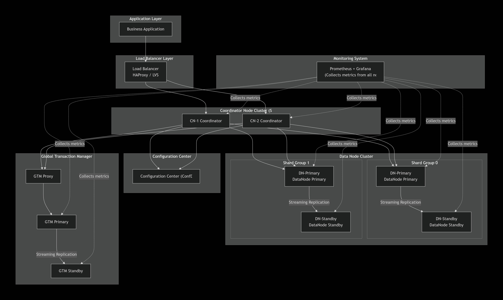

# OpenTenBase Newbie Starter Pack

## Glossary

### 1. Coordinator Node (CN)

The entry point for user connections. It receives SQL queries, generates distributed execution plans, dispatches tasks to DNs, and aggregates results. It does not store user data itself.

### 2. DataNode (DN)

The node that physically stores user data. Each DN is a complete PostgreSQL instance responsible for executing read/write requests dispatched by the CN.

### 3. GTM (Global Transaction Manager)

Responsible for allocating global transaction IDs and managing transaction snapshots, ensuring that distributed transactions spanning multiple DNs satisfy ACID properties.

### 4. Metadata

Information that describes the data structure, such as table schemas, distribution rules, and node lists. The CN stores metadata, while DNs store actual user data — a clear division of responsibilities.

### 5. Shared-Nothing Architecture

A distributed cluster architecture in which each node independently processes its own data. Results are aggregated upward or passed between nodes. Nodes communicate via network protocols, offering better parallel processing and scalability. It can be deployed on commodity x86 servers.

### 6. Primary-Standby Nodes

GTM and DN support a primary-standby architecture, synchronized via streaming replication. CN nodes are stateless; they are typically deployed as multiple instances, and high availability is achieved through a load balancer, without the need for streaming replication.

### 7. Streaming Replication

PostgreSQL’s native high-availability technology. It keeps primary and standby nodes consistent by transmitting WAL logs in real time.

### 8. GTM Proxy

A front-end proxy for the GTM primary node. It forwards transaction ID requests from CNs and automatically switches to the GTM standby node if the primary fails.

### 9. Load Balancer (HAProxy / LVS)

A traffic distributor deployed in front of the CNs. It routes SQL requests to the least busy CN based on each CN’s current load (connection count, response time, etc.).

### 10. Configuration Center (ConfDB)

A configuration database that stores cluster metadata (node list, sharding rules, primary-standby relationships). CNs load cluster topology information from it at startup.

### 11. Monitoring System (Prometheus + Grafana)

Prometheus collects performance metrics from all nodes, and Grafana visualizes the data for cluster status monitoring and troubleshooting.

### 12. Distributed Mode

A deployment topology that includes all three node types: GTM, CN, and DN. Data is horizontally partitioned across multiple shard groups, supporting petabyte-scale data volumes and parallel queries.

### 13. Centralized Mode

A deployment topology that includes only DNs, without GTM or CN. It functions as an enhanced standalone PostgreSQL instance, suitable for development and testing environments.

### 14. Distribution Key (Shard Key)

A column specified during table creation, used to calculate which shard group a data row should be routed to. Including the distribution key in query conditions can avoid full-cluster scans.

### 15. Shard Group

A physical storage unit consisting of one primary DN and one or more standby DNs. It is the fundamental unit of data high availability.

### 16. Replication Table

A table type where each DN stores a complete copy of the data. Suitable for small tables that require frequent JOIN operations. Update performance is lower, but query speed is fast.

### 17. Distributed Table (Sharded Table)

A table type where data is distributed across DN nodes based on the hash value of the distribution key. Writes only affect the corresponding shard group, resulting in high write performance. Queries that include the distribution key can precisely target a single shard group, achieving extremely high query efficiency. Ideal for large, growing tables (fact tables) and the most commonly used table type in OpenTenBase.

### 18. opentenbase_ctl

An automated cluster management tool provided by OpenTenBase. It uses a simplified `opentenbase_config.ini` configuration file to automatically complete software distribution, node initialization, and cluster startup. Suitable for most users needing quick deployment.

### 19. pgxc_ctl

The native cluster management tool of Postgres-XL. It requires a complex `pgxc_ctl.conf` configuration file and provides fine-grained control, suitable for advanced users who need deep understanding of the cluster architecture.

### 20. Data Sharding

The process of splitting a large table into multiple data fragments based on the distribution key and storing them on different DNs. It is the foundational mechanism for horizontal scaling in distributed databases.

---

## Newbie Guide

### 1. What Is OpenTenBase?

OpenTenBase is a relational database cluster platform that provides write reliability and multi-master data synchronization. You can deploy OpenTenBase on one or multiple hosts, with data stored across multiple physical machines. Tables can be stored in two ways: distributed or replicated. When you send a query to OpenTenBase, it automatically dispatches the query to the data nodes and retrieves the final result.  
**Key point**: The SQL you write is almost identical to that of standalone PostgreSQL, so the learning curve is very low.

### 2. OpenTenBase Architecture Diagram

#### Text Description

##### Phase 1: Application Access

1. **Business application initiates SQL request**: The business application (e.g., microservice, web backend) does not connect directly to any database node. Instead, it sends the SQL request to the **load balancer** (such as HAProxy or LVS in the diagram).

2. **Load balancer distributes the request**: The load balancer maintains a list of CN nodes. Based on each CN’s current load (connection count, response time, etc.), it routes the SQL request to the least busy **CN (Coordinator Node)**, for example, CN-1 in the diagram. This step ensures traffic is balanced across multiple CNs.

##### Phase 2: SQL Parsing and Routing Planning

3. **CN reads from Configuration Center**: After receiving the SQL request, CN-1 first retrieves the complete cluster metadata from the **Configuration Center (ConfDB)**, including:
   
   - Which DN nodes exist?
   
   - Which shard groups exist (e.g., Shard Group 0, 1)?
   
   - What is the distribution key (sharding rule) for each shard group?
   
   - What are the primary-standby relationships of each shard group?

4. **CN parses SQL and generates distributed plan**: The CN performs lexical and syntax analysis on the SQL, then generates a distributed execution plan based on the metadata. Key decisions include:
   
   - If the SQL WHERE clause contains the distribution key, the CN can **precisely target** a specific shard group and send the request only to that group.
   
   - If the SQL does not contain the distribution key, the CN **broadcasts** the request to all shard groups and then aggregates the results.

##### Phase 3: Acquiring a Global Transaction ID

5. **CN requests a transaction ID from GTM Proxy**: For write operations or queries requiring transaction support, the CN requests a global transaction ID from the **GTM Proxy**. The GTM Proxy acts as a front-end for the GTM primary node, forwarding requests and caching some information to improve performance.

6. **GTM Proxy forwards to GTM Primary**: The GTM Proxy forwards the request to the **GTM primary node**. The GTM primary allocates a globally unique transaction ID and records the current transaction snapshot, then returns it to the CN via the GTM Proxy.

##### Phase 4: Data Routing and DN Execution

7. **CN dispatches subtasks to DN primary nodes**: Based on the sharding rules, the CN sends SQL subtasks to the **DN-primary nodes** in the corresponding shard groups (e.g., DN-primary of Shard Group 0, DN-primary of Shard Group 1).

8. **DN-primary nodes execute local operations**: After receiving the subtasks, each DN-primary performs data query, update, or insertion operations locally. Each DN-primary is essentially a complete PostgreSQL instance capable of handling local transactions independently.

##### Phase 5: Data Synchronization (Write Scenarios)

9. **DN-primary synchronizes to DN-standby via streaming replication**: For write operations (INSERT, UPDATE, DELETE), after completing the local write, the DN-primary uses **streaming replication** to synchronize transaction logs (WAL logs) in real time to the **DN-standby nodes** within the same shard group. This ensures data consistency between primary and standby nodes, providing the foundation for high availability.

##### Phase 6: Result Aggregation and Return

10. **DN primary nodes return results to CN**: Each DN-primary returns the execution results (e.g., number of rows queried, number of rows affected by a write) to the originating CN-1.

11. **CN aggregates results and returns to application**: CN-1 aggregates the results from multiple DNs (performing operations such as aggregation, sorting, deduplication) to form the final complete result set, which is returned to the business application via the load balancer.

12. **Business application receives response**: One complete SQL request processing cycle ends.

##### Throughout the Process: Monitoring and High Availability

- **Monitoring System (Prometheus + Grafana)**: At every stage, all nodes (Load Balancer, CNs, DN-primary, DN-standby, GTM-primary, GTM-standby, ConfDB) continuously expose performance metrics (QPS, latency, connections, CPU, memory, disk I/O, etc.) to Prometheus. Grafana visualizes this data, allowing operations personnel to monitor cluster health in real time and quickly locate issues when anomalies occur.

- **High Availability Mechanisms**:
  
  - If a **DN-primary node** fails, the **DN-standby node** in the same shard group is automatically (or manually) promoted to the new primary, with no business impact.
  
  - If the **GTM primary node** fails, the GTM Proxy automatically switches requests to the **GTM standby node**, with no impact at the CN layer.
  
  - If a **CN node** goes down, the load balancer automatically removes it from the available list, and subsequent requests are no longer distributed to it.

---

## Frequently Asked Questions (FAQ)

#### Q1: Should I choose centralized or distributed mode for my first deployment?

Choose centralized mode. It is simple to deploy, uses fewer resources, and can be up and running in 10 minutes — perfect for learning and evaluation. Distributed mode is intended for production environments and has complex configuration that is not beginner-friendly.

#### Q2: What is the difference between opentenbase_ctl and pgxc_ctl?

opentenbase_ctl is a packaged automated deployment tool. You only need to fill in one `opentenbase_config.ini` file, and it completes deployment with one click. pgxc_ctl is a low-level manual management tool with complex configuration; users generally do not use it directly.

#### Q3: What should I do if SSH connection fails during deployment?

Check that `ssh-user`, `ssh-password`, and `ssh-port` in `opentenbase_config.ini` are filled in correctly. Verify that the target server is network-reachable and that the SSH port is not blocked by a firewall. You can test connectivity by manually running an `ssh` command first.

#### Q4: Can I deploy distributed mode on a single machine?

Yes. You can deploy distributed mode on a single machine by configuring multiple IP addresses or using different ports. However, this will not demonstrate disaster recovery capabilities and is only suitable for functional verification.

#### Q5: Why are distribution keys and shard groups needed?

**Why distribution keys?**  
A single machine cannot hold all the data, so data must be split and distributed across multiple machines. The distribution key is the rule that determines “which machine this row goes to” by calculating a hash based on the chosen column’s value. Without a distribution key, data cannot be evenly distributed, and queries would not know which machine to target.

**Why shard groups?**  
A single machine can fail, so each piece of data needs a “backup.” A shard group = primary node + standby node. When the primary node fails, the standby automatically takes over, ensuring no data loss and uninterrupted service.

#### Q6: How should I choose a distribution key?

**Core principles**: Ensure both **even data distribution** and **query optimization**.

**Priority principle**: If the table has a **primary key**, prioritize using it as the distribution key (for a composite primary key, choose the first field). If there is a **unique index**, choose the unique index column.

**Even distribution**: Choose a column with **evenly distributed values**, such as user ID or order ID. **Avoid** columns with only a few fixed values, such as “gender” or “status,” as this will concentrate massive amounts of data on a few nodes, causing performance bottlenecks.

**Query optimization**: If your WHERE clause frequently uses a certain column (e.g., `WHERE user_id = ?`), setting that column as the distribution key is ideal. This allows the Coordinator Node (CN) to directly locate the single data node that stores that data, resulting in extremely high query efficiency.

#### Q7: What happens if the query condition does not include the distribution key?

The CN broadcasts the query condition to all shard groups, then aggregates and returns the results from all groups.

#### Q8: How do sharded tables and replicated tables work together?

Sharded tables store big data (distributed storage), while replicated tables provide a complete copy of a small table to all shard groups (redundant storage). Together, they allow JOINs between large and small tables to be completed locally within each shard group, avoiding cross-node data movement and making queries fast and network-efficient.

#### For installation and deployment issues, visit the official documentation:

- **Entry Point**: [OpenTenBase Official Documentation](https://docs.opentenbase.org/)

- **Core Guide**: [Quick Start](https://docs.opentenbase.org/guide/01-quickstart) — covers environment requirements, dependency installation, compilation, and other basic steps.

#### Official documentation mainly covers standard procedures; community-contributed “pitfall guides” specifically address non-standard issues encountered in practice.

- **Article Links**:
  
  - [OpenTenBase Official Website Community Contribution Section](https://www.opentenbase.org/news/news-post-14/)
  
  - [Mo Tianlun Community Repost](https://www.modb.pro/db/1830432843832582144)
