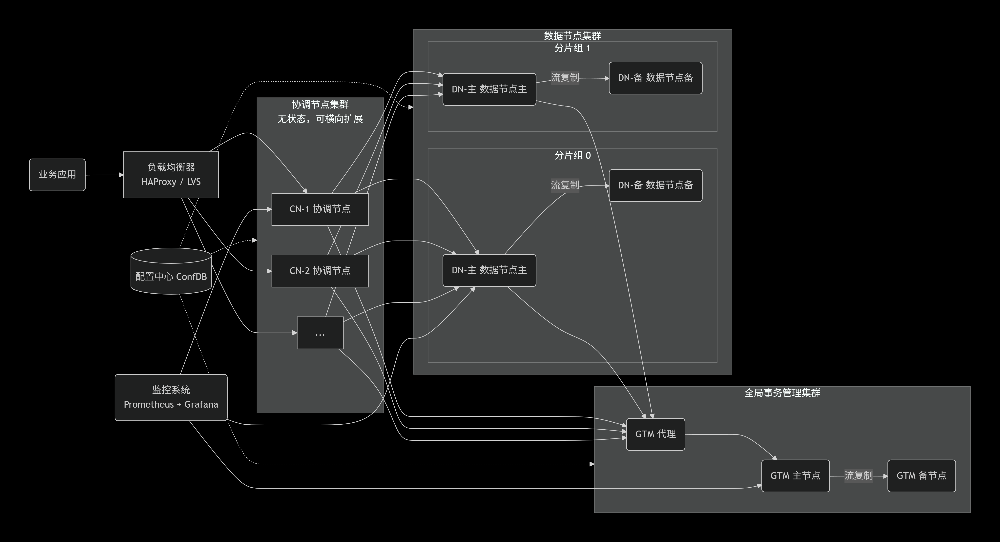

# OpenTenBase 新手入门包

## 术语解释：

### 1. Coordinator Node（协调节点 / CN）

用户连接的入口节点，负责接收 SQL、生成分布式执行计划、分发任务到 DN 并汇总结果，自身不存储用户数据。

### 2. DataNode（数据节点 / DN）

实际存储用户数据的节点，每个 DN 是一个完整的 PostgreSQL 实例，负责执行 CN 下发的读写请求。

### 3. GTM（全局事务管理器 / Global Transaction Manager）

负责分配全局事务 ID 和管理事务快照，保证跨多个 DN 的分布式事务满足 ACID 特性。

### 4.元数据

描述数据结构的信息，如表结构、分布规则、节点列表等。CN 存储元数据，DN 存储实际用户数据，两者分工明确。

### 5.  无共享架构（Shared-Nothing）

分布式集群架构模式，各节点独立处理自己的数据，处理结果向上层汇总或在节点间流转，节点间通过网络协议通信，并行处理和扩展能力更好，可在基础x86服务器上部署

### 6. 主备节点（Master/Slave）

GTM 和 DN 支持主备架构，通过流复制同步；CN 为无状态节点，通常部署多台并通过负载均衡器实现高可用，无需流复制。

### 7. 流复制（Streaming Replication）

PostgreSQL 原生高可用技术，通过实时传输 WAL 日志保持主备节点数据一致。

### 8. GTM 代理（GTM Proxy）

GTM 主节点的前端代理，负责转发 CN 的事务 ID 请求，并在 GTM 主节点故障时自动切换到备节点。

### 9. 负载均衡器（HAProxy / LVS）

部署在 CN 前的流量分发器，根据各 CN 的负载情况将 SQL 请求路由到最空闲的 CN 节点。

### 10. 配置中心（ConfDB）

存储集群元数据（节点列表、分片规则、主备关系）的配置数据库，CN 启动时从其中加载集群拓扑信息。

### 11. 监控系统（Prometheus + Grafana）

Prometheus 负责采集所有节点的性能指标，Grafana 负责将数据可视化展示，用于集群状态监控和故障排查。

### 12. 分布式模式（Distributed Mode）

完整包含 GTM、CN 和 DN 三种节点的部署形态，数据水平切分到多个分片组，支持 PB 级数据量和并行查询。

### 13. 集中式模式（Centralized Mode）

仅包含 DN 的部署形态，无需 GTM 和 CN，相当于增强版单机 PostgreSQL，适合开发测试环境。

### 14. 分布键（Distribution Key / Shard Key）

建表时指定的字段，用于计算数据行应路由到哪个分片组，查询条件中包含分布键时可避免全节点扫描。

### 15. 分片组（Shard Group）

由一个主 DN 和一个或多个备 DN 组成的物理存储单元，是数据高可用的基本单位。

### 16. 复制表（Replication Table）

每个DN都存储完整数据副本的表类型，适合数据量小但需要频繁JOIN的场景，更新性能低但查询快

### 17. 分片表（Distributed Table / Sharded Table）

数据按分布键的哈希值打散存储到各DN节点的表类型。写入时只影响对应分片组，写入性能高；查询时如包含分布键可精确定位到单个分片组，查询效率极高。适合数据量持续增长的大表（事实表），是OpenTenBase中最常用的表类型。

### 18.  opentenbase_ctl

OpenTenBase提供的自动化集群管理工具，使用简化的`opentenbase_config.ini`配置文件，自动完成软件包分发、节点初始化、集群启动等操作。适合大多数用户快速部署

### 19. pgxc_ctl

Postgres-XL原生的集群管理工具，需要复杂的`pgxc_ctl.conf`配置文件，提供精细化控制，适合深入了解集群架构的高级用户使用

### 20. 数据分片（Data Sharding）

将一张大表按分布键拆分成多份数据片段，分别存储到不同 DN 的过程。是分布式数据库实现水平扩展的基础机制。

## 新手导览 ：

### 1.OpenTenBase 是什么？

 OpenTenBase 是一个提供写可靠性，多主节点数据同步的关系数据库集群平台。你可以将 OpenTenBase 配置一台或者多台主机上， OpenTenBase 数据存储在多台物理主机上面。数据表的存储有两种方式， 分别是 distributed 或者 replicated ，当向 OpenTenBase 发送查询 SQL 时， OpenTenBase 会自动向数据节点发出查询语句并获取最终结果。
关键点：用户所写的 SQL 语句与单机 PostgreSQL 几乎一致，学习成本低。

### 2.OpenTenBase架构图：

#### 文字描述 ：

##### 阶段一：应用接入

1. **业务应用发起 SQL 请求**：业务应用（如微服务、Web 后端）不直接连接任何数据库节点，而是将 SQL 请求发送到**负载均衡器**（如图中的 HAProxy 或 LVS）。

2. **负载均衡器分发请求**：负载均衡器维护着一个 CN 节点列表，它根据各 CN 的当前负载情况（连接数、响应时间等），将 SQL 请求路由到最空闲的一台 **CN（协调节点）**，例如图中的 CN-1。这一步确保了多台 CN 之间的流量均衡。

##### 阶段二：SQL 解析与路由规划

3. **CN 读取配置中心**：CN-1 收到 SQL 请求后，首先从**配置中心（ConfDB）** 获取集群的完整元数据信息，包括：
   
   - 有哪些 DN 节点？
   
   - 数据分成了哪几个分片组（Shard Group 0、1  ）？
   
   - 每个分片组的分布键（分片规则）是什么？
   
   - 各分片组的主备关系？

4. **CN 解析 SQL 并生成分布式计划**：CN 对 SQL 进行词法、语法解析，然后结合元数据生成分布式执行计划。关键决策包括：
   
   - 如果 SQL 的 WHERE 条件包含分片键，CN 可以**精确定位**到某个具体分片组，只向该组下发请求。
   
   - 如果 SQL 不包含分片键，CN 会向**所有分片组**广播请求，然后汇总结果。

##### 阶段三：获取全局事务 ID

5. **CN 请求 GTM 代理获取事务 ID**：如果是写入操作或需要事务支持的查询，CN 会向 **GTM 代理**请求分配全局事务 ID。GTM 代理作为 GTM 主节点的前端，负责转发请求并缓存部分信息以提升性能。

6. **GTM 代理转发给 GTM 主节点**：GTM 代理将请求转发给 **GTM 主节点**。GTM 主节点分配全局唯一的事务 ID 并记录当前事务快照，然后通过 GTM 代理返回给 CN。

##### 阶段四：数据路由与 DN 执行

7. **CN 将子任务分发到 DN 主节点**：CN 根据分片规则，将 SQL 子任务发送给对应分片组中的 **DN-主节点**（如分片组0的 DN-主、分片组1的 DN-主）。

8. **DN-主节点执行本地操作**：各 DN-主节点收到子任务后，在本地执行数据查询、更新或插入操作。每个 DN-主节点本质上是一个完整的 PostgreSQL 实例，能够独立处理本地事务。

##### 阶段五：数据同步（写入场景）

9. **DN-主节点通过流复制同步到 DN-备节点**：如果是写入操作（INSERT、UPDATE、DELETE），DN-主节点在完成本地写入后，会通过**流复制**技术将事务日志（WAL 日志）实时同步给同分片组内的 **DN-备节点**。这确保了备节点的数据与主节点保持一致，为高可用提供基础。

##### 阶段六：结果汇总与返回

10. **DN 主节点将结果返回给 CN**：各 DN-主节点将执行结果（如查询到的数据行数、写入影响的行数等）返回给发起请求的 CN-1。

11. **CN 汇总结果并返回给应用**：CN-1 将来自多个 DN 的结果进行汇总（如聚合计算、排序、去重等），形成最终的完整结果集，通过负载均衡器返回给业务应用。

12. **业务应用收到响应**：一次完整的 SQL 请求处理结束。

##### 贯穿全程：监控与高可用保障

- **监控系统（Prometheus + Grafana）**：在整个过程的每一个环节，所有节点（负载均衡器、CN、DN-主、DN-备、GTM-主、GTM-备、ConfDB）都在持续向 Prometheus 暴露性能指标（QPS、延迟、连接数、CPU、内存、磁盘 IO 等）。Grafana 负责将这些数据可视化展示，运维人员可以实时观察集群运行状态，在出现异常时快速定位问题。

- **高可用机制**：
  
  - 如果某个 **DN-主节点**发生故障，同一分片组的 **DN-备节点** 会自动或通过运维手动提升为新的主节点，业务无感知。
  
  - 如果 **GTM 主节点**发生故障，GTM 代理会自动将请求切换到 **GTM 备节点**，CN 层无感知。
  
  - 如果某台 **CN 节点**宕机，负载均衡器会自动将其从可用列表中移除，后续请求不再分发给它。 

## 常见问题（FAQ）

#### Q1：第一次部署，选集中式还是分布式？

选集中式。部署简单、资源占用少，10分钟即可跑通，适合学习体验。分布式用于生产环境，配置复杂，新手不易上手。

#### Q2：opentenbase_ctl 和 pgxc_ctl 有什么区别？

opentenbase_ctl 是封装后的自动化部署工具，只需填写一个 opentenbase_config.ini 文件，一键完成部署。pgxc_ctl 是底层手工管理工具，配置复杂，用户一般不直接使用。

#### Q3：部署时报 SSH 连接失败怎么办？

检查 opentenbase_config.ini 中的 ssh-user、ssh-password、ssh-port 是否正确填写，确认目标服务器网络可达且 SSH 端口未被防火墙拦截。可先手动执行 ssh 命令测试连通性。

#### Q4：单机可以部署分布式模式吗？

可以。在同一台机器上配置多个 IP 或使用不同端口即可部署分布式模式，但无法体现容灾能力，仅适合功能验证。

#### Q5:  为什么需要分布键和分片组：

##### 为什么需要分布键：

单台机器存不下所有数据，需要把数据拆开分散到多台机器上。分布键就是通过选择的字段的值计算哈希决定“这一行数据去哪个机器”的规则。没有分布键，数据无法均匀分散，查询也不知道该去哪个机器找。

##### 为什么需要分片组：

单台机器会坏，需要给每份数据配一个“备胎”。分片组 = 主节点 + 备节点，主节点故障时备节点自动接管，保证数据不丢、服务不停。

#### Q6: 分布键该如何选择：

##### 核心原则：

**既要保证数据均匀分布，也要有利于查询优化**。

**优先原则**：如果表有**主键**，优先选择主键（如果是复合主键，选第一个字段）做分布键；如果有**唯一索引**，则选择唯一索引列。

**均匀分布**：选择一个**值分布均匀**的列，比如用户ID、订单ID这类。**切忌**选择只有少数几个固定值的列，比如“性别”或“状态”，否则大量数据会挤在少数几个节点上，导致性能瓶颈。

**利于查询**：如果你的查询语句中，`where` 条件经常使用某个字段（例如 `where user_id = ?`），那把这个字段设为分布键就非常理想。这样，Coordinator节点（CN）就能直接定位到存储该数据的那一个数据节点，查询效率极高。

#### Q7: 如果查询字段不包括分布键会怎么样：

CN收到查询条件后，会将其广播给所有分片组，然后将所有分片组的结果返回。

#### Q8: 分片表和复制表如何协作：

分片表负责存放大数据（分散存储），复制表负责为所有分片组提供完整小表（冗余存储）。两者配合，让大表小表 JOIN 可以在每个分片组本地完成，不用跨节点搬数据，查询又快又省网络。

#### 安装部署等使用问题可以访问官方文档：

- **入口**：[OpenTenBase 官方文档](https://docs.opentenbase.org/)

- **核心指南**：[快速入门 (Quick Start)](https://docs.opentenbase.org/guide/01-quickstart)包含环境要求、依赖安装、编译等基础步骤

#### 官方文档主要覆盖标准流程，社区贡献的“踩坑指南”则专门解决实战中遇到的非标准问题。

- **文章入口**：
  
  - [OpenTenBase官网社区贡献板块](https://www.opentenbase.org/news/news-post-14/)
  
  - [墨天轮社区转载](https://www.modb.pro/db/1830432843832582144)
