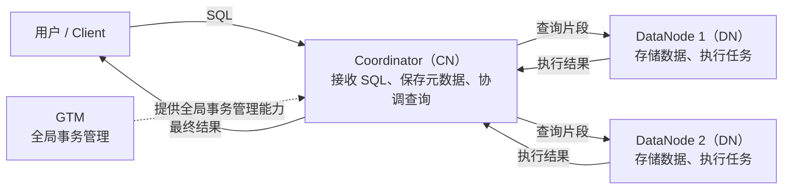

<!--
Copyright (C) 2019-2025 OpenTenBase Authors. All rights reserved.
SPDX-License-Identifier: BSD-3-Clause
-->

# OpenTenBase 架构快速入门

本文面向第一次接触 OpenTenBase 的读者，介绍最常见的架构组件和部署术语，并用一条 SQL 串起它们之间的关系。本文只描述入门所需的基本流程；具体行为仍以当前版本的源码和配置为准。

## 1. 一分钟理解 OpenTenBase

可以先把 OpenTenBase 的分布式架构理解为三个角色：

- Coordinator（CN）接收客户端 SQL，依据元数据协调查询，并汇总结果。
- DataNode（DN）存储用户数据，执行分配到本节点的数据访问和计算。
- GTM 提供全局事务管理能力。



这张图表达的是组件职责，不表示所有请求都一定访问两个 DN，也不展开 GTM 的内部协议。实际涉及哪些 DN，取决于表的数据分布、SQL 和执行计划。

## 2. 一条 SQL 如何执行

以聚合查询为例：

```sql
SELECT department, COUNT(*)
FROM employee
GROUP BY department;
```

在入门层面，可以按下面的顺序理解它：

1. **连接 CN。** 客户端通过 `psql` 等工具连接 Coordinator，并把 SQL 发给它。
2. **协调查询。** CN 根据元数据分析查询，将需要在 DN 上完成的工作分解为查询片段。
3. **DN 执行。** 保存相关数据的 DN 访问本地数据并完成分配到本节点的计算。
4. **汇总结果。** DN 将执行结果返回 CN，CN 收集并处理这些结果。
5. **返回客户端。** CN 将最终结果返回客户端。

可以简记为：

```text
Client -> CN -> DN
Client <- CN <- DN
```

如果一个事务涉及多个节点，还必须保证这些节点对事务有一致的全局认识。GTM 的职责是全局事务管理，而不是执行查询片段或保存用户数据。

## 3. 核心术语

### 3.1 Coordinator / CoordinateNode（CN）

**是什么：** 客户端进入分布式集群时连接的协调节点。

**负责什么：** CN 保存元数据，接收 SQL，将查询分解成在 DN 上执行的片段，并收集结果。

**在一条 SQL 中：** 它位于客户端和 DN 之间，是查询的入口和协调者。用户执行分布式查询时通常连接 CN，而不是逐个连接 DN。

### 3.2 DataNode（DN）

**是什么：** 存放用户数据并执行数据操作的节点。

**负责什么：** 用户数据存储在 DN 中；CN 分解查询后，相关片段由 DN 执行。

**在一条 SQL 中：** DN 访问本节点的数据，将执行结果交回 CN。DN 和 CN 共享相同的模式，但承担的职责不同。

### 3.3 GTM

**是什么：** Global Transaction Manager，即全局事务管理节点。

**负责什么：** 为集群提供全局事务管理能力，使跨节点事务可以在统一的事务管理机制下工作。

**在一条 SQL 中：** GTM 不是查询入口，也不保存用户数据。当事务跨越多个节点时，全局事务管理能力尤为重要。本文不展开其内部协议。

### 3.4 Metadata（元数据）

**是什么：** 描述数据库对象和集群信息的数据，而不是用户业务数据本身。

**负责什么：** CN 包含元数据，并用它理解数据库对象和协调查询。

**在一条 SQL 中：** CN 需要依据相关元数据处理 SQL；真正的用户数据仍存放在 DN。

### 3.5 Distributed Mode（分布式模式）

**是什么：** `opentenbase_ctl` 配置中的 `type=distributed` 部署模式。

**负责什么：** 该模式需要 GTM、Coordinator 和 DataNode，体现完整的分布式组件组合。

**在一条 SQL 中：** 客户端连接 CN，CN 协调 DN；涉及全局事务时，由 GTM 提供事务管理能力。

### 3.6 Centralized Mode（集中式模式）

**是什么：** `opentenbase_ctl` 配置中的 `type=centralized` 部署模式。

**负责什么：** 当前部署工具在此模式下忽略 GTM 和 Coordinator 配置，只构建一组 DataNode。

**在一条 SQL 中：** 它不采用前文所示的 GTM、CN、DN 完整分布式拓扑，因此不要把分布式模式的查询路径原样套用到集中式实例。

| 模式 | `opentenbase_ctl` 处理的组件 | 入门理解 |
| --- | --- | --- |
| Distributed | GTM、Coordinator、DataNode | 完整分布式部署 |
| Centralized | 一组 DataNode | 不构建 GTM 和 Coordinator 的集中式部署 |

### 3.7 Instance（实例）

**是什么：** `opentenbase_ctl` 配置和管理的一套 OpenTenBase 部署。

**负责什么：** 配置文件的 `[instance]` 部分通过 `name` 标识实例，通过 `type` 选择分布式或集中式模式，并通过 `package` 指定安装包。

**在部署中：** 同一份配置还描述该实例包含的节点、服务器登录信息和工具日志级别。

### 3.8 Master Node（主节点）

**是什么：** 配置文件中用 `master` 指定的主节点。

**负责什么：** GTM、CN 和 DN 在分布式配置中都可以具有相应的主节点配置；GTM 主节点只接受一个 IP。

**在部署中：** `opentenbase_ctl` 先根据配置安装主节点，再处理配置的从节点。

### 3.9 Slave Node（从节点）

**是什么：** 配置文件中用 `slave` 指定的从节点。

**负责什么：** 它与对应的主节点形成主从部署关系。CN 和 DN 的从节点 IP 数量必须是主节点 IP 数量的整数倍。

**在部署中：** 不需要从节点时可以不配置；需要多个从节点时，应按配置说明提供相应数量的 IP。

### 3.10 `nodes-per-server`

**是什么：** CN 和 DN 配置中的可选项，默认值为 `1`。

**负责什么：** 它指定在每个 IP 对应的服务器上部署多少个该类型的节点。

**在部署中：** 如果主节点配置包含 3 个 IP，且 `nodes-per-server=2`，工具会部署 6 个对应节点。它描述的是每台服务器上的节点数量，不是集群的服务器数量。

### 3.11 Node Group（节点组）

**是什么：** 一组 DN 的逻辑分组。

**负责什么：** 当前 `opentenbase_ctl` 的分布式安装流程会用配置中的 DN 创建默认 Node Group，并在节点上创建相应的节点和分片组信息。

**在部署中：** 安装日志中的 `Create node group` 表示工具正在建立这层逻辑组织。入门时只需记住 Node Group 组织的是 DN，不要把它理解成服务器组或 Kubernetes Node Group。

### 3.12 `opentenbase_ctl`

**是什么：** OpenTenBase 的集群部署和管理工具。

**负责什么：** 工具读取配置文件中的实例、GTM、CN、DN、服务器和日志信息，完成安装，并提供状态查看、启停等管理能力。

**在部署中：** 例如，用户可以用 `install -c opentenbase_config.ini` 安装实例，再用 `status -c opentenbase_config.ini` 查看节点状态。

## 4. 容易混淆的边界

| 容易混淆的说法 | 更准确的理解 |
| --- | --- |
| CN 保存业务数据 | CN 保存元数据；用户数据存储在 DN |
| DN 是客户端的分布式查询入口 | 客户端连接 CN，由 CN 协调 DN |
| GTM 负责分解 SQL 或执行 Join | GTM 负责全局事务管理，查询分解由 CN 完成 |
| `nodes-per-server` 是服务器总数 | 它是每个 IP 上部署的对应类型节点数 |
| Node Group 是一组物理服务器 | 它是 DN 的逻辑分组 |
| 集中式模式只是“节点较少”的分布式模式 | 当前部署工具会忽略 GTM/CN 配置，只构建一组 DN |

## 5. 快速记忆

```text
CN：接请求、看元数据、做协调、收结果
DN：存数据、做执行、回结果
GTM：管全局事务

Client -> CN -> DN
           |
          GTM（全局事务管理）
```

再记住两条部署规则：

- `distributed` 需要 GTM、CN 和 DN。
- `centralized` 在当前部署工具中只构建一组 DN。

## 6. 事实依据与延伸阅读

本文的架构事实来自仓库当前版本的以下内容：

- [`README_ZH.md`](../README_ZH.md)：CN、DN、GTM 的职责，分布式/集中式配置，主从节点和 `nodes-per-server`。
- [`contrib/opentenbase_ctl/README.md`](../contrib/opentenbase_ctl/README.md)：`opentenbase_ctl` 的配置、安装和管理流程。
- [`contrib/opentenbase_ctl/src/config/config.h`](../contrib/opentenbase_ctl/src/config/config.h)：集中式模式忽略 GTM/CN 配置并只使用一组 DN。
- [`contrib/opentenbase_ctl/src/cluster/cluster.cpp`](../contrib/opentenbase_ctl/src/cluster/cluster.cpp)：默认 Node Group 的创建过程。
- [`src/gtm/README`](../src/gtm/README)：GTM 源码目录和相关组件说明。

本文刻意不描述数据分布算法、查询优化细节和 GTM 内部协议；这些内容需要结合具体版本的设计文档和源码单独学习。
