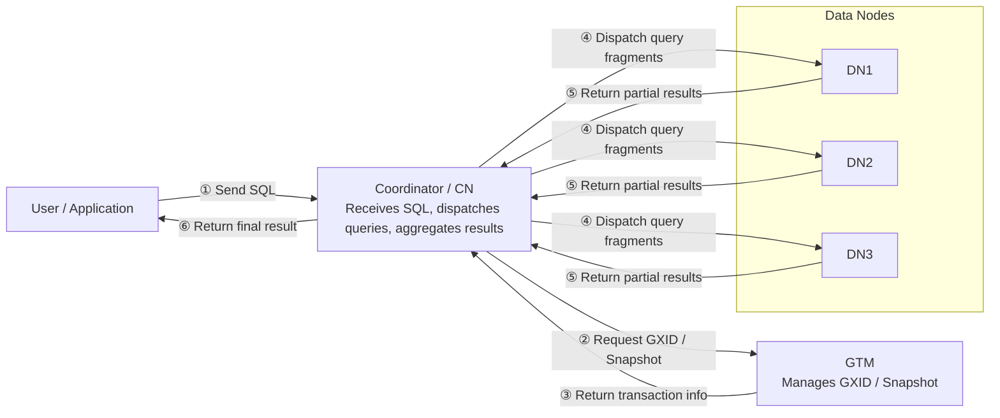

# OpenTenBase Beginner's Guide: Core Terms and Architecture

This guide is intended for readers who are new to OpenTenBase. Based on the project `README`, source tree, and deployment documents, it introduces the core terms, basic architecture, and common ways to understand OpenTenBase.

## 1. What Is OpenTenBase?

OpenTenBase is an enterprise-grade distributed database system evolved from Postgres-XL. It inherits PostgreSQL's SQL capabilities and ecosystem, and organizes multiple database nodes into a unified database cluster through components such as `Coordinator/CN`, `Datanode/DN`, and `GTM`.

In simple terms:

- If PostgreSQL is like a single warehouse where both data storage and query execution happen in one database.
- OpenTenBase is more like a group of warehouses working together: the front desk receives and dispatches requests, multiple warehouses store and process data, and the central ledger keeps distributed transactions consistent.

## 2. Architecture Overview

In one sentence: users connect only to `CN`; `CN` receives SQL, dispatches queries, and aggregates results; `DN` stores real data and executes local queries; `GTM` manages global transaction IDs and global snapshots to keep cross-node transactions consistent.

## 3. Core Terms

| Term | Beginner-friendly explanation |
| --- | --- |
| `PostgreSQL` | A mature open-source relational database. OpenTenBase inherits many PostgreSQL capabilities, so its SQL usage, client tools, and ecosystem are close to PostgreSQL. |
| `Postgres-XL` | A distributed database project based on PostgreSQL. OpenTenBase evolved from Postgres-XL, so it can be understood as an important source of OpenTenBase's distributed architecture. |
| `OpenTenBase` | A distributed database system that organizes multiple nodes into one unified cluster and provides users with an experience similar to using a single database. |
| `GTM` | Global Transaction Manager. It is like a central ledger: it assigns global transaction IDs for cross-node transactions, maintains global snapshots, and keeps transaction states consistent across nodes. |
| `GTM Proxy` | A proxy layer for GTM. It can aggregate requests from CN/DN to GTM, reduce direct pressure on GTM, and help in GTM failover scenarios. |
| `Coordinator / CN` | The coordinator node and the entry point for users and applications. It does not store real business data. It receives SQL, parses SQL, decides which DN nodes to access, dispatches queries, and aggregates results. |
| `Datanode / DN` | The data node that stores real user data. CN splits a query into fragments and sends them to related DN nodes. Each DN executes its local part and returns partial results. |
| `GXID` | Global Transaction ID. A transaction that spans multiple nodes needs one unified ID so that GTM, CN, and DN can recognize it as the same transaction. |
| `Global Snapshot` | A global snapshot describes which transactions are committed and which are not visible at a specific moment across the whole cluster. It helps ensure a consistent data view when querying across DN nodes. |
| `Distribution` | The data distribution strategy that decides how rows of a table are placed across multiple DN nodes. A proper distribution strategy improves parallel processing capability. |
| `DISTRIBUTE BY HASH` | Distributes rows to different DN nodes by hashing a specified column. It is suitable for large tables, especially when the distribution column has high cardinality and queries can benefit from parallel execution. |
| `DISTRIBUTE BY REPLICATION` | A replicated table strategy where every DN stores a full copy of the data. It is suitable for small tables, dictionary tables, configuration tables, and other read-heavy data. |
| `Node Group` | A group of DN nodes. When creating tables or planning data distribution, data can be limited to a specific node group. |
| `Pooler / pgxc_pool` | The connection pool and node connection management mechanism. When CN accesses DN nodes, it needs to maintain connections to those nodes. The pooler can reuse connections and cache node information. |
| `opentenbase_ctl` | A lightweight OpenTenBase cluster management tool. It is used to install or delete clusters, start or stop nodes, check status, and run shell/SQL/GUC operations in batches. |

## 4. Query Execution Flow

A normal query roughly goes through the following steps:

1. A user or application connects to a `Coordinator/CN`;
2. `CN` receives the SQL statement, then parses, optimizes, and plans it;
3. If transaction consistency is involved, `CN` requests `GXID` and `Global Snapshot` from `GTM`;
4. `CN` decides which `Datanode/DN` nodes should be accessed according to the table distribution strategy;
5. `CN` dispatches query fragments to the target `DN` nodes;
6. Each `DN` executes the query on its local data and returns partial results;
7. `CN` aggregates, sorts, or combines the results, and returns the final result to the user;

## 5. Distributed Features

OpenTenBase's distributed features are mainly reflected in the following aspects:

- Multiple entry points: multiple `CN` nodes can receive user requests;
- Multiple storage nodes: user data is stored across multiple `DN` nodes;
- Query pushdown: `CN` tries to dispatch query fragments to `DN` nodes for execution instead of pulling all data back for local processing;
- Global transactions: `GTM` maintains global transaction IDs and snapshots to ensure cross-node transaction consistency;
- Data distribution: tables can be distributed across multiple DN nodes by hash or replicated to all DN nodes;
- Cluster operations: `opentenbase_ctl` can centrally manage GTM, CN, DN, and other nodes, reducing deployment and daily operation complexity;

## 6. Beginner FAQ

### Q1: Which node do users connect to?

Users or applications usually connect to `Coordinator/CN`. `CN` is the database access entry point and coordinates subsequent execution.

### Q2: Is real data stored on CN or DN?

Real user data is mainly stored on `Datanode/DN`. `CN` mainly stores metadata and does not store real business data.

### Q3: Is GTM used to store data?

No. `GTM` does not store user table data. It mainly handles global transaction management, such as assigning `GXID` and generating global snapshots.

### Q4: Why are multiple DN nodes needed?

Multiple `DN` nodes can distribute large table data and allow multiple nodes to execute queries in parallel, improving capacity and processing capability.

### Q5: How should I choose between replicated tables and distributed tables?

Large tables are usually suitable for distributed tables, for example using `DISTRIBUTE BY HASH`.

Small tables, configuration tables, and dictionary tables are usually suitable for replicated tables, for example using `DISTRIBUTE BY REPLICATION`.

### Q6: What is the difference between `opentenbase_ctl` and `pg_ctl`?

`opentenbase_ctl` is used for the whole OpenTenBase cluster and can manage multiple nodes such as GTM, CN, and DN.

`pg_ctl` is more focused on starting, stopping, or restarting a single PostgreSQL/OpenTenBase instance.

## 7. Further Reading

- `README.md`: project introduction, build, installation, and usage instructions
- `src/`: core database source tree
- `src/backend/pgxc/`: core modules for distributed execution, node management, connection pooling, and data location
- `src/gtm/`: GTM, GTM Proxy, and GTM client implementations
- `contrib/opentenbase_ctl/`: OpenTenBase cluster management tool
- `doc/src/sgml/start.sgml`: basic architecture description
- `doc/src/sgml/ddl.sgml`: table distribution, replicated tables, and distribution strategies
- `doc/src/sgml/add-node.sgml` and `doc/src/sgml/remove-node.sgml`: node scale-out and scale-in instructions
