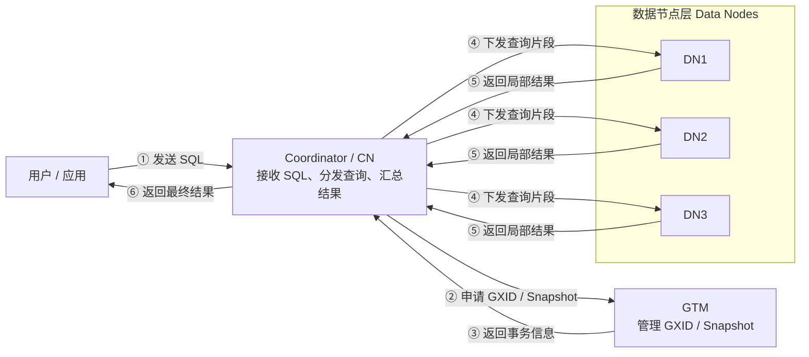

# OpenTenBase 新手导览：核心术语与架构理解

本文面向第一次接触 OpenTenBase 的读者，基于项目 `README`、源码目录和部署文档，整理 OpenTenBase 的核心术语、基础架构关系和常见理解方式。

## 1. OpenTenBase 是什么

OpenTenBase 是基于 Postgres-XL 演进的企业级分布式数据库系统。它继承 PostgreSQL 的 SQL 能力和生态，同时通过 `Coordinator/CN`、`Datanode/DN`、`GTM` 等组件，把多个数据库节点组织成一个对外看起来统一的数据库集群。

通俗理解：

- 如果 PostgreSQL 像一个单体仓库，数据和查询都在一台数据库里完成。
- 那 OpenTenBase 更像一组协同工作的仓库：前台负责接待和调度，多个仓库负责存储和执行，总账房负责保证多仓库之间的事务不乱。

## 2. 架构理解图

一句话理解：用户只连接 `CN`；`CN` 负责接收 SQL、分发查询和汇总结果；`DN` 真正存储数据并执行本地查询；`GTM` 负责全局事务 ID 和全局快照，保证跨节点事务一致。

## 3. 核心术语表

| 术语 | 新手解释 |
| --- | --- |
| `PostgreSQL` | 一个成熟的开源关系型数据库。OpenTenBase 继承了 PostgreSQL 的很多能力，因此 SQL 用法、客户端工具和生态都比较接近 PostgreSQL。 |
| `Postgres-XL` | PostgreSQL 的分布式数据库项目，OpenTenBase 基于 Postgres-XL 演进而来。可以把它理解成 OpenTenBase 分布式架构的重要来源。 |
| `OpenTenBase` | 一个分布式数据库系统，把多个节点组织成一个统一集群，对用户提供类似单个数据库的使用体验。 |
| `GTM` | Global Transaction Manager，全局事务管理器。它像“总账房”，负责给跨节点事务分配全局事务 ID，并维护全局快照，保证多个节点上的事务状态一致。 |
| `GTM Proxy` | GTM 的代理层。它可以汇聚 CN/DN 到 GTM 的请求，减少直接访问 GTM 的压力，也有助于 GTM 故障切换场景。 |
| `Coordinator / CN` | 协调节点，是用户和应用连接数据库的入口。它不保存真实业务数据，主要负责接收 SQL、解析 SQL、决定访问哪些 DN、下发查询并汇总结果。 |
| `Datanode / DN` | 数据节点，真正保存用户数据。CN 会把查询拆成片段发给相关 DN，DN 在本地执行后返回局部结果。 |
| `GXID` | Global Transaction ID，全局事务 ID。跨多个节点的一笔事务需要一个统一编号，方便 GTM、CN、DN 识别这是同一笔事务。 |
| `Global Snapshot` | 全局快照。它描述某一时刻整个集群中哪些事务已经提交、哪些还不可见，用来保证跨 DN 查询时看到一致的数据视图。 |
| `Distribution` | 数据分布策略，决定一张表的数据行如何放到多个 DN 上。合理的数据分布能提高并行处理能力。 |
| `DISTRIBUTE BY HASH` | 按指定列做哈希分布，把不同行分散到不同 DN。适合大表，尤其适合按高区分度字段分散数据并进行并行查询。 |
| `DISTRIBUTE BY REPLICATION` | 复制表，表示每个 DN 都保存一份完整数据。适合小表、字典表、配置表等读多写少的数据。 |
| `Node Group` | 节点组，通常是一组 DN 的集合。建表或规划数据分布时，可以把数据限制在某个节点组中。 |
| `Pooler / pgxc_pool` | 连接池和节点连接管理机制。CN 访问 DN 时，需要维护到各个节点的连接，连接池可以复用连接并缓存节点信息。 |
| `opentenbase_ctl` | OpenTenBase 的轻量级集群管理工具。它用于安装集群、删除集群、启动/停止节点、查看状态、批量执行 shell/SQL/GUC 操作等。 |

## 4. 查询执行流程

一个普通查询大致会经历以下步骤：

1. 用户或应用程序连接到某个 `Coordinator/CN`；
2. `CN` 接收 SQL，并进行解析、优化和计划生成；
3. 如果涉及事务一致性，`CN` 会向 `GTM` 申请 `GXID` 和 `Global Snapshot`；
4. `CN` 根据表的分布策略判断应该访问哪些 `Datanode/DN`；
5. `CN` 把查询片段下发到目标 `DN`；
6. 各个 `DN` 在本地数据上执行查询，返回局部结果；
7. `CN` 汇总、排序、聚合结果后，把最终结果返回给用户；

## 5. 分布式特征总结

OpenTenBase 的分布式特征主要体现在以下几点：

- 多入口：可以有多个 `CN` 接收用户请求；
- 多存储：用户数据存储在多个 `DN` 上；
- 查询下推：`CN` 会尽量把查询片段下发给 `DN` 执行，而不是把所有数据拉回本地处理；
- 全局事务：`GTM` 负责维护全局事务 ID 和快照，保证跨节点事务的一致性；
- 数据分布：表可以按哈希等方式分散到多个 DN，也可以复制到所有 DN；
- 集群运维：`opentenbase_ctl` 可以统一管理 GTM、CN、DN 等节点，降低部署和日常运维成本；

## 6. 新手常见 FAQ

### Q1：用户连接的是哪个节点？

用户或应用程序通常连接 `Coordinator/CN`。`CN` 是数据库访问入口，负责接收 SQL 并协调后续执行

### Q2：真实数据存在 CN 还是 DN？

真实用户数据主要存储在 `Datanode/DN`。`CN` 主要保存元数据，不保存真实业务数据

### Q3：GTM 是用来存数据的吗？

不是，`GTM` 不负责存储用户表数据，它主要负责全局事务管理，例如分配 `GXID` 和生成全局快照

### Q4：为什么需要多个 DN？

多个 `DN` 可以把大表数据分散存储，并让多个节点并行执行查询，提高容量和处理能力

### Q5：复制表和分布表怎么选？

 大表通常适合做分布表，例如使用 `DISTRIBUTE BY HASH`

 小表、配置表、字典表通常适合做复制表，例如使用 `DISTRIBUTE BY REPLICATION`

### Q6：`opentenbase_ctl` 和 `pg_ctl` 有什么区别？

 `opentenbase_ctl` 面向整个 OpenTenBase 集群，可以管理 GTM、CN、DN 等多个节点

 `pg_ctl` 更偏向控制单个 PostgreSQL/OpenTenBase 实例的启动、停止和重启

## 7. 参考阅读位置

- `README_ZH.md`：项目介绍、构建、安装、使用说明
- `src/`：数据库核心源码目录
- `src/backend/pgxc/`：分布式执行、节点管理、连接池、数据定位等核心模块
- `src/gtm/`：GTM、GTM Proxy、GTM 客户端相关实现
- `contrib/opentenbase_ctl/`：OpenTenBase 集群管理工具
- `doc/src/sgml/start.sgml`：架构基础说明
- `doc/src/sgml/ddl.sgml`：表分布、复制表、分布策略相关说明
- `doc/src/sgml/add-node.sgml` 和 `doc/src/sgml/remove-node.sgml`：节点扩缩容相关说明