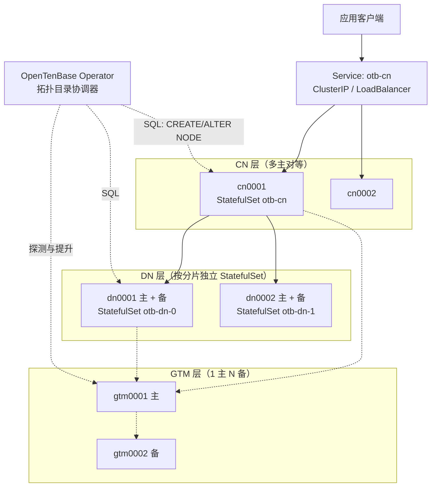
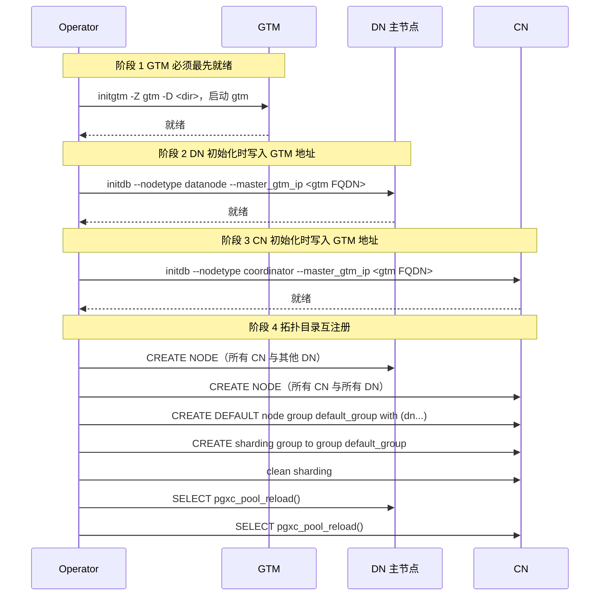

<!--
Copyright (C) 2019-2025 OpenTenBase Authors. All rights reserved.
SPDX-License-Identifier: BSD-3-Clause
-->

# OpenTenBase 接入 Kubernetes PostgreSQL 部署框架的可行性方案

关联 Issue：#201
仓库基线：`master` 分支 `b612d77c`

本文调研 CloudNativePG 的核心抽象，对比 OpenTenBase 的部署模型，给出接入方案与最小 PoC 设计。文中每一条关于 OpenTenBase 的行为判断都标注了源码位置。**凡是无法从当前仓库确认的内容，一律标记为待验证假设，不写成结论。**

---

## 目录

- [1. 结论先行](#1-结论先行)
- [2. CloudNativePG 的核心抽象](#2-cloudnativepg-的核心抽象)
- [3. OpenTenBase 部署模型的源码事实](#3-opentenbase-部署模型的源码事实)
- [4. 五个关键差异](#4-五个关键差异)
- [5. 可复用与必须新建的能力](#5-可复用与必须新建的能力)
- [6. 最小 PoC 设计](#6-最小-poc-设计)
- [7. 扩缩容边界](#7-扩缩容边界)
- [8. 监控指标接入](#8-监控指标接入)
- [9. 风险与待验证清单](#9-风险与待验证清单)
- [10. 源码依据索引](#10-源码依据索引)

---

## 1. 结论先行

**不能直接复用任何现有 PostgreSQL Operator，但可以复用其中约一半的基础设施能力。**

必须新建的核心是一个「拓扑目录协调器」。原因是 OpenTenBase 把节点的网络地址**持久化在系统表里**，而不是靠 Kubernetes Service 动态解析。这一点决定了整个设计的走向。

本方案最重要的三个发现，都来自源码而非通用经验：

| 发现 | 影响 | 依据 |
| --- | --- | --- |
| GTM 地址在 `initdb` 阶段就以 SQL 写入系统表 | GTM 切换不能靠改配置文件解决 | `src/bin/initdb/initdb.c:2165-2168` |
| 存在 `ALTER CLUSTER GTM NODE` 语法，且带 `cluster` 标志时会广播到全集群 | GTM 切换有原生的单条 SQL 解法 | `src/backend/parser/gram.y:12949`、`src/backend/tcop/utility.c:973` |
| 每个节点占用 3 个连续端口，且端口探测通过 SSH 完成 | 端口分配逻辑必须整体重写 | `contrib/opentenbase_ctl/src/utils/utils.cpp:39` |

第二条尤其关键。一个常见的设计误区是认为 GTM 故障切换需要「进入所有 CN/DN 容器改 `postgresql.conf`，再 `pg_ctl reload`」。源码表明存在更正确的路径。详见 [4.2](#42-gtm-地址是系统表状态而不是配置项)。

---

## 2. CloudNativePG 的核心抽象

选择 CloudNativePG（CNPG）作为调研对象，因为它是目前 Kubernetes 上设计最现代的 PostgreSQL Operator，且不依赖外部一致性存储。

> 说明：本节内容来自 CNPG 公开文档与其架构设计，属于外部资料。本文不对其版本细节做断言，仅提取与本方案相关的抽象层次。

| 抽象层 | CNPG 的做法 | 对 OpenTenBase 的可借鉴程度 |
| --- | --- | --- |
| **CRD** | `Cluster` 描述一主多备；`Pooler`、`Backup`、`ScheduledBackup` 独立 | 高。声明式 spec/status 模型可直接借鉴 |
| **Pod 管理** | 直接控制 Pod，不用 StatefulSet，以便精细控制故障转移顺序 | 中。需重新评估，见 [6.2](#62-为什么选择-statefulset) |
| **实例管理** | Pod 内注入 instance manager 作为 PID 1，负责本地启停与状态上报 | 高。这个模式非常适合承载 OpenTenBase 的多角色差异 |
| **Service** | 自动生成 `-rw`、`-ro`、`-r` 三类 Service 按角色路由 | 部分。OpenTenBase 的读写入口都是 CN，语义不同 |
| **存储** | PGDATA 与 WAL 可用独立 PVC 模板 | 高。可直接复用 |
| **备份** | instance manager 内置 barman-cloud，直传对象存储 | 部分。单节点备份可复用，但分布式一致性备份需新建 |
| **监控** | 内置 Prometheus exporter，配合 ServiceMonitor | 部分。GTM 不是 PostgreSQL，需独立 exporter |
| **升级** | 倒序滚动：先重建备节点，再受控 switchover | 部分。多角色场景需要分层编排 |

CNPG 最值得借鉴的一点是**它不迷信 StatefulSet**。它选择直接管理 Pod，因为 StatefulSet 的顺序约束在故障转移时反而是障碍。这个判断对 OpenTenBase 同样重要，但结论可能相反 —— 见 6.2 节的讨论。

---

## 3. OpenTenBase 部署模型的源码事实

本节全部结论来自仓库源码，可逐条复核。

### 3.1 角色与初始化命令不同

三种角色使用**不同的初始化二进制和参数**：

```
GTM:  initgtm -Z gtm -D <datadir>
CN:   initdb --nodename <name> --nodetype coordinator -D <datadir> \
        --master_gtm_nodename <gtm> --master_gtm_ip <ip> --master_gtm_port <port>
DN:   initdb --nodename <name> --nodetype datanode -D <datadir> \
        --master_gtm_nodename <gtm> --master_gtm_ip <ip> --master_gtm_port <port>
```

依据：`contrib/opentenbase_ctl/src/cluster/cluster.cpp:844-870`。

这意味着容器镜像的 entrypoint 必须能按角色分支，且 CN/DN 在初始化时就必须知道 GTM 的地址。**GTM 必须先就绪** —— 这是一条强制的编排顺序约束。

### 3.2 GTM 地址被写入系统表

`initdb` 收到 `--master_gtm_*` 参数后，执行的是一条 SQL：

```c
static void
load_gtm_info(FILE *cmdfd)
{
    PG_CMD_PRINTF3("create gtm node %s with (type='gtm', host='%s',port=%s, primary=1);\n\n",
                master_gtm_nodename, master_gtm_ip, master_gtm_port);
}
```

依据：`src/bin/initdb/initdb.c:2165-2168`。

**这是本方案中最重要的一条事实。** GTM 地址不是 `postgresql.conf` 里的一个 GUC，而是一条持久化在系统表中的节点定义。因此：

- 改配置文件 + reload **不能**更新 GTM 地址。
- 必须通过 SQL 修改。

### 3.3 每个节点占用 3 个连续端口

```c
node_port    = current_port;
pooler_port  = current_port + 1;
forward_port = current_port + 2;
```

起始端口为 `11000`，同一 IP 上的下一个节点从 `forward_port + 1` 继续探测。

依据：`contrib/opentenbase_ctl/src/utils/utils.cpp:39-95`；`contrib/opentenbase_ctl/src/types/types.h:72` 注释「转发节点端口（自动分配，与node port相邻）」。

同时注意 `check_port_available()` 的签名带 `username` / `password` / `ssh_port` —— **端口探测是通过 SSH 远程执行的**。在 Kubernetes 中，Pod 内运行 SSH 服务属于反模式，这段逻辑必须整体替换为静态端口约定。

### 3.4 节点名长度上限为 64

```c
#define PGXC_NODENAME_LENGTH  64
```

超长时报错 `Node name "%s" is too long`。

依据：`src/include/pgxc/nodemgr.h:21`；`src/backend/pgxc/nodemgr/nodemgr.c:1471-1476`。

这条约束直接限制了 K8s 资源命名策略。注意区分：**节点名**受此限制，而注册进系统表的 **host 字段** 使用 `NAMEDATALEN`（`nodemgr.c:810-811`），完整的 Headless Service FQDN 需要核对是否超限，见 [9. 风险清单](#9-风险与待验证清单) R1。

### 3.5 默认节点组只包含 DN 主节点

```cpp
if (config->nodes[i].type != Constants::NODE_TYPE_DN_MASTER) {
    continue;
}
node_name_list += config->nodes[i].name + ",";
...
create_sql = "CREATE DEFAULT node group default_group with (" + node_name_list + ");";
```

随后执行 `CREATE sharding group to group default_group;` 与 `clean sharding;`。

依据：`contrib/opentenbase_ctl/src/cluster/cluster.cpp:201-226, 278-300`。

### 3.6 拓扑变更后必须重载连接池

工具在注册节点后统一执行 `SELECT pgxc_pool_reload();`。

依据：`contrib/opentenbase_ctl/src/cluster/cluster.cpp:241`。

### 3.7 集中式模式不构建 GTM 与 CN

```
// distributed代表分布式，需要gtm、协调节点和数据节点；
// centralized代表集中式，此时会忽略gtm和协调节点的配置，只有1组数据节点
```

依据：`contrib/opentenbase_ctl/src/config/config.h:24`。

因此 CRD 需要区分这两种拓扑，且集中式模式下 GTM/CN 字段应当被忽略而非报错。

---

## 4. 五个关键差异

### 4.1 拓扑目录是持久化状态，不是动态发现

普通 PostgreSQL 集群中，备节点通过 `primary_conninfo` 找主节点，客户端通过 Service 找数据库，节点之间不需要知道彼此的精确地址。

OpenTenBase 不同：CN 和 DN 都需要在本地系统表中注册**所有对端**的 host 与 port。注册语句形如：

```sql
CREATE NODE dn0002 WITH (TYPE='datanode', HOST='...', PORT=11000);
ALTER  NODE cn0001 WITH (HOST='...', PORT=11000);
```

依据：`contrib/opentenbase_ctl/src/cluster/cluster.cpp:188-191` 的注释与 `build_create_pgxz_node_cmd()`。

**后果**：Pod IP 漂移会破坏这张目录表。这是整个方案要解决的第一问题。

### 4.2 GTM 地址是系统表状态，而不是配置项

结合 [3.2](#32-gtm-地址被写入系统表) 的发现，GTM 故障切换的正确路径必须走 SQL。

而语法层面提供了恰好合适的工具：

```
ALTER GTM NODE nodename WITH (...)          -- 仅当前节点
ALTER CLUSTER GTM NODE nodename WITH (...)  -- 全集群
```

依据：`src/backend/parser/gram.y:12939, 12949`。

`cluster` 标志的作用在 utility 层：

```c
case T_AlterNodeStmt:
    PgxcNodeAlter((AlterNodeStmt *) parsetree);
    if (((AlterNodeStmt *) parsetree)->cluster)
        exec_type = EXEC_ON_ALL_NODES;
```

依据：`src/backend/tcop/utility.c:971-975`。

**这意味着 GTM 切换有可能通过一条广播 SQL 完成**，而不需要 Operator 逐个进入容器改配置。这条路径显著简化了 failover 控制器的设计。

不过必须诚实说明：本文没有在真实集群上验证这条语句在 GTM 主节点已宕机时的实际行为（此时广播本身可能受影响）。因此列为 [R2](#9-风险与待验证清单)。

### 4.3 端口不是单一的 5432

每节点 3 个端口，且原实现依赖 SSH 探测可用性。Kubernetes 中每个 Pod 有独立网络命名空间，端口冲突问题天然消失，因此应改为**静态约定**：

| 端口 | 用途 | 建议值 |
| --- | --- | --- |
| node_port | 客户端与节点间 SQL | 11000 |
| pooler_port | 连接池 | 11001 |
| forward_port | 节点间数据转发 | 11002 |

每个 Pod 独占一份，不再需要探测。

### 4.4 高可用是分层的，不是单集群的

| 角色 | 高可用形态 | 配置约束 |
| --- | --- | --- |
| GTM | 1 主 + N 备 | `master` **只能一个 IP** |
| CN | 多主对等 | 备节点数为主节点整数倍 |
| DN | 每分片 1 主 + N 备 | 备节点数为主节点整数倍 |

依据：`config.h` 各结构体注释；`README_ZH.md` 配置表。

CN 是「多主对等」而非「一主多备」，这与 CNPG 的 `Cluster` 模型语义完全不同，不能套用。

### 4.5 部署工具依赖 SSH，在 K8s 中不可用

`opentenbase_ctl` 通过 libssh2 远程分发安装包并执行命令，配置里要求所有服务器**账号密码一致**（`config.h` 中 `ssh_user` / `ssh_password` 注释）。

Kubernetes 中的正确做法是：容器 entrypoint 完成本地初始化，Operator 通过 SQL 连接完成拓扑注册。**完全不使用 SSH。**

---

## 5. 可复用与必须新建的能力

### 5.1 可以复用（约 50%）

| 能力 | 复用方式 |
| --- | --- |
| 声明式 CRD + spec/status + conditions | 直接借鉴 CNPG 模型 |
| PVC 模板与存储类管理 | 直接复用，PGDATA 与 WAL 可分盘 |
| 单节点流复制 | GTM 主备、DN 分片内主备可复用 PostgreSQL 物理复制机制 |
| Pod 内 instance manager 模式 | 借鉴思路，按角色分支实现 |
| Prometheus exporter + ServiceMonitor | CN/DN 可复用 postgres-exporter |
| 滚动升级的分批思路 | 需扩展为按角色分层 |

### 5.2 必须新建

| 能力 | 为什么无法复用 |
| --- | --- |
| **拓扑目录协调器** | 核心。现有 Operator 没有「把对端地址写进系统表」这个概念 |
| **GTM 角色控制器** | GTM 不是 PostgreSQL 实例，`initgtm` 与 `gtm` 进程独立 |
| **GTM 切换后的目录更新** | 需要走 `ALTER CLUSTER GTM NODE` 而非配置 reload |
| **多角色引导状态机** | 必须 GTM → DN → CN 顺序，且最后统一注册 |
| **node group 与 sharding group 管理** | 分片元数据是 OpenTenBase 独有概念 |
| **分片扩容与数据重分布** | 长耗时有状态操作，现有 Operator 无对应抽象 |
| **免 SSH 的初始化路径** | 替换 `opentenbase_ctl` 的 SSH 依赖 |
| **分布式一致性备份** | 跨 DN 的一致性点需要全局事务信息参与，不能各节点独立备份 |

---

## 6. 最小 PoC 设计

### 6.1 资源拓扑



### 6.2 为什么选择 StatefulSet

CNPG 刻意不用 StatefulSet。但对 OpenTenBase，我们建议**先用 StatefulSet**，理由：

1. 需要稳定的 Pod 名与 DNS。由于地址要写进系统表（[3.2](#32-gtm-地址被写入系统表)、[4.1](#41-拓扑目录是持久化状态不是动态发现)），稳定标识的价值远大于 Pod 控制灵活性。
2. 每分片一个独立 StatefulSet，可对单分片独立调整存储与副本，避免所有 DN 绑在一起。
3. PVC 与 Pod 序号的稳定绑定符合分片数据不可互换的语义。

**但这是一个待验证的初步选择，不是最终结论。** 如果后续实现自动故障转移时发现 StatefulSet 的顺序约束造成阻碍，应转向 CNPG 式的直接 Pod 管理。列为 [R4](#9-风险与待验证清单)。

命名建议（同时满足 K8s 与 64 字符节点名限制）：

| K8s 资源 | OpenTenBase 节点名 |
| --- | --- |
| `otb-gtm-0` | `gtm0001` |
| `otb-cn-0` | `cn0001` |
| `otb-dn-0-0` | `dn0001` |

节点名保持 `opentenbase_ctl` 的既有风格（`cn0001` / `dn0001` / `gtm0001`），与 `get_node_name()` 的前缀约定一致（`types.h:149-163`）。

### 6.3 Service 设计

| Service | 类型 | 用途 |
| --- | --- | --- |
| `otb-gtm-headless` | Headless | GTM 主备的稳定 DNS |
| `otb-cn-headless` | Headless | CN 间互连与目录注册 |
| `otb-dn-<shard>-headless` | Headless | DN 间互连与目录注册 |
| `otb-cn` | ClusterIP / LB | **唯一对外入口**，负载分流到多个 CN |

注意与 CNPG 的区别：OpenTenBase 不需要 `-ro` 只读 Service。读写都经 CN，只读扩展靠增加 CN 而非暴露 DN。

### 6.4 引导流程



阶段 1 到 3 的顺序不是设计偏好，而是 [3.1](#31-角色与初始化命令不同) 的强制约束：CN/DN 的 `initdb` 命令行必须带 GTM 地址。

阶段 4 的语句序列与 `opentenbase_ctl` 的实际行为对齐（`cluster.cpp:220, 290-291`），不是自行设计的流程。

### 6.5 状态机

```
Pending → BootstrappingGTM → BootstrappingDN → BootstrappingCN
        → RegisteringTopology → Running
                                  ↓
                          TopologyDrifted（检测到目录与期望不一致）
                                  ↓
                          Reconciling → Running
```

`TopologyDrifted` 是本设计特有的状态。它对应一个持续存在的风险：系统表中的地址可能与实际 Pod 地址不符。Operator 应周期性比对 `pgxc_node` 与期望拓扑，发现漂移即执行补偿性 DDL。

---

## 7. 扩缩容边界

### 7.1 CN 扩容：相对安全

CN 不存业务数据（[3.5](#35-默认节点组只包含-dn-主节点) 反证：node group 只含 DN），因此扩容不涉及数据迁移。

流程：
1. 提升 `coordinators.replicas`，StatefulSet 拉起新 Pod。
2. 新 CN 完成 `initdb`（带 GTM 地址）并启动。
3. 在**所有已有 CN 与 DN** 上 `CREATE NODE <new_cn> WITH (TYPE='coordinator', ...)`。
4. 在**新 CN** 上注册全部已有节点。
5. 全集群 `SELECT pgxc_pool_reload()`。

第 3、4 步的双向注册是必需的，源于 [4.1](#41-拓扑目录是持久化状态不是动态发现) 的网格特性。

### 7.2 DN 分片扩容：必须谨慎

新增分片后，已有数据的分布不再匹配新的分片映射，需要数据重分布。

**本方案明确不声称能自动安全完成这一步。** 建议边界：

- Operator 负责：拉起新分片 Pod、完成目录注册、执行 `ALTER NODE GROUP ... ADD`。
- Operator **不负责**：在 reconcile 主循环中执行数据重分布。

理由是重分布可能耗时数小时并持有锁，放在控制循环里会导致控制器超时。应由独立的 Kubernetes Job 承载，Operator 只跟踪 Job 状态。

**同时必须说明**：本文没有在真实集群验证 OpenTenBase 在线重分布的具体行为、是否阻塞写入、以及中断后的恢复语义。这是本方案最大的未验证区域，列为 [R3](#9-风险与待验证清单)。在验证完成前，生产环境的分片扩容应保持人工介入。

### 7.3 缩容：暂不建议自动化

DN 缩容涉及数据迁出与分片映射收缩，风险高于扩容。建议第一版 Operator **拒绝**减少 `shards`，返回明确的校验错误，而不是尝试执行。

---

## 8. 监控指标接入

| 目标 | 方案 | 说明 |
| --- | --- | --- |
| CN / DN | Sidecar 运行 postgres-exporter | 可直接复用社区 exporter |
| GTM | **需要新建 gtm-exporter** | GTM 不是 PostgreSQL，没有 `pg_stat_*` 视图 |
| 拓扑一致性 | Operator 自身暴露指标 | 建议指标：`otb_topology_drift_total`、`otb_pgxc_node_mismatch` |
| 分片健康 | Operator 汇总各分片主备状态 | 建议指标：`otb_shard_ready` |

其中「拓扑一致性」指标是本方案特有的建议。由于目录漂移是 OpenTenBase 在 K8s 上的头号风险，它应当是一等可观测对象，而不是只在日志里体现。

GTM 可采集的指标需要进一步确认。`src/gtm/README` 说明了源码结构（server 端在 `include`/`common`/`main`，client 在 `client`），但本文未逐一确认可导出的统计项，列为 [R5](#9-风险与待验证清单)。

---

## 9. 风险与待验证清单

诚实标注未验证项，是本方案与「看起来很完整的设计」的主要区别。

| 编号 | 风险 / 待验证项 | 当前状态 | 建议验证方式 |
| --- | --- | --- | --- |
| **R1** | Headless Service 的完整 FQDN 长度是否超出系统表 host 字段限制 | **未验证**。节点名限制 64 已确认（`nodemgr.h:21`），但 host 字段使用 `NAMEDATALEN`，需实测 | 在测试集群用长 FQDN 执行 `CREATE NODE` 观察是否报错 |
| **R2** | `ALTER CLUSTER GTM NODE` 在 GTM 主节点已宕机时能否成功广播 | **未验证**。语法与广播机制已确认（`gram.y:12949`、`utility.c:973`），但故障场景下的行为未测 | 搭建集群后杀掉 GTM 主进程再执行该语句 |
| **R3** | 在线分片重分布的阻塞程度与中断恢复语义 | **未验证**。这是最大的未知区域 | 小数据量集群执行 `ALTER NODE GROUP ADD` 并观察锁与耗时 |
| **R4** | StatefulSet 的顺序约束是否会阻碍自动故障转移 | **待评估**。当前选择 StatefulSet 是基于稳定标识需求的初步判断 | 实现 failover 原型后重新评估，必要时改为直接管理 Pod |
| **R5** | GTM 可导出的监控指标清单 | **未确认** | 阅读 `src/gtm/main` 的统计相关实现 |
| **R6** | 目录注册过程中断导致的部分节点元数据不一致 | **已识别，方案已设计**（周期性比对 + 补偿 DDL），但未实现验证 | 实现后注入网络故障测试 |
| **R7** | 分布式一致性备份的可行路径 | **未设计**。各 DN 独立备份无法保证跨分片一致性 | 需要单独立项调研 |

**本方案的性质**：这是一份静态设计文档与 CRD 草案。它**不包含**可运行的 Operator，也**不代表** OpenTenBase 已在 Kubernetes 上成功部署。所有 K8s 侧的行为都是设计意图，尚未经过 API Server 校验或实际 reconcile 验证。

---

## 10. 源码依据索引

| 结论 | 文件与位置 |
| --- | --- |
| 三种角色的初始化命令不同 | `contrib/opentenbase_ctl/src/cluster/cluster.cpp:844-870` |
| GTM 地址以 SQL 写入系统表 | `src/bin/initdb/initdb.c:2165-2168` |
| `--master_gtm_*` 参数定义 | `src/bin/initdb/initdb.c:3376-3378, 3540-3553` |
| `ALTER GTM NODE` / `ALTER CLUSTER GTM NODE` 语法 | `src/backend/parser/gram.y:12939, 12949` |
| `cluster` 标志触发全集群广播 | `src/backend/tcop/utility.c:971-975` |
| 每节点 3 个连续端口，起始 11000 | `contrib/opentenbase_ctl/src/utils/utils.cpp:39-95` |
| forward_port 与 node port 相邻 | `contrib/opentenbase_ctl/src/types/types.h:72` |
| 端口探测通过 SSH | `contrib/opentenbase_ctl/src/utils/utils.cpp:39`（签名含 username/password/ssh_port） |
| 节点名上限 64 | `src/include/pgxc/nodemgr.h:21`；`src/backend/pgxc/nodemgr/nodemgr.c:1471-1476` |
| host 字段使用 NAMEDATALEN | `src/backend/pgxc/nodemgr/nodemgr.c:810-811` |
| 默认节点组只含 DN 主节点 | `contrib/opentenbase_ctl/src/cluster/cluster.cpp:201-226` |
| 创建 sharding group 与 clean sharding | `contrib/opentenbase_ctl/src/cluster/cluster.cpp:290-291` |
| 拓扑变更后 `pgxc_pool_reload()` | `contrib/opentenbase_ctl/src/cluster/cluster.cpp:241` |
| 集中式模式忽略 GTM 与 CN | `contrib/opentenbase_ctl/src/config/config.h:24` |
| GTM 主节点只能一个 IP | `contrib/opentenbase_ctl/src/config/config.h`（`ConfigFileGtm`） |
| 备节点数为主节点整数倍 | `contrib/opentenbase_ctl/src/config/config.h`（`ConfigFileCoordinators` / `ConfigFileDatanodes`） |
| 节点名前缀约定 | `contrib/opentenbase_ctl/src/types/types.h:149-163` |
| `opentenbase_ctl` 子命令清单 | `contrib/opentenbase_ctl/README.md` |
| GTM 源码结构 | `src/gtm/README` |

---

## 相关文档

- [`poc/opentenbasecluster-crd.yaml`](poc/opentenbasecluster-crd.yaml)：CRD 草案
- [`poc/sample-distributed.yaml`](poc/sample-distributed.yaml)：分布式模式示例
- [`poc/sample-centralized.yaml`](poc/sample-centralized.yaml)：集中式模式示例
- [`poc/validate.py`](poc/validate.py)：离线结构校验脚本
- [`discussion-draft.md`](discussion-draft.md)：社区讨论帖草案
- [`AI_USAGE_REPORT.md`](AI_USAGE_REPORT.md)：AI 使用策略自我报告
