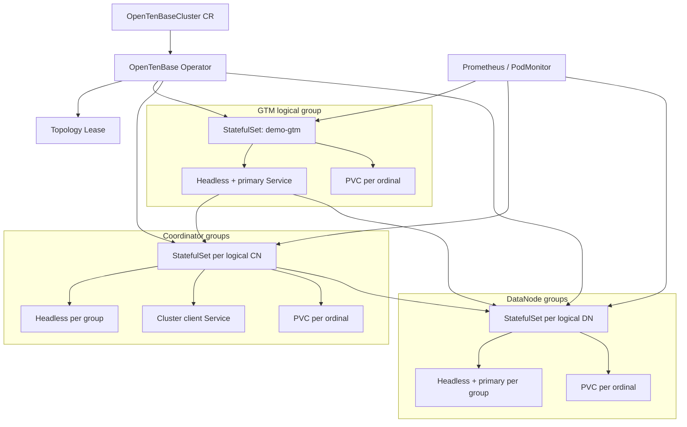

<!--
Copyright (c) 2026 OpenTenBase Contributors
Licensed under the BSD 3-Clause License. See LICENSE.txt.
-->

# OpenTenBase 接入 CloudNativePG 社区部署框架的可行性设计

> 状态：Issue #201 设计提案
> 调研基线：OpenTenBase `b612d77c`；CloudNativePG 1.28 运维文档及 1.30 镜像支持边界；Kubernetes `apiextensions.k8s.io/v1`
> 日期：2026-07-28

## 1. 结论先行

OpenTenBase 不应直接 fork CloudNativePG（下文简称 CNPG），也不应把整个分布式集群伪装成一个 CNPG `Cluster`。推荐新建一个较薄的 `OpenTenBaseCluster` 高层 Operator，复用 CNPG 已验证的 Kubernetes 运维模式和外围生态，但由 OpenTenBase 自己维护 GTM、Coordinator（CN）、DataNode（DN）之间的拓扑不变量。

最小 PoC 的边界是：

- 用一个 `OpenTenBaseCluster` CRD 表达集中式或分布式拓扑。
- GTM 使用一个 StatefulSet；每个逻辑 CN、DN 各使用一个独立 StatefulSet，副本 ordinal 表示该逻辑节点的主备实例。
- 使用稳定的 headless Service 完成节点间寻址，使用单独的 CN read-write Service 作为客户端入口。
- 按 `GTM 主 -> CN/DN 主并行 -> 各备节点 -> 分布式节点目录和默认 node group` 的状态机初始化，任一步骤都必须可重试。
- PoC 只允许创建时确定 DN 分片数。DN 扩缩容、全局一致备份和自动角色切换在具备数据库级协议前一律 fail closed。
- 监控先复用 Prometheus/PodMonitor 接入方式；备份只复用对象存储、凭据和 Job 等外围模式，不宣称单节点备份天然等于分布式一致备份。

配套交付物：

- [`OpenTenBaseCluster` CRD 草案](../design/opentenbase-cluster-crd.yaml)
- [最小集群示例](../design/opentenbase-cluster-example.yaml)
- [AI 使用策略自我报告](../design/issue-201-ai-usage-report.md)

## 2. 从第一性原理定义“集群正确”

Operator 的目标不是让 Pod 数量等于 `spec`，而是持续保证下面的不变量。

### 2.1 数据与路由不变量

1. 用户流量只进入可服务的 CN，不直接把 DN 暴露为业务入口。
2. 每个 CN/DN 主实例都有稳定且唯一的节点名；Pod IP 变化不能改变数据库节点身份。
3. 每个可服务 CN 看到的 CN/DN 节点目录必须与 `spec` 对应的期望拓扑一致。
4. 分布式模式下必须先有可用 GTM，CN/DN 才能完成初始化并对外 Ready。
5. DN 分片集合变化不是普通的 StatefulSet 扩缩容，而是数据放置、再平衡和元数据变更事务。

### 2.2 高可用与存储不变量

1. StatefulSet ordinal 是实例身份，不等于数据库角色；主备角色必须由数据库状态确认。
2. 同一逻辑节点的主、备不能共享同一数据目录，且应跨 worker node/可用区调度。
3. Service selector 只能指向数据库确认可服务的实例，不能仅依赖 Pod `Running`。
4. 任何自动切换都必须同时更新 GTM/CN/DN 的依赖关系和路由元数据；做不到时宁可标记 `Degraded` 并停止自动操作。

### 2.3 控制器不变量

1. `spec` 是期望状态，`status.observedGeneration` 表明控制器实际处理过的版本。
2. 每一步必须幂等：重复 reconcile 不重复创建数据库节点、不破坏已完成初始化。
3. 拓扑变更以规范化拓扑的哈希 `topologyRevision` 为提交标识；数据库元数据成功后才推进 `status`。
4. 单集群拓扑写操作由 Kubernetes `Lease` 串行化；失败后从数据库实际状态重新发现，而不是盲目重放。
5. 删除 PVC、缩减 DN 或覆盖数据库角色属于破坏性操作，必须有显式策略和人工确认。

这些约束决定了复用边界：Kubernetes 资源管理可以复用，分布式数据库语义必须新建。

## 3. 为什么选择 CloudNativePG

先对候选框架做轻量筛选，再对推荐项深入分析。

| 维度 | CloudNativePG | StackGres | Crunchy PGO | Zalando Operator |
| --- | --- | --- | --- | --- |
| 核心定位 | Kubernetes-native PostgreSQL 生命周期 | PostgreSQL 平台，集成面较大 | PostgreSQL 集群与 pgBackRest | Patroni/Spilo 体系 |
| 许可证 | Apache-2.0 | AGPL-3.0 | Apache-2.0 | MIT |
| HA 控制 | 自有 instance manager + K8s API | Patroni | Patroni | Patroni |
| 存储/Service/监控/滚动升级文档 | 完整且边界明确 | 完整 | 完整 | 完整 |
| 作为 OpenTenBase 设计基线 | **推荐**：原生控制器模式清晰，依赖较少 | 平台耦合较重 | 备份能力强但 Patroni 假设仍在 | 与 Spilo 镜像耦合较深 |

选择 CNPG 不是因为它能直接运行 OpenTenBase，而是因为它把 PostgreSQL Operator 的核心责任拆得最清楚：CRD/status、每实例 Pod 管理、Service selector、独立 PVC、探针、滚动更新、备份插件和 Prometheus 指标。它因此适合作为“哪些能复用、哪些不能复用”的参照系。

## 4. CNPG 核心抽象与复用判定

| 能力 | CNPG 1.30 的抽象 | OpenTenBase 处理 | 判定 |
| --- | --- | --- | --- |
| CRD | 一个 `Cluster` 表达一个 PostgreSQL 主实例和可选热备 | 一个 `OpenTenBaseCluster` 表达 GTM + 多个 CN/DN 逻辑节点及其主备 | 新建 |
| Operator | reconcile 单 PostgreSQL 集群生命周期 | 高层拓扑状态机，编排多个角色和数据库目录 | 新建，复用控制器模式 |
| Pod 管理 | 每实例一个 Pod，instance manager 为 PID 1 并管理 postmaster/探针 | GTM 不是 PostgreSQL postmaster；CN/DN 还需角色化 initdb 和拓扑注册 | 新建 role-aware instance agent |
| Service | `rw` 指主、`ro` 指备、`r` 指任意实例 | 客户端只需要 CN 服务；GTM、DN 默认仅内部 headless/primary 服务 | 复用 Service 模式，新建 selector 语义 |
| 存储 | 每实例独立 PVC，推荐 shared-nothing | GTM、每个 CN/DN 实例同样需要独立 PVC 和反亲和 | 可直接复用 K8s 模式 |
| 备份 | 单 PostgreSQL 集群的 base backup、WAL、PITR，推荐 CNPG-I/Barman | 多 DN + GTM 的恢复点必须全局一致 | 仅复用传输/凭据/Job；一致性协议新建 |
| 监控 | 内置 exporter，支持自定义 SQL 指标和 PodMonitor | 增加 GTM、路由目录、跨 DN 事务、各角色复制延迟指标 | 复用 Prometheus 接入，新建指标集 |
| 升级 | 先备后主、受控 switchover 的滚动更新 | 还需按 GTM/CN/DN 依赖和兼容矩阵排序 | 复用策略思想，新建编排 |

CNPG 官方明确限制应用镜像为“一个 Primary + 多个可选 Hot Standby”的 PostgreSQL 架构，并只支持 PGDG 正式支持的 PostgreSQL 版本。因此，把 OpenTenBase 镜像直接声明为受支持的 CNPG 镜像是不成立的产品承诺。可以做兼容性 spike，但不能作为 PoC 的控制面基础。

## 5. OpenTenBase 当前部署模型

OpenTenBase 的公开说明和 `opentenbase_ctl` 源码共同给出以下事实：

- 分布式模式由 GTM、CN、DN 组成；用户连接 CN，数据保存在 DN，GTM 管理全局事务。
- 集中式模式只有一个逻辑 DN 组，不需要 GTM/CN。
- CN/DN 初始化不是普通 `initdb`：还需要 `--nodename`、`--nodetype` 和 GTM 主节点参数。
- CN/DN 的备实例从同名主实例执行 `pg_basebackup`。
- 安装器实际顺序是 GTM 主节点先启动；CN/DN 主节点可并行；之后启动 CN/DN/GTM 备节点；最后创建默认 node group。
- 通用产品形态尚不能把 `expand`/`shrink` 当作安全能力。

这也修正了“GTM -> DN -> CN 必须完全串行”的过度简化。真正的硬依赖是 GTM 必须先就绪；CN/DN 主实例在拥有 GTM 地址后可以并行初始化，但分布式节点目录和默认 node group 只能在所有必要主实例就绪后提交。

## 6. 三种接入方式

### 方案 A：fork CNPG

优点是可以直接修改现成 controller、instance manager 和备份代码。缺点是 CNPG 的核心不变量就是单主多备；为了 GTM 和多 CN/DN 改写该不变量，实际会触及 API、故障切换、Service、备份和升级的全部核心路径。长期还要持续合并上游变化。

**结论：拒绝。** 这不是小范围适配，而是用错误的领域模型做二次开发。

### 方案 B：高层 Operator 组合多个 CNPG `Cluster`

每个 CN/DN 逻辑节点对应一个 CNPG `Cluster`，GTM 由 OpenTenBase Operator 自管。它能最大化复用单逻辑节点内的复制、PVC、Service、备份和滚动更新。

主要风险是 CNPG 明确不支持 OpenTenBase 版本/镜像和多角色语义；instance manager 会覆盖入口并按 PostgreSQL 单集群假设管理进程。跨 CNPG child resource 的拓扑提交、故障切换和全局备份仍需新建。

**结论：只作为 time-boxed 兼容性 spike。** 通过以下门槛后才可考虑进入第二阶段：

1. OpenTenBase CN/DN 镜像通过 CNPG bootstrap、探针、复制和 switchover e2e。
2. CNPG 升级不会覆盖 OpenTenBase 必需配置。
3. 上游明确接受或至少记录该非 PGDG 使用边界。

### 方案 C：独立 Operator，复用 CNPG 模式与生态

Operator 直接管理 StatefulSet、Service、PVC、Secret、ConfigMap、Lease 和 PodMonitor。Pod 内使用轻量 `otb-instance-manager` 管理 CN/DN/GTM 的角色化启动、探针和优雅退出。外围能力遵循 CNPG 已验证的接口和运行模式。

**结论：推荐。** 它的新增代码正好覆盖 OpenTenBase 独有语义，并避免依赖 CNPG 不承诺的扩展点。

## 7. 推荐架构



### 7.1 资源映射

以 `coordinator.groups: 2`、`replicasPerGroup: 2` 为例：

- `demo-gtm`：一个 StatefulSet，ordinal 0/1 提供两个稳定候选实例；实际主备角色由数据库状态确认，不能由 ordinal 推导。
- `demo-cn-0`、`demo-cn-1`：每个逻辑 CN 一个 StatefulSet，每个有两个实例。
- `demo-dn-0`、`demo-dn-1`：每个逻辑 DN 分片一个 StatefulSet，每个有两个实例。

不采用“所有 CN 一个 StatefulSet、所有 DN 一个 StatefulSet”，因为那会把“逻辑节点编号”和“主备编号”压进同一 ordinal，导致滚动、PVC 所有权、反亲和、故障域和缩容语义难以验证。

### 7.2 Service

| Service | Selector | 用途 | 默认暴露 |
| --- | --- | --- | --- |
| `<name>-gtm` | 当前 GTM primary 标签 | CN/DN 的 GTM 地址 | 仅集群内 |
| `<name>-gtm-headless` | 全部 GTM 实例 | 稳定 DNS、复制 | 仅集群内 |
| `<name>-cn-<n>-headless` | 指定逻辑 CN 全部实例 | 主备复制/发现 | 仅集群内 |
| `<name>-rw` | 所有 `role=coordinator, serving=true` 的主实例 | 应用入口，可为 ClusterIP/LoadBalancer | 按 CRD |
| `<name>-dn-<n>` | 指定逻辑 DN 当前 primary | CN 到 DN 路由 | 仅集群内 |
| `<name>-dn-<n>-headless` | 指定逻辑 DN 全部实例 | 主备复制/发现 | 仅集群内 |

DN 和 GTM 不提供默认外部 Service。网络策略只允许 Operator、同集群数据库 Pod、监控和明确授权的运维 Job 访问内部端口。

### 7.3 Readiness 语义

Pod readiness 必须高于 `pg_isready`：

- GTM：进程响应且确认当前角色。
- DN：本地数据库可用、能访问期望 GTM、节点身份匹配。
- CN：本地数据库可用、能访问 GTM、实际节点目录哈希等于 `status.topologyRevision`。

只有 CN 满足最后一条时，Operator 才设置 `serving=true`，客户端 Service 才会选中它。

## 8. Reconcile 与初始化状态机

| Phase | 控制器动作 | 进入下一阶段的门槛 |
| --- | --- | --- |
| `Pending` | 默认值、CEL/webhook 校验、生成规范拓扑和 revision | spec 合法；镜像、Secret、StorageClass 可解析 |
| `Provisioning` | 创建 ServiceAccount、Secret/ConfigMap、Service、PVC/StatefulSet 模板 | 所有 owner reference 和资源规格一致 |
| `BootstrappingGTM` | 初始化并启动 GTM primary，再建立 standby | GTM primary 探针通过；standby 达到策略要求 |
| `BootstrappingDataPlane` | CN/DN primary 并行执行角色化 initdb 和启动 | 所有必要 primary 可本地连接并能访问 GTM |
| `BootstrappingReplicas` | CN/DN standby 通过同组 primary 的 `pg_basebackup` 创建 | 每组达到 `replicasPerGroup` 的就绪门槛 |
| `RegisteringTopology` | 获取 Lease；比较实际目录；执行 CREATE/ALTER NODE 和默认 node group；再次读取校验 | 每个 serving CN 的实际目录哈希等于期望 revision |
| `Ready` | 设置 Conditions、Service selector、持续健康检查 | 所有核心不变量成立 |
| `Degraded` | 停止危险自动操作，保留诊断信息和可恢复资源 | 人工修复或后续 reconcile 重新满足门槛 |

### 8.1 幂等与故障恢复

- 初始化用 PVC 内 marker + 数据库实际查询双重确认；marker 只能作为提示，数据库状态是最终证据。
- SQL 不直接盲重放：先查询节点目录，再生成差异化的 `CREATE NODE`/`ALTER NODE`；不在期望拓扑中的节点只报告，不在 PoC 自动删除。
- `status` 只有在外部副作用确认成功后更新。
- reconcile 使用退避和 Kubernetes Event；不可恢复配置错误设置 `SpecInvalid=True`，不会不断重启 Pod。
- Operator 崩溃后可从 StatefulSet/PVC、数据库角色和节点目录重建 observed state。

## 9. CRD 关键语义

CRD 草案把“逻辑组数”和“每组实例数”分开：

```yaml
spec:
  mode: Distributed
  gtm:
    replicas: 2
  coordinator:
    groups: 2
    replicasPerGroup: 2
  datanode:
    groups: 2
    replicasPerGroup: 2
```

- `groups` 决定数据库逻辑节点/分片数量。
- `replicasPerGroup` 决定同一逻辑节点的数据副本数量。
- `mode: Centralized` 时禁止 GTM/CN，且 `datanode.groups` 必须为 1。
- `status` 暴露 phase、conditions、observedGeneration、topologyRevision 和每角色 ready/desired 数量。
- PoC 默认 `topologyChangePolicy: Manual`，避免把 StatefulSet 数量变化误当作安全的数据库扩缩容。

## 10. 生命周期边界

### 10.1 扩容与缩容

| 操作 | PoC 行为 | 后续实现前置条件 |
| --- | --- | --- |
| 增加 CN 逻辑组 | 生成变更计划，默认等待人工批准 | 所有节点目录幂等注册、连接排空和回滚测试 |
| 减少 CN 逻辑组 | 拒绝 | Service 摘除、连接排空、全拓扑 DROP NODE 协议 |
| 增加 DN 逻辑组 | 拒绝 | OpenTenBase 通用形态的数据迁移/再平衡协议 |
| 减少 DN 逻辑组 | 拒绝 | 分片排空、数据完整性证明、显式破坏性批准 |
| 增加同组 standby | 计划态或实验开关 | `pg_basebackup`、复制槽/参数、角色确认 e2e |
| PVC 扩容 | StorageClass 支持时允许 increase-only | 文件系统扩容和磁盘指标验证 |

### 10.2 故障切换

PoC 提供检测和 fencing，不提供“看到 Pod 失败就自动 promote”：

1. 先确认旧主不可写，避免双主。
2. 选择满足复制位置、时间线和拓扑 revision 的候选。
3. 按数据库协议 promote。
4. 更新 GTM/DN/CN 依赖和 Service selector。
5. 从所有 serving CN 验证拓扑。

在这套协议通过网络分区、Operator 重启、旧主复活和部分元数据提交测试前，自动切换会放大数据损坏风险。

### 10.3 升级

- Operator 自身升级与数据库镜像升级分离。
- 数据库升级先做兼容性 preflight 和备份可恢复性检查。
- 同一逻辑组先升级 standby，再受控切换，再升级旧主。
- 集群角色顺序由版本兼容矩阵决定；默认 CN/DN 分批，GTM 最后，任一批次失败即停止。
- 主版本升级不伪装成滚动升级，使用逻辑迁移或经过验证的 dump/restore/蓝绿流程。

## 11. 备份与恢复

CNPG 的单集群 base backup + WAL/PITR 不能自动提升为 OpenTenBase 全局一致备份。独立备份各 DN 可能对应不同全局事务边界；只恢复 DN 而没有匹配的 GTM/目录状态，也不能证明集群一致。

因此分两层处理：

1. **可复用层**：对象存储凭据、加密、保留策略、上传/恢复 Job、CSI VolumeSnapshot、告警和备份 CR 状态模式。
2. **必须新建层**：全局写入屏障或一致性快照协议、各 DN/GTM 恢复点清单、拓扑 revision、原子发布的 backup manifest、全角色恢复顺序和恢复后校验。

PoC 不暴露“已支持 PITR”的字段。第一版备份实验只允许在显式维护窗口内完成全局 checkpoint/写入 fencing 后，对所有成员产生同一 manifest；恢复测试成功前不得标记 `BackupReady=True`。

## 12. 监控

复用 CNPG 的 Prometheus 思路：每个实例在独立 metrics 端口导出基础 PostgreSQL/进程/存储指标，Operator 可选创建 PodMonitor。新增 OpenTenBase 指标：

- `opentenbase_role_up{role,logical_node,instance}`
- `opentenbase_topology_revision{coordinator}`
- `opentenbase_topology_mismatch_total`
- `opentenbase_gtm_connectivity`
- `opentenbase_replication_lag_bytes{logical_node,instance}`
- `opentenbase_reconcile_phase`
- `opentenbase_reconcile_errors_total{reason}`
- `opentenbase_dn_group_count`

关键告警包括：无 serving CN、GTM 不可达、同组出现多个 primary、CN 拓扑 revision 不一致、复制延迟超过阈值、PVC 容量不足、reconcile 长时间停在同一 phase。

## 13. 安全与权限

- Operator 使用 namespace-scoped Role，默认不需要 cluster-admin。
- Secret 只通过引用传入，不复制到 CR status/Event/日志。
- 数据库 Pod 使用非 root、只读 root filesystem、独立 ServiceAccount 和最小 Linux capabilities。
- 拓扑 SQL 使用专用管理凭据；业务账号不能执行节点目录变更。
- admission 校验模式和拓扑下限；破坏性变更由 webhook/Operator 双重拒绝。
- finalizer 只保证数据库级清理顺序，不默认删除 PVC；PVC 保留策略必须显式配置。

## 14. 风险登记

| 风险 | 后果 | PoC 缓解/验证 |
| --- | --- | --- |
| StatefulSet ordinal 被误当作数据库主角色 | 双主或错误路由 | 角色探针 + selector 标签只由 instance agent/Operator 更新 |
| 拓扑 SQL 部分成功 | CN 目录不一致 | Lease、revision、读后校验、差异化重试 |
| Pod IP 进入数据库目录 | 重建后路由失效 | 只注册稳定 Service DNS |
| DN 数量直接缩减 | 数据丢失 | spec 变更 fail closed |
| 各 DN 独立备份 | 恢复后全局不一致 | 不宣称分布式 PITR；先设计全局 manifest/barrier |
| GTM 自动切换协议不完整 | GXID/快照风险 | PoC 只检测和 fencing，人工 promote |
| OpenTenBase 镜像交给 CNPG instance manager | 上游不支持、升级不可预测 | 仅限隔离 compatibility spike |
| Operator 删除导致资源误删 | 数据丢失 | PVC 默认 Retain，finalizer 明确列出阻塞原因 |

## 15. 分阶段落地

### Phase 0：兼容性与不变量实验（1–2 周）

- 制作 Kubernetes 可运行的 OpenTenBase 镜像。
- 在 Kind 上验证 GTM、单 CN、单 DN 的角色化 initdb、稳定 DNS、重启和 PVC 重挂载。
- time-box CNPG child `Cluster` spike，记录 instance manager 的具体不兼容点。
- 退出门槛：初始化命令、探针和数据库目录查询都有可重复 e2e。

### Phase 1：最小 Operator（2–4 周）

- 实现 CRD、默认值/校验、资源生成、phase/status/conditions。
- 实现 GTM -> CN/DN -> topology 的幂等 bootstrap。
- 实现 CN 客户端 Service、基础指标、网络策略。
- 退出门槛：删除任意非数据 Pod、重启 Operator、重复 apply CR 都能收敛到同一 topologyRevision。

### Phase 2：单逻辑组 HA（3–5 周）

- 实现 CN/DN standby、fencing、人工 switchover、复制延迟门槛。
- 增加跨 node/zone 调度和 PDB。
- 退出门槛：主 Pod 丢失、网络分区、旧主恢复场景无双主，RPO/RTO 有测量结果。

### Phase 3：数据保护与受控演进

- 定义全局 backup manifest/barrier，完成整集群恢复演练。
- 实现 CN 安全扩展；DN 扩展必须等数据库再平衡接口成熟。
- 形成版本兼容矩阵和滚动升级 e2e。

## 16. PoC 验证矩阵

| 场景 | 期望结果 |
| --- | --- |
| 首次创建 distributed CR | 按 phase 收敛，所有 serving CN 目录 revision 相同 |
| 重复 apply 相同 CR | 不重复 initdb/CREATE NODE，资源无无意义 diff |
| Operator 在每个 phase 崩溃并重启 | 从外部实际状态恢复并继续 |
| GTM 未就绪 | CN/DN 不 Ready，不进入 topology 注册 |
| CN/DN Pod 重建 | PVC 和逻辑节点名保持，Service DNS 不变 |
| CN 目录被手工修改 | 检测 mismatch；只执行可证明安全的修复，否则 Degraded |
| 修改 DN groups | admission 或 reconcile 明确拒绝，现有数据面不变 |
| 同组出现双 primary 信号 | 摘除 Service、设置 SplitBrainSuspected，不自动选主 |
| PVC 接近满 | 指标与告警生效，不通过盲目 failover 掩盖磁盘问题 |
| 删除 CR | 受 finalizer/保留策略控制，PVC 默认保留 |

## 17. 待社区讨论

1. OpenTenBase 是否已有可供 Operator 调用的正式 topology diff/reconcile API，还是首版只能通过 SQL 和 `opentenbase_ctl` 能力拆分？
2. GTM 当前推荐的选主、fencing 和数据同步协议是什么？哪些状态可以安全暴露为探针？
3. 通用 OpenTenBase 形态何时能提供 DN 在线再平衡接口？在此之前是否同意 CRD 把 DN groups 设为 immutable？
4. CN/DN 主备切换后，哪些节点目录字段必须同步更新，是否需要全 CN 广播？
5. 全局一致备份是否已有事务屏障/快照接口可复用？
6. 社区倾向把 Operator 放在本仓库 `contrib/`，还是建立独立仓库以隔离 Go/Kubernetes 发布周期？
7. 是否接受以 CNPG 1.30 为行为基线但不承诺 API/二进制兼容的定位？

## 18. 参考资料

### CloudNativePG 官方资料

- [项目主页与许可证](https://github.com/cloudnative-pg/cloudnative-pg)
- [1.30 Container Image Requirements](https://cloudnative-pg.io/docs/1.30/container_images/)
- [1.28 Architecture](https://cloudnative-pg.io/docs/1.28/architecture/)
- [1.28 Postgres Instance Manager](https://cloudnative-pg.io/docs/1.28/instance_manager/)
- [1.28 Service Management](https://cloudnative-pg.io/docs/1.28/service_management/)
- [1.28 Storage](https://cloudnative-pg.io/docs/1.28/storage/)
- [1.28 Bootstrap](https://cloudnative-pg.io/docs/1.28/bootstrap/)
- [1.28 Monitoring](https://cloudnative-pg.io/docs/1.28/monitoring/)
- [Operator capability levels](https://cloudnative-pg.io/docs/current/operator_capability_levels/)

### OpenTenBase 一手资料

- [OpenTenBase 架构与部署说明](https://github.com/OpenTenBase/OpenTenBase/blob/b612d77c/README.md)
- [`opentenbase_ctl` 初始化参数](https://github.com/OpenTenBase/OpenTenBase/blob/b612d77c/contrib/opentenbase_ctl/src/cluster/cluster.cpp#L829-L870)
- [`opentenbase_ctl` 分布式安装状态机](https://github.com/OpenTenBase/OpenTenBase/blob/b612d77c/contrib/opentenbase_ctl/src/cluster/cluster.cpp#L1009-L1077)
- [`opentenbase_ctl` 节点目录和默认 node group](https://github.com/OpenTenBase/OpenTenBase/blob/b612d77c/contrib/opentenbase_ctl/src/cluster/cluster.cpp#L161-L223)
- [`opentenbase_ctl` 用户文档](https://github.com/OpenTenBase/OpenTenBase/blob/b612d77c/contrib/opentenbase_ctl/README.md)
