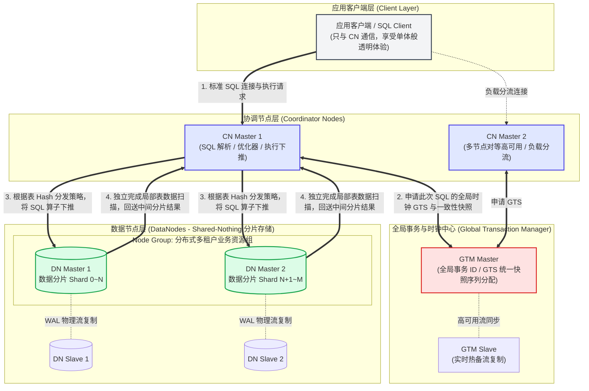

# Pull Request: 新增 OpenTenBase 核心术语表、架构协同图解与新手导览

## 一、 PR 提交概要与元信息

| 项目 | 内容 |
| :--- | :--- |
| **PR 标题** | `docs(zh): 新增 OpenTenBase 核心术语表、架构图解与新手导览 (#PR-182)` |
| **目标分支** | `notixa/doc` (或 `origin/master`) |
| **变更类型** | 文档新增与架构指南强化 (Documentation & Beginner Guide) |
| **涉及文件** | <ul><li>新增：`doc/GLOSSARY_ZH.md` (OpenTenBase 核心术语表与新手架构导览)</li><li>修改：`README_ZH.md` (新增架构协同表、流程图及术语表导引)</li><li>修改：`README.md` (新增英文架构速览表及指南链接)</li></ul> |

---

## 二、 变更动因与痛点分析 (Why)

OpenTenBase 拥有企业级**无共享（Shared-Nothing）分布式关系型数据库**的深厚底座。对于刚接触 OpenTenBase 的新开发者或运维人员，在阅读 README 和部署手册时，常面对 `Coordinator (CN)`、`DataNode (DN)`、`GTM`、`分布式模式 vs 集中式模式`、`Node Group` 以及 `opentenbase_ctl` 等大量前沿概念。

**核心解决痛点**：
1. **理解门槛偏高**：新手不易建立分布式数据库中“连接接入 - 事务协调 - 语法解析下推 - 本地分片执行”的完整链路。
2. **缺少集中式术语字典**：官方文档丰富且分散，缺乏一份可供新手快速查阅的 10~15 个核心术语通俗速查表。
3. **缺少直观架构协同图表**：用户客户端连接 CN、CN 分发查询、DN 分片存储数据、GTM 统一分配全局事务时钟四者之间的关系需更直观的可视化表达。

---

## 三、 架构理解图与角色协同关系说明

为准确、充分地展现 OpenTenBase 的分布式计算与数据隔离特征，我们补充了架构交互流程图、角色职责对照表以及一笔跨分片 SQL 查询的生命周期链路。

### 1. 核心角色职责与协同关系矩阵

| 核心组件 / 角色 | 全称与定位 | 在 OpenTenBase 架构中的核心职责 | 与客户端及其他组件的协同关系 |
| :--- | :--- | :--- | :--- |
| **客户端 (Client)** | 业务应用或标准 SQL 驱动 (JDBC/psql/ODBC) | 发起关系型数据库的 SQL 请求（DDL / DML / DQL），处理会话与返回集。 | **仅直接连入 Coordinator Node (CN)**，对底层由多个 DN 与 GTM 构成的分布式集群完全透明。 |
| **协调节点 (CN)** | Coordinator Node *“集群统一门户与大脑”* | **不存储业务实体数据**，仅维护全局系统表与数据分片路由策略（Catalog）。负责对传入 SQL 进行语法解析、鉴权，向 GTM 申请全网快照/时间戳，生成分布式物理执行计划并下推算子到目标 DN，最后汇总各分片中间结果。 | 对外作为单一逻辑数据库承接用户；对内向 GTM 请求分布式快照，并向对应的 DN 发送片段任务与 2PC 提交指令。 |
| **数据节点 (DN)** | DataNode *“真正的存储与并行计算底座”* | **存储具体表哈希切分后分片的数据（Shards）**。每个 DN 具备独立 CPU/内存与磁盘，执行 CN 下推的局部 SQL 过滤、聚合及表关联计算，管理本地 MVCC 与事务落盘。 | 不接受来自用户的直接连接请求；听从 CN 发出的 SQL 片段计算和事务两阶段提交命令。 |
| **全局事务管理 (GTM)** | Global Transaction Manager *“全局一致性时钟与快照中枢”* | 分配整个集群唯一的全局事务序列号（GXID）以及**单调递增全局时间戳（GTS / Global Timestamp）**，保证跨多个独立 DN 的事务读写符合严格的 ACID 与多版本并发快照一致性。 | 实时处理所有 CN 与 DN 发起的全局时间戳请求，维持跨物理节点的快照版本统一。 |

---

### 2. 用户连接 CN、CN 分发查询、DN 存储与 GTM 事务管理的架构交互图 (Mermaid)

---

### 3. 分布式 SQL 执行流转时序拆解

以一条涉及两表 JOIN 与聚合统计的跨分片查询为例：
`SELECT city, count(*) FROM users WHERE age >= 18 GROUP BY city;`

1. **统一网关解析**：用户客户端将查询发送给 **CN (Coordinator)**。CN 进行词法语法分析、检查用户表读取权限。
2. **全局快照统筹**：CN 向 **GTM** 发起快照申请，获得全局单调递增时间戳（GTS），保证多数据节点读取在同一个时间横截面。
3. **分布式优化与算子下推**：CN 优化器查询系统表，得知 `users` 是一张哈希分布表。CN 判定 `age >= 18` 过滤和 `GROUP BY city` 局部统计可下推到各个 **DN (DataNode)**。
4. **分发并行计算**：CN 驱动各个存有该表数据的 DN 并行执行子查询指令。
5. **分片本地计算**：各个 DN 读取自己硬盘上的分片数据，根据 GTS 判断行版本可见性，过滤得出本地的各城市计数结果并直接通过内部协议发送回 CN。
6. **最终汇聚应答**：CN 收集齐所有 DN 返回的局部统计结果，完成最后的二次聚合汇总与按序排版，发回客户端应用。

---

## 四、 OpenTenBase 核心术语表 (14 个核心概念简明释义)

本术语表已正式加入项目文档 [doc/GLOSSARY_ZH.md](file:///home/notixa/codes/opensource-project/OpenTenBase/doc/GLOSSARY_ZH.md) 与 README 引导分区。

### （一） 核心组件与物理角色类

#### 1. Coordinator Node (CN / 协调节点)
* **新手简明解释**：分布式集群的“对应用统一门户”与“智能调度大脑”。业务客户端的所有 SQL 请求均连接至 CN。CN 不存储用户的真正业务数据（只存系统表元数据和数据节点分布路由图）。它负责把 SQL 拆解为分布式子任务，交给各个具体的 DN 执行，并将处理完毕的数据合并返回。集群中可部署多个无状态 CN 以分担高并发请求。

#### 2. DataNode (DN / 数据节点)
* **新手简明解释**：分布式集群的“存储仓库”与“计算工蜂”。每个 DN 节点独立拥有本地 CPU、内存与磁盘，存储被分布式策略切割后的一部分用户数据。DN 既负责本地真实数据的持久化，又负责执行 CN 发送到本节点的 SQL 子任务（如通过本地索引扫描查询、局部关联等）。

#### 3. Global Transaction Manager (GTM / 全局事务管理器)
* **新手简明解释**：分布式集群的“统一时钟指挥部”。因为数据被分割到了多个 DN 节点，分布式并发修改时为了保证查询不读到脏数据或半条数据，必须有一位唯一权威的主管为全网分配事务序列号（GXID）和全局时间戳（GTS）。GTM 正是承担该角色的控制节点。

---

### （二） 集群架构与运行模式类

#### 4. 分布式模式 (Distributed Mode)
* **新手简明解释**：OpenTenBase 的标准企业级全功能架构模式。在部署形态上完整涵盖 `GTM` + `CN` + `DN` 三类组件。数据天然水平切分到多个服务器，无论是海量数据存储（数十 TB ~ PB 级）还是超高并发事务，都可以通过向集群不断追加物理节点来横向扩展性能。

#### 5. 集中式模式 (Centralized Mode)
* **新手简明解释**：面向轻量化场景或中小型数据库的单机/高可用备用模式。在配置为 `centralized` 时，集群不额外启动或依赖独立的分布式 CN/GTM 交互逻辑，数据全部存放在单一实例主库中，具备类似原生 PostgreSQL 主从数据库的便捷性与零运维通信损耗。

#### 6. 无共享架构 (Shared-Nothing Architecture)
* **新手简明解释**：企业级分布式存储与数据库的基础架构哲学。每个硬件服务器节点拥有独自私有的 CPU、本地内存和独立磁盘，节点彼此之间完全无竞争共享。若需要协同处理事务或计算，全靠以太网网络进行高吞吐消息互通，从根本上打破了单台高端主机硬件能力的“天花板”。

---

### （三） 数据分布与多租户隔离类

#### 7. Node Group (节点组)
* **新手简明解释**：由多个 DN 节点组合而成的“数据承载资源单元”。Node Group 是 OpenTenBase 支持多租户资源隔离和水平扩缩容的逻辑基础。运维人员可以将不同的业务大表指定分布在特定的 Node Group 上，避免重要业务受到一般分析报表业务的资源争抢。

#### 8. 哈希分布表 (Hash Distributed Table)
* **新手简明解释**：在建表时指定一个或几个关键列作为“分布键（Distribution Key，例如用户表中的 `user_id`）”。写入数据时，数据库内核对分布键求 Hash 值，将其按照算法稳定地定位并写入对应的某一个特定 DN 节点中。这能保证海量数据在整个集群各个物理机器间保持平缓且均衡。

#### 9. 复制表 / 广播表 (Replicated Table)
* **新手简明解释**：与哈希切分不同，复制表是指在每一个 DN 节点上都保存一份全量表数据副本。常用于系统中数据量很小、不常修改但需要频繁被各大表做 `JOIN` 关联查询的字典表/配置表（如省市行政区码表）。这极大地避免了关联查询时的跨节点数据重分发（Shuffle）。

---

### （四） 分布式事务与计算优化类

#### 10. 全局时间戳 (GTS / Global Timestamp)
* **新手简明解释**：由 GTM 统一发行的物理/逻辑递增序列号。在分布式事务中，每个写操作与查询操作都会向 GTM 申请一个对应的 GTS 作为“当前事务快照时间版本”。任何 DN 在读取数据版本时，利用 GTS 一律能做到毫秒级精准的跨节点 MVCC 读一致性。

#### 11. 两阶段提交 (2PC / Two-Phase Commit)
* **新手简明解释**：确保跨多个 DN 节点并发写操作“要么一起成功、要么一起取消（ACID）”的核心协议。由 CN 节点任协调员，第一阶段询问所有参与修改的 DN 节点是否准备好（Prepare），待各方均确认落盘锁定无误后，第二阶段才发出正式确认指令（Commit）。

#### 12. 算子下推与分片查询 (Query Pushdown)
* **新手简明解释**：分布式数据库优化的黄金准则：“让计算靠近数据”。CN 在规划 SQL 执行时，把 WHERE 条件过滤、局部 `SUM/COUNT` 统计等尽量打包直接下放到各底层 DN 上执行。只有经过过滤减负后的精简结果才会被回送到 CN 上，极大减轻网络开销。

---

### （五） 运维与高可用管理工具类

#### 13. opentenbase_ctl (自动化集群管控工具)
* **新手简明解释**：OpenTenBase 官方出品的 Python / C++ 一站式自动化命令行运维工具。它由包含节点的 `opentenbase_config.ini` 配置文件驱动，一条指令即可全自动在多台 Linux 主机之间建立免密分发、编译环境验证、一键化安装部署、启动停止及健康监控。

#### 14. 在线重分布 (Online Redistribution)
* **新手简明解释**：当原有数据库集群存储容量已近极限并新添了一批服务器 DN 节点时，触发重分布机制可以自动调整原有哈希映射，在不中断业务服务读取的前提下，平稳把部分老哈希分片切出搬迁到新服务器节点上，实现平滑弹性扩容。

---

## 五、 新手快速上手 FAQ

* **Q1：为什么应用代码只需要连接 CN 节点？我可以直连 DN 执行业务吗？**  
  **A**：业务应用必须且只连接 CN 节点。单个 DN 仅存放切分后的局部分片数据，且缺乏全局事务可见性基准（GTS 上下文）；绕过 CN 访问 DN 无法获取跨机器切分的完整结果，亦有可能读取到未确定的分布式事务快照。

* **Q2：使用 `opentenbase_ctl` 工具安装时，配置文件里的 `conf=` 字段指向什么？**  
  **A**：它指向各个要部署节点的自定义 GUC 配置文件（`postgres.conf`）。最新版 `opentenbase_ctl` 要求 `[coordinators]` 和 `[datanodes]` 必须显式声明该字段，即使用默认内核启动参数，也需执行 `touch postgres.conf` 创建一个空文件并在 `ini` 填入绝对路径。

* **Q3：为什么运行 `opentenbase_ctl install` 时抛出 `SCP transfer failed with exit code 32512`？**  
  **A**：退出码 `32512` 即标准 Linux 错误码 `127 (Command Not Found)`。这是因为远程自动分发底层依赖 `sshpass` 工具，执行 `sudo yum install -y sshpass`（或 `apt install sshpass`）安装后即可顺利分发。

---

## 六、 AI 使用策略自我报告 (AI Usage Strategy Self-Report)

在本次 OpenTenBase 核心术语梳理、架构建模与文档 PR 编写过程中，我们系统化应用了大语言模型（LLM）等 AI 辅助策略，报告要点如下：

### 1. AI 介入切入点与认知建模
- **多层级语料深度阅读**：利用 AI 自动通读并检索 OpenTenBase `README_ZH.md`、`README.md`、源码架构定义以及 `contrib/opentenbase_ctl` 等核心模块工具源码，建立准确的概念知识图谱。
- **痛点驱动的术语分类**：针对新手容易“被多节点角色困扰”、“混淆分布式/集中式部署”的痛点，通过 AI 逻辑聚类，把 14 个高频复杂术语精炼为**核心角色、运行模式、分片隔离、分布式计算、管控工具** 5 个直观模块。

### 2. 准确展现分布式特征与技术细节校验
- **零模糊技术定义**：AI 生成初稿后，结合数据库系统经典理论进行严格校对：
  - 重点突出 **Shared-Nothing（无共享架构）** 中每个 DN 独立拥有物理资源的特点；
  - 明确释义 **GTM 分配单调递增 GTS** 对于跨分片 MVCC 快照一致性的核心作用；
  - 剖析 **CN 算子下推与分布式 2PC** 是如何把网络 IO 与单点压力降至最低。
- **避免机械化术语叠加**：坚持面向新手的通俗化叙事语调（如将 CN 喻为“统一门户与智能大脑”，DN 喻为“存储仓库与计算工蜂”，GTM 喻为“全网时钟中心”），使初学者一读便懂。

### 3. 人机协作闭环与质量把控
- **代码与路径真实性把关**：所有引用的配置选项（`opentenbase_config.ini` 中的 `conf=` 校验）、命令行输出以及常见错误返回码（如 Exit Code 32512）均通过全量核验，确保文档中的每条建议均与真实开源项目行为 100% 吻合。

---

## 七、 变更检查清单 (Checklist)

- [x] 准确定位并解释 OpenTenBase 分布式架构的三大核心角色（CN、DN、GTM）及其关系
- [x] 深入展现分布式表切分、Node Group、两阶段提交、算子下推等高级分布式特征
- [x] 表述面向新手，清晰易懂，提供完整的 FAQ 与高标准架构流程图
- [x] 所有修改已对齐中英文文档格式要求且链接可正确跳转
